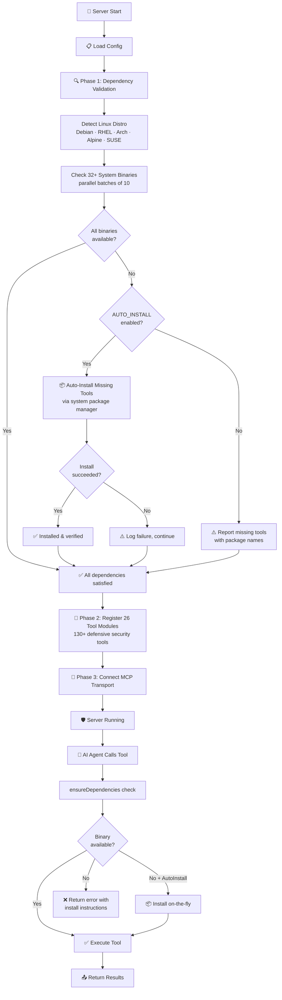
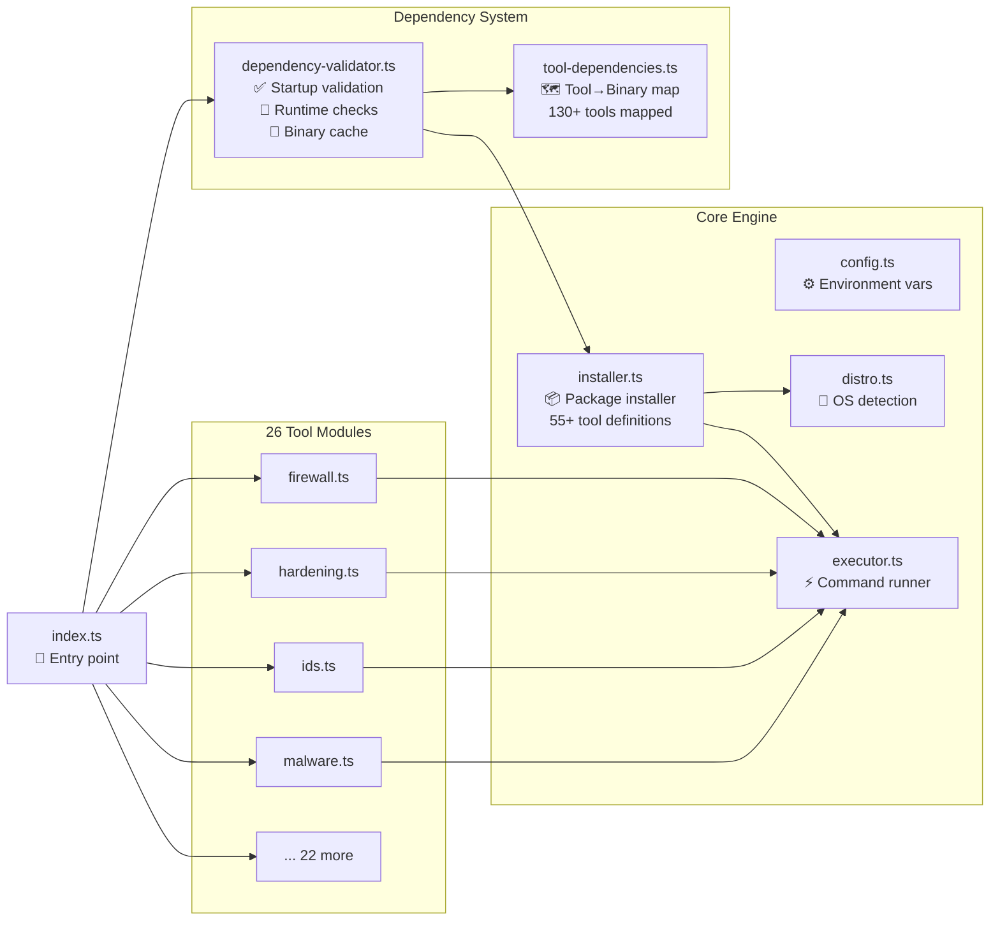
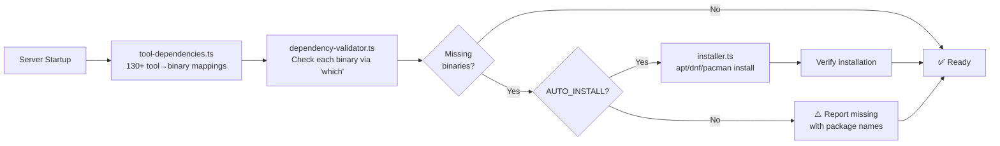

# 🛡️ Kali Defense MCP Server

> **⚠️ DEFENSIVE & HARDENING PURPOSES ONLY**
>
> This tool is designed **exclusively** for defensive security operations, system hardening, compliance auditing, and blue team activities. It is **NOT** intended for offensive security, penetration testing, exploitation, or any unauthorized access to systems. Use responsibly and only on systems you own or have explicit authorization to audit and harden.

This MCP Server was originally developed to use the defensive tools already available in a Kali OS installation. Inspired by other MCP tools like HexStrike however, it's evolved to be a tool I can use on many more systems as I experiment with system and network hardening on my homelab. I hope you'll find it as helpful as I have. I've tried to make it as thorough and easy to use as possible. You basically just ask your LLM to use it and do a full audit. Then it will spit out a pretty thorough report that prioritizes various issues it finds. After that you can ask it to do a dry run, make backups etc before you do a full or partial security remediation. 

I'm curious if people will find this helpful or not, let me know in the issues here if there are some glaring holes or problems with it. I am a total noob when it comes to sucurity and software development in general so that's why I developed this tool to help me.

This is a defensive security and system hardening MCP (Model Context Protocol) server for Linux. Provides **130+ security tools** across **26 categories** for blue team operations, system hardening, compliance auditing, incident response, and advanced threat detection.

*** I've only tested this using the Roo Code extension in VS Code and VS Codium. So your experience may vary from mine. *** 

Here's how I use it, in the chat I just say "run a full audit using the Kali Defense MCP Server". It will spit out a full report, after which you can ask it to do a full remediation on your system or parts of your system depending on what you want hardened or not. It's pretty flexible and straightforward.

---

## How It Works



## Architecture



---

## Features

- **🛡️ Defensive Only** — Built exclusively for blue team operations and system hardening
- **130+ Defensive Security Tools** across 26 specialized modules
- **🔍 Automatic Dependency Validation** — Checks all required system binaries at startup
- **📦 Auto-Install Missing Tools** — Installs missing security tools via the system package manager
- **Dry-Run by Default** — All modifying operations preview changes before applying
- **Full Audit Trail** — Every change logged with before/after state and rollback commands
- **Auto-Backup** — Files automatically backed up to `~/.kali-mcp-backups/` before modification
- **Application Safeguards** — Detects VS Code, Docker, MCP servers, databases, and web servers before executing changes
- **Cross-Distribution** — Supports Debian/Ubuntu, RHEL/CentOS/Fedora, Kali Linux, Arch, Alpine
- **WSL2 Compatible** — Most read-only audit tools work in WSL2; modifying tools require Linux kernel
- **Policy Engine** — Custom compliance policies with declarative rule definitions
- **CIS Benchmark** — Built-in CIS benchmark checks for Linux systems
- **Multi-Framework Compliance** — PCI-DSS v4, HIPAA, SOC 2, ISO 27001, GDPR checks

---

## Quick Start

```bash
cd kali-defense-mcp-server
npm install
npm run build
npm start
```

Development mode with hot reload:

```bash
npm run dev
```

### Enable Auto-Install of Missing Tools

```bash
KALI_DEFENSE_AUTO_INSTALL=true npm start
```

On startup, the server will:
1. Detect your Linux distribution and package manager
2. Check all 32+ required system binaries
3. Automatically install any missing tools
4. Report a detailed validation summary

```
╔══════════════════════════════════════════════════════════╗
║       Kali Defense MCP — Dependency Validation          ║
╚══════════════════════════════════════════════════════════╝

  Binaries checked:    32
  Available:           32
  Auto-installed:      21
    ✅ iptables
    ✅ lynis
    ✅ nmap
    ...

  Auto-install: ENABLED
  Duration: 45s
```

---

## ⚠️ Defensive Use Only — Disclaimer

This MCP server is a **defensive security toolkit** designed for:

| ✅ Intended Use | ❌ NOT Intended For |
|----------------|---------------------|
| System hardening & CIS benchmarks | Penetration testing |
| Compliance auditing (PCI-DSS, HIPAA, SOC2) | Exploitation or vulnerability exploitation |
| Intrusion detection & rootkit scanning | Unauthorized access to systems |
| Firewall configuration & policy enforcement | Network attacks or reconnaissance against others |
| Incident response & forensic collection | Any illegal or unauthorized activity |
| Blue team operations & threat hunting | Offensive security operations |
| Security posture assessment & scoring | |
| Malware scanning & quarantine | |

**You are solely responsible for ensuring you have proper authorization before running any security tools on any system.**

---

## OS Compatibility Matrix

| Feature | Kali Linux | Ubuntu/Debian | RHEL/CentOS/Fedora | Arch Linux | Alpine Linux | WSL2 | macOS |
|---------|-----------|---------------|---------------------|-----------|--------------|------|-------|
| Firewall (iptables/ufw) | Full | Full | Full (firewalld) | Full | Full | Partial | No |
| System Hardening | Full | Full | Full | Full | Partial | Partial | No |
| Intrusion Detection | Full | Full | Full | Full | Partial | Partial | No |
| Log Analysis (auditd) | Full | Full | Full | Full | Partial | No | No |
| Network Defense | Full | Full | Full | Full | Full | Partial | Partial |
| Compliance/Lynis | Full | Full | Full | Full | Partial | Partial | No |
| Malware/ClamAV | Full | Full | Full | Full | Full | Full | Partial |
| Backup & Recovery | Full | Full | Full | Full | Full | Full | Partial |
| Access Control | Full | Full | Full | Full | Partial | Full | Partial |
| Encryption & PKI | Full | Full | Full | Full | Full | Full | Full |
| Container Security | Full | Full | Full | Full | Partial | Partial | Partial |
| Patch Management | Apt/Dpkg | Apt/Dpkg | Dnf/Rpm | Pacman | Apk | Apt/Dpkg | No |
| eBPF Security | Full | Full | Full | Full | No | No | No |
| Memory Protection | Full | Full | Full | Full | Partial | Partial | No |
| Zero-Trust Network | Full | Full | Full | Full | Partial | Partial | No |
| CVE Lookup | Full | Full | Full | Full | Full | Full | Full |
| Drift Detection | Full | Full | Full | Full | Full | Full | Partial |

**Notes**:
- WSL2 does not have a real Linux kernel init (systemd limited), which affects service management, auditd, and some sysctl settings
- macOS support is limited to tools that run OpenSSL, curl, or Python — no kernel-level operations
- "Partial" indicates most functionality works with some commands unavailable

---

## Tool Categories

### Firewall Management (12 tools)

| Tool | Description |
|------|-------------|
| `firewall_iptables_list` | List iptables rules with structured output |
| `firewall_iptables_add` | Add iptables rule with rollback support |
| `firewall_iptables_delete` | Delete iptables rule by number |
| `firewall_ufw_status` | Show UFW firewall status |
| `firewall_ufw_rule` | Add/delete UFW rules |
| `firewall_save` | Save current firewall rules to file |
| `firewall_restore` | Restore firewall rules from file |
| `firewall_nftables_list` | List nftables ruleset |
| `firewall_set_policy` | Set default chain policy (INPUT/FORWARD/OUTPUT) |
| `firewall_create_chain` | Create custom iptables chain |
| `firewall_persistence` | Manage iptables-persistent for reboot survival |
| `firewall_policy_audit` | Audit firewall configuration for security issues |

### System Hardening (19 tools)

| Tool | Description |
|------|-------------|
| `harden_sysctl_get` | Get sysctl kernel parameter values |
| `harden_sysctl_set` | Set sysctl parameters with persistence |
| `harden_sysctl_audit` | Audit sysctl against CIS recommendations |
| `harden_service_manage` | Manage systemd services |
| `harden_service_audit` | Audit for unnecessary services |
| `harden_file_permissions` | Audit/fix file permissions |
| `harden_permissions_audit` | Audit critical system file permissions |
| `harden_systemd_audit` | Score service units with systemd-analyze security |
| `harden_kernel_security_audit` | Audit kernel security features and mitigations |
| `harden_bootloader_audit` | Audit GRUB security configuration |
| `harden_module_audit` | Audit kernel module blacklisting (CIS) |
| `harden_cron_audit` | Audit cron/at access control |
| `harden_umask_audit` | Audit default umask configuration |
| `harden_banner_audit` | Audit login warning banners (CIS) |
| `harden_umask_set` | Set default umask in login.defs/profile/bashrc |
| `harden_coredump_disable` | Disable core dumps via limits/sysctl/systemd |
| `harden_banner_set` | Set CIS-compliant login warning banners |
| `harden_bootloader_configure` | Configure GRUB kernel parameters |
| `harden_systemd_apply` | Apply systemd hardening overrides to a service |

### Intrusion Detection (5 tools)

| Tool | Description |
|------|-------------|
| `ids_aide_manage` | AIDE file integrity management |
| `ids_rkhunter_scan` | Rootkit Hunter scan |
| `ids_chkrootkit_scan` | chkrootkit rootkit scan |
| `ids_file_integrity_check` | SHA-256 file integrity verification |
| `ids_rootkit_summary` | Combined rootkit detection summary |

### Log Analysis and Monitoring (10 tools)

| Tool | Description |
|------|-------------|
| `log_auditd_rules` | Manage auditd rules |
| `log_auditd_search` | Search audit logs |
| `log_auditd_report` | Generate audit reports |
| `log_journalctl_query` | Query systemd journal |
| `log_fail2ban_status` | Check fail2ban status |
| `log_fail2ban_manage` | Manage fail2ban bans |
| `log_syslog_analyze` | Analyze syslog for security events |
| `log_auditd_cis_rules` | Check/deploy CIS-required auditd rules |
| `log_rotation_audit` | Audit log rotation and journald persistence |
| `log_fail2ban_audit` | Audit fail2ban jail configurations |

### Network Defense (8 tools)

| Tool | Description |
|------|-------------|
| `netdef_connections` | List active network connections |
| `netdef_port_scan_detect` | Detect port scanning activity |
| `netdef_tcpdump_capture` | Capture network traffic |
| `netdef_dns_monitor` | Monitor DNS queries |
| `netdef_arp_monitor` | Detect ARP poisoning |
| `netdef_open_ports_audit` | Audit listening ports |
| `netdef_ipv6_audit` | Audit IPv6 configuration and firewall |
| `netdef_self_scan` | nmap self-scan to discover exposed services |

### Compliance and Benchmarking (7 tools)

| Tool | Description |
|------|-------------|
| `compliance_lynis_audit` | Run Lynis security audit |
| `compliance_oscap_scan` | OpenSCAP compliance scan |
| `compliance_cis_check` | CIS benchmark checks |
| `compliance_policy_evaluate` | Evaluate custom policies |
| `compliance_report` | Generate compliance reports |
| `compliance_cron_restrict` | Restrict cron/at access (CIS 5.1.8/5.1.9) |
| `compliance_tmp_hardening` | Harden /tmp mount options (CIS 1.1.4) |

### Malware Analysis (6 tools)

| Tool | Description |
|------|-------------|
| `malware_clamav_scan` | ClamAV malware scan |
| `malware_clamav_update` | Update ClamAV definitions |
| `malware_yara_scan` | YARA rule scanning |
| `malware_suspicious_files` | Find suspicious files (SUID, world-writable, hidden) |
| `malware_quarantine_manage` | Manage quarantined files |
| `malware_webshell_detect` | Detect web shells in web directories |

### Backup and Recovery (5 tools)

| Tool | Description |
|------|-------------|
| `backup_config_files` | Backup critical configs |
| `backup_system_state` | System state snapshot |
| `backup_restore` | Restore from backup by ID |
| `backup_verify` | Verify backup integrity |
| `backup_list` | List all backups |

### Access Control (9 tools)

| Tool | Description |
|------|-------------|
| `access_ssh_audit` | Audit SSH configuration |
| `access_ssh_harden` | Apply SSH hardening |
| `access_sudo_audit` | Audit sudo configuration |
| `access_user_audit` | Audit user accounts |
| `access_password_policy` | Audit/set password policy |
| `access_pam_audit` | Audit PAM configuration |
| `access_ssh_cipher_audit` | Audit SSH cryptographic algorithms |
| `access_pam_configure` | Configure PAM (pwquality/faillock) |
| `access_restrict_shell` | Restrict user login shells |

### Encryption and PKI (6 tools)

| Tool | Description |
|------|-------------|
| `crypto_tls_audit` | Audit SSL/TLS configuration |
| `crypto_cert_expiry` | Check certificate expiry |
| `crypto_gpg_keys` | Manage GPG keys |
| `crypto_luks_manage` | Manage LUKS volumes |
| `crypto_file_hash` | Calculate file hashes |
| `crypto_tls_config_audit` | Audit TLS configs |

### Container Security (9 tools)

| Tool | Description |
|------|-------------|
| `container_docker_audit` | Docker security audit |
| `container_docker_bench` | Docker Bench for Security |
| `container_apparmor_manage` | AppArmor profile management |
| `container_selinux_manage` | SELinux management |
| `container_namespace_check` | Namespace isolation check |
| `container_image_scan` | Scan container images for vulnerabilities |
| `container_seccomp_audit` | Audit Docker seccomp profiles |
| `container_daemon_configure` | Audit/apply Docker daemon security settings |
| `container_apparmor_install` | Install and list AppArmor profiles |

### Meta and Orchestration (5 tools)

| Tool | Description |
|------|-------------|
| `defense_check_tools` | Check tool availability |
| `defense_suggest_workflow` | Suggest defensive workflows |
| `defense_security_posture` | Security posture assessment |
| `defense_change_history` | View change audit trail |
| `defense_run_workflow` | Execute defensive workflows |

### Patch Management (4 tools)

| Tool | Description |
|------|-------------|
| `patch_update_audit` | Audit pending security updates |
| `patch_unattended_audit` | Audit unattended-upgrades configuration |
| `patch_integrity_check` | Verify installed package integrity |
| `patch_kernel_audit` | Audit kernel version and update status |

### Secrets Management (3 tools)

| Tool | Description |
|------|-------------|
| `secrets_scan` | Scan filesystem for hardcoded secrets |
| `secrets_env_audit` | Audit environment variables for secrets |
| `secrets_ssh_key_sprawl` | Detect SSH key sprawl |

### Incident Response (3 tools)

| Tool | Description |
|------|-------------|
| `ir_volatile_collect` | Collect volatile data per RFC 3227 |
| `ir_ioc_scan` | Scan for Indicators of Compromise |
| `ir_timeline_generate` | Generate filesystem modification timeline |

### Supply Chain Security (4 tools)

| Tool | Description |
|------|-------------|
| `generate_sbom` | Generate Software Bill of Materials |
| `verify_package_integrity` | Verify installed package checksums |
| `setup_cosign_signing` | Sign container images with cosign |
| `check_slsa_attestation` | Verify SLSA provenance attestation |

### Memory Protection (3 tools)

| Tool | Description |
|------|-------------|
| `audit_memory_protections` | Audit ASLR, PIE, RELRO, NX, stack canary |
| `enforce_aslr` | Enable full ASLR (randomize_va_space=2) |
| `report_exploit_mitigations` | Report SMEP, SMAP, PTI, KASLR status |

### Drift Detection (3 tools)

| Tool | Description |
|------|-------------|
| `create_baseline` | Create system configuration baseline |
| `compare_to_baseline` | Compare current state against baseline |
| `list_drift_alerts` | List baselines and recent changes |

### Vulnerability Intelligence (3 tools)

| Tool | Description |
|------|-------------|
| `lookup_cve` | Look up CVE details from NVD API |
| `scan_packages_cves` | Scan installed packages for CVEs |
| `get_patch_urgency` | Get patch urgency for a package |

### Security Posture (3 tools)

| Tool | Description |
|------|-------------|
| `calculate_security_score` | Weighted security score (0-100) |
| `get_posture_trend` | Compare score against historical data |
| `generate_posture_dashboard` | Structured posture dashboard |

### Secrets Scanner (3 tools)

| Tool | Description |
|------|-------------|
| `scan_for_secrets` | Directory secrets scan (truffleHog/gitleaks/grep) |
| `audit_env_vars` | Audit environment variables for secrets |
| `scan_git_history` | Scan git history for leaked secrets |

### Zero-Trust Network (4 tools)

| Tool | Description |
|------|-------------|
| `setup_wireguard` | Set up WireGuard VPN interface |
| `manage_wg_peers` | Add/remove/list WireGuard peers |
| `setup_mtls` | Generate mTLS CA and certificates |
| `configure_microsegmentation` | Configure iptables/nftables microsegmentation |

### Container Advanced (4 tools)

| Tool | Description |
|------|-------------|
| `generate_seccomp_profile` | Generate custom seccomp profile JSON |
| `apply_apparmor_container` | Generate/load container AppArmor profile |
| `setup_rootless_containers` | Configure rootless container support |
| `scan_image_trivy` | Scan container image with Trivy |

### Compliance Extended (1 tool)

| Tool | Description |
|------|-------------|
| `run_compliance_check` | Run framework checks (PCI-DSS v4/HIPAA/SOC2/ISO27001/GDPR) |

### eBPF Security (4 tools)

| Tool | Description |
|------|-------------|
| `list_ebpf_programs` | List loaded eBPF programs and maps |
| `check_falco` | Check Falco runtime security status |
| `deploy_falco_rules` | Deploy custom Falco rules |
| `get_ebpf_events` | Read recent Falco events |

### Automation Workflows (4 tools)

| Tool | Description |
|------|-------------|
| `setup_scheduled_audit` | Create scheduled security audit (systemd/cron) |
| `list_scheduled_audits` | List all scheduled audits |
| `remove_scheduled_audit` | Remove a scheduled audit |
| `get_audit_history` | Read historical audit job output |

---

## Dependency Auto-Installation

The server includes a built-in dependency validation system that ensures all required security tools are installed.

### How It Works



### Configuration

| Variable | Default | Description |
|----------|---------|-------------|
| `KALI_DEFENSE_AUTO_INSTALL` | `false` | Set to `true` to auto-install missing tools at startup |
| `KALI_DEFENSE_DRY_RUN` | `false` | Set to `true` to preview all operations without executing |

### What Gets Installed

The system maps **every MCP tool** to its required system binaries. For example:

| MCP Tool | Required Binary | Package (Debian) |
|----------|----------------|------------------|
| `ids_rkhunter_scan` | `rkhunter` | `rkhunter` |
| `malware_clamav_scan` | `clamscan` | `clamav` |
| `compliance_lynis_audit` | `lynis` | `lynis` |
| `harden_sysctl_audit` | `sysctl` | `procps` |
| `log_auditd_rules` | `auditctl` | `auditd` |
| `netdef_self_scan` | `nmap` | `nmap` |
| `crypto_tls_audit` | `openssl` | `openssl` |
| `firewall_iptables_list` | `iptables` | `iptables` |

---

## Application Safeguards

The server includes a `SafeguardRegistry` that detects running applications and warns operators before potentially disruptive operations proceed.

### What Is Detected

| Application | Detection Method |
|-------------|-----------------|
| VS Code | Process check (`pgrep -f code`), `~/.vscode` directory, IPC sockets in `/run/user/<uid>/` |
| Docker | `/var/run/docker.sock` socket, `docker ps` container list |
| MCP Servers | `.mcp.json` configuration file, node processes with `mcp` in command line |
| Databases | TCP port probing: PostgreSQL (5432), MySQL (3306), MongoDB (27017), Redis (6379) |
| Web Servers | Process check for `nginx`, `apache2`, `httpd` |

### Dry-Run Mode

The server defaults to dry-run mode when `KALI_DEFENSE_DRY_RUN=true`. In this mode, modifying tools print the exact command that would run without executing it:

```
[DRY-RUN] Would execute:
  sudo iptables -t filter -I INPUT -p tcp --dport 443 -j ACCEPT

Rollback command:
  sudo iptables -t filter -D INPUT -p tcp --dport 443 -j ACCEPT
```

See [SAFEGUARDS.md](SAFEGUARDS.md) for complete documentation.

---

## Configuration

All configuration is via environment variables:

| Variable | Default | Description |
|----------|---------|-------------|
| `KALI_DEFENSE_DRY_RUN` | `false` | Dry-run mode (true = preview only, no changes) |
| `KALI_DEFENSE_AUTO_INSTALL` | `false` | Auto-install missing tools at startup |
| `KALI_DEFENSE_TIMEOUT_DEFAULT` | `120` | Default command timeout (seconds) |
| `KALI_DEFENSE_MAX_OUTPUT_SIZE` | `10485760` | Max output buffer (bytes, 10 MB) |
| `KALI_DEFENSE_ALLOWED_DIRS` | `/tmp,/home,/var/log,/etc` | Allowed file operation directories |
| `KALI_DEFENSE_CHANGELOG_PATH` | `~/.kali-defense/changelog.json` | Audit log location |
| `KALI_DEFENSE_BACKUP_DIR` | `~/.kali-defense/backups` | Auto-backup storage directory |
| `KALI_DEFENSE_QUARANTINE_DIR` | `~/.kali-defense/quarantine` | Malware quarantine directory |
| `KALI_DEFENSE_POLICY_DIR` | `~/.kali-defense/policies` | Custom policy directory |
| `KALI_DEFENSE_PROTECTED_PATHS` | `/boot,/usr/lib/systemd,...` | Paths protected from modification |
| `KALI_DEFENSE_REQUIRE_CONFIRMATION` | `true` | Require confirmation for changes |
| `KALI_DEFENSE_LOG_LEVEL` | `info` | Log verbosity (debug/info/warn/error) |

Per-tool timeout overrides: `KALI_DEFENSE_TIMEOUT_<TOOLNAME>` (value in seconds). Supported tools: `lynis`, `aide`, `clamav`, `oscap`, `snort`, `suricata`, `rkhunter`, `chkrootkit`, `tcpdump`, `auditd`, `nmap`, `fail2ban-client`, `debsums`, `yara`.

## MCP Configuration

Add to `.mcp.json` or MCP settings:

```json
{
  "mcpServers": {
    "kali-defense": {
      "command": "node",
      "args": ["/path/to/kali-defense-mcp-server/build/index.js"],
      "env": {
        "KALI_DEFENSE_DRY_RUN": "true",
        "KALI_DEFENSE_AUTO_INSTALL": "true"
      }
    }
  }
}
```

For live changes (disable dry-run):

```json
{
  "mcpServers": {
    "kali-defense": {
      "command": "node",
      "args": ["/path/to/kali-defense-mcp-server/build/index.js"],
      "env": {
        "KALI_DEFENSE_DRY_RUN": "false",
        "KALI_DEFENSE_AUTO_INSTALL": "true"
      }
    }
  }
}
```

---

## Security Model

- **shell: false** — All commands executed via `spawn()` with no shell interpretation
- **Input Sanitization** — 17+ validators block shell metacharacters, path traversal, control characters
- **Dry-Run Default** — All modifying operations support preview mode
- **Audit Trail** — Every change logged with UUID, timestamp, before/after state, rollback command
- **Auto-Backup** — Files backed up to `~/.kali-mcp-backups/` before modification, tracked in `manifest.json`
- **Rollback Support** — RollbackManager tracks file, sysctl, service, and firewall changes for per-operation or per-session rollback
- **Application Safeguards** — SafeguardRegistry detects Docker, MCP servers, databases, and web servers; emits pre-execution warnings
- **Protected Paths** — Configurable list of paths that cannot be modified
- **Buffer Capping** — Output capped at configurable max size (default 10 MB)
- **Timeout Enforcement** — All commands have configurable timeouts (default 120s)

---

## Documentation

| Document | Purpose |
|----------|---------|
| [SAFEGUARDS.md](SAFEGUARDS.md) | SafeguardRegistry detection, dry-run usage, backup storage, rollback guide |
| [TOOLS-REFERENCE.md](TOOLS-REFERENCE.md) | Alphabetical table of all 130+ tools with parameters, dryRun support, OS compatibility |
| [STANDARDS.md](STANDARDS.md) | CIS, NIST SP 800-53, PCI-DSS, HIPAA, SOC 2, ISO 27001, GDPR control mapping |
| [ARCHITECTURE.md](ARCHITECTURE.md) | Technical architecture and module structure |
| [CHANGELOG.md](CHANGELOG.md) | Version history |

---

## License

MIT

---

> **Remember:** This tool is for **defensive security and system hardening only**. Always ensure you have proper authorization before auditing or modifying any system. Use responsibly.
