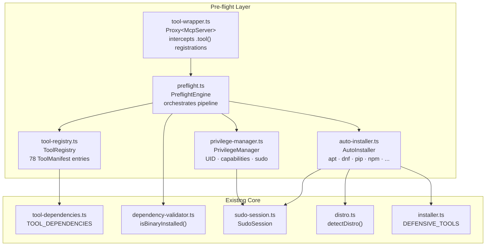
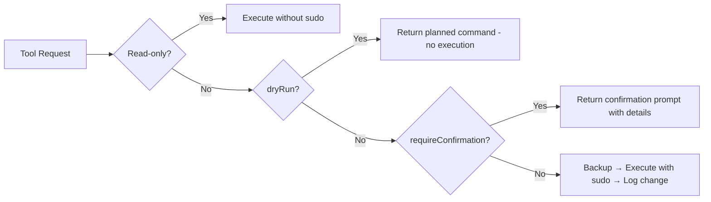
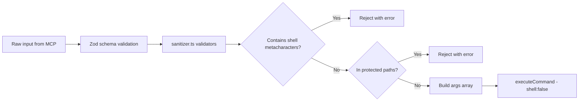
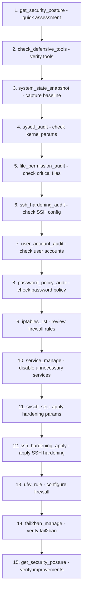

# Defense MCP Server — Architecture Document

> **Project**: `defense-mcp-server`
> **Version**: 0.6.0
> **Purpose**: Standalone MCP server for defensive security, system hardening, and blue team operations
> **SDK**: `@modelcontextprotocol/sdk` v1.27.1 · `zod` v3.25.76
> **Transport**: StdioServerTransport
> **Runtime**: Node.js ≥ 18 · TypeScript 5.9+

---

## Table of Contents

1. [Design Principles](#design-principles)
2. [Project Structure](#project-structure)
3. [Architecture Overview](#architecture-overview)
4. [Pre-flight Validation Layer](#pre-flight-validation-layer)
5. [Core Modules](#core-modules)
6. [Tool Modules](#tool-modules)
   - [1. Firewall Management](#1-firewall-management-firewallts)
   - [2. System Hardening](#2-system-hardening-hardeningts)
   - [3. Intrusion Detection](#3-intrusion-detection-idsts)
   - [4. Log Analysis & Monitoring](#4-log-analysis--monitoring-loggingts)
   - [5. Network Defense](#5-network-defense-network-defensets)
   - [6. Compliance & Benchmarking](#6-compliance--benchmarking-compliancets)
   - [7. Malware Analysis](#7-malware-analysis-malwarets)
   - [8. Backup & Recovery](#8-backup--recovery-backupts)
   - [9. Access Control](#9-access-control-access-controlts)
   - [10. Encryption & PKI](#10-encryption--pki-encryptionts)
   - [11. Container & MAC Security](#11-container--mac-security-container-securityts)
7. [Meta Tools](#meta-tools)
8. [Configuration Reference](#configuration-reference)
9. [Security Model](#security-model)
10. [Policy Engine](#policy-engine)
11. [Example Workflows](#example-workflows)
12. [Cross-Distro Support Matrix](#cross-distro-support-matrix)
13. [Implementation Conventions](#implementation-conventions)

---

## Design Principles

| # | Principle | Implementation |
|---|-----------|---------------|
| 1 | **Dry-run by default** | All modifying operations default to `dryRun=true`. Set `DEFOPSEC_DRY_RUN=false` to enable live changes. |
| 2 | **Audit everything** | Every change logged via `changelog.ts` with before/after state, UUID, timestamp, and rollback command. |
| 3 | **Backup before modify** | `backupFile()` called automatically before any file modification. Backup path stored in changelog entry. |
| 4 | **Rollback support** | Every `ChangeEntry` includes a `rollbackCommand` string the agent can execute to undo the change. |
| 5 | **Cross-distro** | `distro.ts` detects Debian/Ubuntu, RHEL/CentOS, Arch, Alpine, SUSE and adapts commands accordingly. |
| 6 | **Progressive hardening** | Tools organized: **Assess → Plan → Implement → Verify**. Assessment tools are always safe to run. |
| 7 | **No shell execution** | All commands use `spawn()` with `shell: false`. Arguments are pre-sanitized arrays. |
| 8 | **Least privilege** | Tools request only the minimum privilege needed. Read-only operations never use `sudo`. |

---

## Project Structure

```
defense-mcp-server/
├── package.json
├── tsconfig.json
├── README.md
├── docs/
│   ├── ARCHITECTURE.md          ← this file
│   ├── TOOLS-REFERENCE.md       ← complete tool reference
│   ├── SAFEGUARDS.md            ← safeguards & rollback reference
│   ├── SPECIFICATION.md         ← server specification
│   └── STANDARDS.md             ← compliance standards mapping
├── src/
│   ├── index.ts                 ← entry point: creates McpServer, wraps with pre-flight, connects stdio
│   ├── core/
│   │   ├── executor.ts          ← safe command execution (spawn, shell:false, timeouts, buffer cap)
│   │   ├── config.ts            ← env-based config with defensive defaults
│   │   ├── sanitizer.ts         ← input validation (targets, paths, services, sysctl keys, etc.)
│   │   ├── parsers.ts           ← output parsing (text, key-value, table, JSON, XML)
│   │   ├── changelog.ts         ← audit trail with backup/restore
│   │   ├── distro.ts            ← Linux distribution detection
│   │   ├── distro-adapter.ts    ← cross-distro command adaptation
│   │   ├── installer.ts         ← defensive tool auto-installation
│   │   ├── policy-engine.ts     ← policy evaluation engine for compliance checks
│   │   ├── tool-registry.ts     ← tool manifest registry (94 tools, sudo/capability declarations)
│   │   ├── privilege-manager.ts ← privilege detection (UID/EUID, Linux capabilities, sudo status)
│   │   ├── auto-installer.ts    ← multi-package-manager auto-dependency resolution
│   │   ├── preflight.ts         ← pre-flight orchestration engine with caching
│   │   ├── tool-wrapper.ts      ← Proxy-based middleware wrapping McpServer for pre-flight injection
│   │   ├── rate-limiter.ts      ← per-tool and global invocation rate limiting
│   │   ├── logger.ts            ← structured JSON logging with security event level
│   │   ├── encrypted-state.ts   ← AES-256-GCM encrypted state storage with PBKDF2 key derivation
│   │   ├── secure-fs.ts         ← atomic file writes with audit trail and permission hardening
│   │   ├── spawn-safe.ts        ← safe subprocess execution helper
│   │   ├── sudo-session.ts      ← sudo credential management with Buffer zeroing
│   │   ├── sudo-guard.ts        ← sudo access control
│   │   ├── command-allowlist.ts ← 190-entry binary allowlist with integrity verification
│   │   ├── backup-manager.ts    ← file backup manager with manifest tracking
│   │   ├── rollback.ts          ← change rollback manager
│   │   ├── safeguards.ts        ← running application detection and safety checks
│   │   ├── dependency-validator.ts ← startup dependency validation
│   │   └── tool-dependencies.ts ← per-tool binary dependency declarations
│   └── tools/
│       ├── firewall.ts          ← iptables, nftables, ufw management + USB device control
│       ├── hardening.ts         ← sysctl, kernel params, services, file perms, GRUB, banners
│       ├── ids.ts               ← AIDE, rkhunter, chkrootkit, file integrity monitoring
│       ├── logging.ts           ← auditd, journalctl, fail2ban, syslog analysis
│       ├── network-defense.ts   ← tcpdump, connection monitoring, port scan detection, segmentation
│       ├── compliance.ts        ← lynis, OpenSCAP, CIS benchmarks, compliance reporting
│       ├── malware.ts           ← ClamAV, YARA, suspicious file analysis, quarantine
│       ├── backup.ts            ← config backup, system state snapshot, restore, verification
│       ├── access-control.ts    ← SSH hardening, sudo audit, PAM, user audit, password policy
│       ├── encryption.ts        ← SSL/TLS audit, GPG, LUKS, cert lifecycle monitoring
│       ├── container-security.ts ← Docker audit, AppArmor, SELinux, namespaces, container vuln scan
│       ├── meta.ts              ← check_tools, suggest_workflow, posture, history, auto-remediation
│       ├── patch-management.ts  ← update auditing, integrity checks, CVE intelligence
│       ├── secrets.ts           ← secrets scanning, env audit, SSH key sprawl, git history scan
│       ├── incident-response.ts ← volatile data collection, IOC scan, timeline + forensics
│       ├── sudo-management.ts   ← sudo elevation, session management
│       ├── supply-chain-security.ts ← SBOM, cosign signing, SLSA verification
│       ├── drift-detection.ts   ← configuration drift baselines and comparison
│       ├── zero-trust-network.ts ← WireGuard VPN, mTLS certs, microsegmentation
│       ├── ebpf-security.ts     ← Falco runtime security, eBPF program listing
│       ├── app-hardening.ts     ← per-app hardening (nginx, sshd, postgresql, redis, etc.)
│       ├── reporting.ts         ← consolidated security reports (Markdown/HTML/JSON/CSV)
│       ├── dns-security.ts      ← DNSSEC, tunneling detection, domain blocklists, query log audit
│       ├── vulnerability-management.ts ← nmap/nikto scanning, vuln tracking, risk prioritization
│       ├── process-security.ts  ← process audit, Linux capabilities, namespace isolation, anomaly detection
│       ├── waf.ts               ← ModSecurity audit/rules, OWASP CRS, rate limiting, WAF log analysis
│       ├── threat-intel.ts      ← IP/hash/domain threat feeds, blocklist application
│       ├── cloud-security.ts    ← AWS/GCP/Azure detection, IMDS security, IAM credential scanning
│       ├── api-security.ts      ← API discovery, auth auditing, rate-limit testing, CORS checking
│       ├── deception.ts         ← canary tokens, honeyport listeners, trigger monitoring
│       ├── wireless-security.ts ← Bluetooth/WiFi audit, rogue AP detection, interface disabling
│       └── siem-integration.ts  ← rsyslog/Filebeat forwarding, log audit, connectivity testing
└── build/                       ← compiled JS output (tsc)
```

---

## Architecture Overview

```mermaid
graph TB
    subgraph MCP_Transport
        STDIO[StdioServerTransport]
    end

    subgraph Server_Core
        MCP[McpServer - defense-mcp-server v0.6.0]
    end

    subgraph Core_Modules
        EXE[executor.ts - shell:false spawn]
        CFG[config.ts - env-based config]
        SAN[sanitizer.ts - input validation]
        PAR[parsers.ts - output parsing]
        CHL[changelog.ts - audit trail]
        DST[distro.ts - distro detection]
        INS[installer.ts - tool auto-install]
        POL[policy-engine.ts - compliance policies]
        RL[rate-limiter.ts - rate limiting]
        LOG2[logger.ts - structured JSON logging]
    end

    subgraph Tool_Modules
        FW[firewall.ts - 5 tools]
        HD[hardening.ts - 8 tools]
        IDS[ids.ts - 3 tools]
        LOG[logging.ts - 4 tools]
        ND[network-defense.ts - 4 tools]
        CMP[compliance.ts - 7 tools]
        MAL[malware.ts - 4 tools]
        BKP[backup.ts - 1 tool]
        ACC[access-control.ts - 6 tools]
        ENC[encryption.ts - 5 tools]
        CTR[container-security.ts - 6 tools]
        META[meta.ts - 6 tools]
        PM[patch-management.ts - 5 tools]
        SEC[secrets.ts - 4 tools]
        IR[incident-response.ts - 2 tools]
        SUDO[sudo-management.ts - 6 tools]
        SC[supply-chain-security.ts - 1 tool]
        DD[drift-detection.ts - 1 tool]
        ZT[zero-trust-network.ts - 1 tool]
        EBPF[ebpf-security.ts - 2 tools]
        APP[app-hardening.ts - 1 tool]
        REP[reporting.ts - 1 tool]
        DNS[dns-security.ts - 1 tool]
        VM[vulnerability-management.ts - 1 tool]
        PS[process-security.ts - 1 tool]
        WAF[waf.ts - 1 tool]
        TI[threat-intel.ts - 1 tool]
        CS[cloud-security.ts - 1 tool]
        API[api-security.ts - 1 tool]
        DEC[deception.ts - 1 tool]
        WS[wireless-security.ts - 1 tool]
        SIEM[siem-integration.ts - 1 tool]
    end

    STDIO <--> MCP
    MCP --> FW & HD & IDS & LOG & ND & CMP & MAL & BKP & ACC & ENC & CTR & META
    MCP --> PM & SEC & IR & SUDO & SC & DD & ZT & EBPF & APP
    MCP --> REP & DNS & VM & PS & WAF & TI & CS & API & DEC & WS & SIEM
    FW & HD & IDS & LOG & ND & CMP & MAL & BKP & ACC & ENC & CTR & META --> EXE & SAN & PAR & CHL
    PM & SEC & IR & SC & DD & ZT & EBPF & APP --> EXE & SAN & PAR & CHL
    REP & DNS & VM & PS & WAF & TI & CS & API & DEC & WS & SIEM --> EXE & SAN & PAR & CHL
    EXE --> CFG
    EXE --> DST
    INS --> DST
    CMP --> POL
    EXE --> RL
```



---

## Pre-flight Validation Layer

The pre-flight validation system is a transparent middleware layer that sits between the MCP transport and the tool handlers. It validates every tool invocation before the handler executes — checking dependencies, verifying privileges, and optionally auto-installing missing packages.

### Module Overview

| Module | File | Responsibility |
|--------|------|----------------|
| **Tool Registry** | [`tool-registry.ts`](src/core/tool-registry.ts) | Enhanced manifest registry for all 94 tools. Each `ToolManifest` declares required/optional binaries, Python modules, npm packages, system libraries, required files, sudo level (`never`/`always`/`conditional`), Linux capabilities, and category metadata. Singleton with O(1) lookup by tool name. |
| **Privilege Manager** | [`privilege-manager.ts`](src/core/privilege-manager.ts) | Detects current privilege level by querying UID/EUID, parsing Linux capabilities from `/proc/self/status` CapEff bitmask (41 capability names mapped), testing passwordless sudo via `sudo -n true`, checking `SudoSession` cached credentials, and reading group memberships via `id -Gn`. Results cached for 30 seconds. |
| **Auto-Installer** | [`auto-installer.ts`](src/core/auto-installer.ts) | Multi-package-manager dependency resolver supporting 8 package managers: apt, dnf, yum, pacman, apk, zypper, brew, pip, and npm. Resolves distro-specific package names from the `DEFENSIVE_TOOLS` catalog. Tries user-site installs before sudo. Verifies installation after each attempt. |
| **Pre-flight Engine** | [`preflight.ts`](src/core/preflight.ts) | Orchestration engine that runs the full validation pipeline: manifest resolution → dependency checking → auto-installation → privilege validation → pass/fail determination. Returns a structured `PreflightResult` with human-readable summaries. Results cached for 60 seconds (passing results only). |
| **Tool Wrapper** | [`tool-wrapper.ts`](src/core/tool-wrapper.ts) | `createPreflightServer()` — creates a `Proxy` around `McpServer` that intercepts `.tool()` registrations. Wraps every handler function with pre-flight validation. Transparent to all 29 existing tool registration files — zero changes required. |

### Module Relationships



### Proxy-Based Middleware Pattern

The integration uses a JavaScript `Proxy` to intercept the `McpServer.tool()` method at registration time:

```typescript
// src/index.ts — entry point
const rawServer = new McpServer({ name: 'defense-mcp-server', version: '...' });
const server = createPreflightServer(rawServer);  // ← returns Proxy<McpServer>

registerFirewallTools(server);      // tools register on the proxy — handlers auto-wrapped
registerHardeningTools(server);     // no changes to tool registration files
// ...

await rawServer.connect(transport); // connect uses the real server
```

The proxy intercepts **only** the `tool` property. All other methods (`connect`, `resource`, `prompt`, etc.) pass through to the underlying server unchanged. For each `.tool()` call:

1. The tool name is extracted from `args[0]`
2. If the tool is in the bypass set (sudo management tools), it registers directly
3. Otherwise, the handler (always `args[args.length - 1]`) is wrapped in a pre-flight function
4. The wrapped handler runs `PreflightEngine.runPreflight(toolName)` before calling the original
5. On pre-flight failure: returns an MCP error response without calling the handler
6. On pre-flight success with warnings: optionally prepends a status banner to the response
7. If pre-flight itself throws unexpectedly: logs to stderr and falls through to the original handler (safety net)

### Data Flow

```
AI Agent ──→ MCP Transport ──→ Proxy<McpServer>
                                    │
                                    ▼
                          ┌─────────────────────┐
                          │  Wrapped Handler     │
                          │                      │
                          │  1. Check bypass set  │
                          │  2. runPreflight()    │──→ ToolRegistry.getManifest()
                          │     ├─ checkDeps()    │──→ isBinaryInstalled() / python3 -c / which / pkg-config
                          │     ├─ autoInstall()  │──→ AutoInstaller.resolveAll() → apt/dnf/pip/npm
                          │     └─ checkPrivs()   │──→ PrivilegeManager.checkForTool() → UID/sudo/caps
                          │  3. Pass/Fail         │
                          │     ├─ PASS → handler │──→ Original tool handler executes
                          │     └─ FAIL → error   │──→ Actionable MCP error returned
                          └─────────────────────┘
```

### Cache Invalidation

Pre-flight results are cached to minimize repeated subprocess calls:

| Cache | TTL | Invalidation Trigger |
|-------|-----|---------------------|
| `PreflightEngine.resultCache` | 60s | `sudo_elevate`, `sudo_drop`, dependency installation |
| `PrivilegeManager.cachedStatus` | 30s | `sudo_elevate`, `sudo_drop` |
| `dependency-validator` binary cache | ∞ (startup) | `clearDependencyCache()` after auto-install |

The `invalidatePreflightCaches()` function (exported from `tool-wrapper.ts`) is called from `sudo-management.ts` tool handlers whenever the sudo session state changes.

---

## Core Modules

### `executor.ts` — Safe Command Execution

Adapted directly from [`kali-mcp-server/src/core/executor.ts`](../kali-mcp-server/src/core/executor.ts). Uses `child_process.spawn` with `shell: false`.

```typescript
interface ExecuteOptions {
  command: string;       // Binary name resolved via PATH
  args: string[];        // Pre-sanitized argument array
  timeout?: number;      // Falls back to per-tool or default timeout
  cwd?: string;          // Working directory
  env?: Record<string, string>;
  stdin?: string;        // Optional stdin data
  maxBuffer?: number;    // Max buffer per stream
  toolName?: string;     // Per-tool timeout lookup key
}

interface CommandResult {
  stdout: string;
  stderr: string;
  exitCode: number;
  timedOut: boolean;
  duration: number;      // Wall-clock ms
}
```

**Key behaviors:**
- Timeout via `AbortController` + `setTimeout`
- Buffer capping with `[OUTPUT TRUNCATED]` marker
- Exit code 124 on timeout (matches GNU coreutils convention)
- Never uses shell — all arguments are positional array elements

### `config.ts` — Environment-Based Configuration

Adapted from [`kali-mcp-server/src/core/config.ts`](../kali-mcp-server/src/core/config.ts) with defensive-first defaults.

```typescript
interface DefenseMcpConfig {
  // ── Execution limits ──
  defaultTimeout: number;           // DEFENSE_TIMEOUT_DEFAULT (seconds→ms), default: 120s
  maxBuffer: number;                // DEFENSE_MAX_OUTPUT_SIZE (bytes), default: 10MB
  logLevel: "debug"|"info"|"warn"|"error"; // DEFENSE_LOG_LEVEL, default: "info"
  rateLimit: number;                // DEFENSE_RATE_LIMIT, default: 0 (unlimited)
  toolTimeouts: Record<string, number>; // DEFENSE_TIMEOUT_<TOOL> overrides

  // ── Filesystem safety ──
  allowedDirs: string[];            // DEFENSE_ALLOWED_DIRS, default: "/tmp,/home,/var/log,/etc"
  protectedPaths: string[];         // DEFENSE_PROTECTED_PATHS, default: "/boot,/usr/lib/systemd"
  toolPathPrefix: string;           // DEFENSE_TOOL_PATH_PREFIX, default: ""

  // ── Defensive OPSec ──
  dryRun: boolean;                  // DEFOPSEC_DRY_RUN, default: true
  changelogPath: string;            // DEFOPSEC_CHANGELOG_PATH, default: ~/.kali-defense/changelog.json
  backupDir: string;                // DEFOPSEC_BACKUP_DIR, default: ~/.kali-defense/backups
  autoInstall: boolean;             // DEFOPSEC_AUTO_INSTALL, default: false
  requireConfirmation: boolean;     // DEFOPSEC_REQUIRE_CONFIRMATION, default: true

  // ── Policy engine ──
  policyDir: string;                // DEFENSE_POLICY_DIR, default: ~/.kali-defense/policies
  complianceProfile: string;        // DEFENSE_COMPLIANCE_PROFILE, default: "cis-level1"

  // ── Quarantine ──
  quarantineDir: string;            // DEFENSE_QUARANTINE_DIR, default: ~/.kali-defense/quarantine
}
```

### `sanitizer.ts` — Input Validation

Adapted from [`kali-mcp-server/src/core/sanitizer.ts`](../kali-mcp-server/src/core/sanitizer.ts) with additional defensive validators.

**Existing validators (reused):**
- `validateTarget(target)` — hostname/IP/CIDR validation with allow/block lists
- `validatePort(port)` — single port 1-65535
- `validatePortRange(range)` — port specs like `"1-1024"` or `"80,443"`
- `validateFilePath(path, allowedDirs?)` — path traversal prevention + allowed-dir restriction
- `sanitizeArgs(args)` — shell metacharacter rejection for argument arrays
- `validateServiceName(name)` — systemd service name validation
- `validateSysctlKey(key)` — sysctl key format validation
- `validateConfigKey(key)` — generic config key validation
- `validatePackageName(name)` — package name validation

**New validators for defense server:**
- `validateIptablesChain(chain)` — validates chain names: `INPUT`, `OUTPUT`, `FORWARD`, custom alphanumeric
- `validateIptablesAction(action)` — validates `-j` targets: `ACCEPT`, `DROP`, `REJECT`, `LOG`, `RETURN`
- `validateInterface(iface)` — network interface name: alphanumeric + hyphens, max 15 chars
- `validateUsername(username)` — POSIX username: `^[a-z_][a-z0-9_-]*[$]?$`, max 32 chars
- `validateGroupName(group)` — same pattern as username
- `validateCronExpression(expr)` — basic cron syntax validation
- `validateYaraRule(path)` — validates `.yar`/`.yara` file extension + path safety
- `validateCertPath(path)` — validates certificate file extensions (`.pem`, `.crt`, `.key`, `.p12`)
- `validateFirewallZone(zone)` — firewalld zone name validation
- `validateAuditdKey(key)` — auditd watch key validation

### `parsers.ts` — Output Parsing

Adapted from [`kali-mcp-server/src/core/parsers.ts`](../kali-mcp-server/src/core/parsers.ts) with additional parsers.

**Existing parsers (reused):**
- `parseKeyValue(text, delimiter)` — key=value or key: value parsing
- `parseTable(text)` — whitespace-delimited table parsing
- `parseJsonSafe(text)` — safe JSON.parse wrapper
- `formatToolOutput(data)` — MCP text content formatter
- `createTextContent(text)` — MCP text content factory
- `createErrorContent(error)` — MCP error content factory

**New parsers for defense server:**
- `parseIptablesOutput(text)` — parse `iptables -L -n -v` into structured rule objects
- `parseNftOutput(text)` — parse `nft list ruleset` output
- `parseSysctlOutput(text)` — parse `sysctl -a` into key-value pairs
- `parseAuditdLog(text)` — parse auditd log entries into structured events
- `parseLynisReport(text)` — parse Lynis audit output into findings/score
- `parseOscapReport(xml)` — parse OpenSCAP XML results
- `parseClamavOutput(text)` — parse ClamAV scan results (infected files, stats)
- `parseSsOutput(text)` — parse `ss -tulpn` into connection objects
- `parseFailStatus(text)` — parse fail2ban-client status output
- `parseServiceStatus(text)` — parse systemctl status into structured state

### `changelog.ts` — Audit Trail

Reused directly from [`kali-mcp-server/src/core/changelog.ts`](../kali-mcp-server/src/core/changelog.ts).

```typescript
interface ChangeEntry {
  id: string;              // UUID v4
  timestamp: string;       // ISO 8601
  tool: string;            // MCP tool name that made the change
  action: string;          // e.g., "set_sysctl", "add_firewall_rule"
  target: string;          // e.g., "/etc/sysctl.conf", "iptables:INPUT"
  before?: string;         // State before change
  after?: string;          // State after change
  backupPath?: string;     // Path to backup file
  dryRun: boolean;         // Whether this was dry-run only
  success: boolean;        // Whether operation succeeded
  error?: string;          // Error message if failed
  rollbackCommand?: string; // Command to undo this change
}
```

**Public API:**
- `logChange(entry)` → appends to changelog JSON, returns complete `ChangeEntry`
- `getChangelog(limit?)` → returns entries newest-first, optionally limited
- `backupFile(filePath)` → copies file to `~/.kali-defense/backups/<timestamp>-<name>`
- `restoreFile(backupPath, originalPath)` → copies backup back to original location

### `distro.ts` — Distribution Detection

Reused directly from [`kali-mcp-server/src/core/distro.ts`](../kali-mcp-server/src/core/distro.ts).

```typescript
interface DistroInfo {
  id: string;                  // e.g., "ubuntu", "fedora"
  name: string;                // e.g., "Ubuntu 22.04 LTS"
  version: string;             // e.g., "22.04"
  family: "debian"|"rhel"|"arch"|"alpine"|"suse"|"unknown";
  packageManager: "apt"|"dnf"|"yum"|"pacman"|"apk"|"zypper"|"unknown";
  initSystem: "systemd"|"openrc"|"sysvinit"|"unknown";
  hasFirewalld: boolean;
  hasUfw: boolean;
  hasSelinux: boolean;
  hasApparmor: boolean;
}
```

### `installer.ts` — Defensive Tool Auto-Installation

Adapted from [`kali-mcp-server/src/core/installer.ts`](../kali-mcp-server/src/core/installer.ts) with a defense-focused tool catalog.

The `DEFENSIVE_TOOLS` catalog is expanded to include all tools used by the 11 modules (lynis, aide, rkhunter, chkrootkit, clamav, yara, oscap, snort, suricata, tcpdump, fail2ban, auditd, logwatch, openssl, docker, etc.) with cross-distro package mappings.

### `policy-engine.ts` — Policy Evaluation Engine (NEW)

A new module that defines and evaluates compliance policies against system state.

```typescript
interface PolicyRule {
  id: string;                    // e.g., "CIS-1.1.1"
  title: string;                 // Human-readable title
  description: string;           // What this rule checks
  severity: "critical"|"high"|"medium"|"low"|"info";
  category: string;              // e.g., "filesystem", "network", "access"
  check: PolicyCheck;            // How to evaluate
  remediation: string;           // Human-readable fix
  remediationCommand?: string;   // Automated fix command
  references: string[];          // CIS benchmark, NIST, etc.
}

interface PolicyCheck {
  type: "command"|"file-content"|"file-permission"|"sysctl"|"service-state"|"package-installed";
  // Type-specific fields:
  command?: string;              // For type "command"
  args?: string[];
  expectedOutput?: string;       // Regex pattern for expected output
  expectedExitCode?: number;
  path?: string;                 // For file-based checks
  key?: string;                  // For sysctl checks
  expectedValue?: string;
  service?: string;              // For service-state checks
  expectedState?: "active"|"inactive"|"masked";
  permission?: string;           // For file-permission checks (e.g., "0600")
}

interface PolicyResult {
  rule: PolicyRule;
  status: "pass"|"fail"|"error"|"skip";
  actual?: string;               // What was found
  expected?: string;             // What was expected
  message: string;
  timestamp: string;
}

// Public API:
function loadPolicy(profileName: string): PolicyRule[];
function evaluateRule(rule: PolicyRule): Promise<PolicyResult>;
function evaluateProfile(profileName: string): Promise<PolicyResult[]>;
function generateReport(results: PolicyResult[]): string;
```

---

## Tool Modules

Each tool module exports a single `registerXxxTools(server: McpServer): void` function. Tools are registered using the pattern:

```typescript
server.tool(
  "tool_name",
  "Tool description string",
  {
    param1: z.string().describe("Parameter description"),
    param2: z.number().optional().default(42).describe("Optional with default"),
    dryRun: z.boolean().optional().default(true).describe("Dry-run mode"),
  },
  async (params) => {
    // 1. Validate inputs via sanitizer
    // 2. Check dryRun → return planned command if true
    // 3. Backup any files that will be modified
    // 4. Build args array
    // 5. Execute via executeCommand()
    // 6. Log change via logChange()
    // 7. Return { content: [createTextContent(output)] }
  },
);
```

### Tool Return Convention

All tools return the standard MCP response:

```typescript
// Success
{ content: [{ type: "text", text: "..." }] }

// Error
{ content: [{ type: "text", text: "Error: ..." }], isError: true }
```

---

### 1. Firewall Management (`firewall.ts`)

**Registered by**: `registerFirewallTools(server: McpServer): void`
**Tools**: 7

#### `iptables_list`
List current iptables rules for a given table and chain.

| Parameter | Type | Required | Default | Description |
|-----------|------|----------|---------|-------------|
| `table` | `z.enum` | no | `"filter"` | Table: filter, nat, mangle, raw, security |
| `chain` | `z.string` | no | — | Specific chain to list (INPUT, OUTPUT, FORWARD, or custom) |
| `verbose` | `z.boolean` | no | `true` | Show packet/byte counters |
| `numeric` | `z.boolean` | no | `true` | Numeric output (no DNS resolution) |

**Command**: `iptables -t <table> -L [chain] -n [-v] --line-numbers`
**Privilege**: `sudo` (read-only but requires root for some tables)
**Modifies system**: No

#### `iptables_add_rule`
Add a new iptables rule to a specified chain.

| Parameter | Type | Required | Default | Description |
|-----------|------|----------|---------|-------------|
| `chain` | `z.string` | yes | — | Chain to add rule to |
| `table` | `z.enum` | no | `"filter"` | Table: filter, nat, mangle, raw |
| `protocol` | `z.enum` | no | — | Protocol: tcp, udp, icmp, all |
| `source` | `z.string` | no | — | Source IP/CIDR |
| `destination` | `z.string` | no | — | Destination IP/CIDR |
| `dport` | `z.string` | no | — | Destination port or range |
| `sport` | `z.string` | no | — | Source port or range |
| `in_interface` | `z.string` | no | — | Input interface |
| `out_interface` | `z.string` | no | — | Output interface |
| `action` | `z.enum` | yes | — | Target: ACCEPT, DROP, REJECT, LOG, RETURN |
| `position` | `z.number` | no | — | Rule position (insert at line number) |
| `comment` | `z.string` | no | — | Rule comment |
| `dryRun` | `z.boolean` | no | `true` | Preview command without executing |

**Command**: `iptables -t <table> [-I|-A] <chain> [pos] [match-options] -j <action>`
**Privilege**: `sudo`
**Modifies system**: Yes (unless dryRun)
**Rollback**: `iptables -t <table> -D <chain> <rule-spec>`

#### `iptables_delete_rule`
Delete an iptables rule by line number or rule specification.

| Parameter | Type | Required | Default | Description |
|-----------|------|----------|---------|-------------|
| `chain` | `z.string` | yes | — | Chain to delete from |
| `table` | `z.enum` | no | `"filter"` | Table name |
| `rule_number` | `z.number` | no | — | Rule line number to delete |
| `rule_spec` | `z.string` | no | — | Full rule specification to match |
| `dryRun` | `z.boolean` | no | `true` | Preview command without executing |

**Command**: `iptables -t <table> -D <chain> <number|spec>`
**Privilege**: `sudo`
**Modifies system**: Yes (unless dryRun)

#### `nftables_list`
List current nftables ruleset.

| Parameter | Type | Required | Default | Description |
|-----------|------|----------|---------|-------------|
| `family` | `z.enum` | no | — | Filter by family: ip, ip6, inet, bridge, arp |
| `table` | `z.string` | no | — | Specific table name |
| `chain` | `z.string` | no | — | Specific chain name |
| `json` | `z.boolean` | no | `false` | Output in JSON format |

**Command**: `nft [--json] list [ruleset|table <family> <table>|chain <family> <table> <chain>]`
**Privilege**: `sudo`
**Modifies system**: No

#### `ufw_status`
Show UFW firewall status and rules.

| Parameter | Type | Required | Default | Description |
|-----------|------|----------|---------|-------------|
| `verbose` | `z.boolean` | no | `true` | Show verbose output |
| `numbered` | `z.boolean` | no | `false` | Show rule numbers |

**Command**: `ufw status [verbose|numbered]`
**Privilege**: `sudo`
**Modifies system**: No

#### `ufw_rule`
Add, delete, or modify a UFW rule.

| Parameter | Type | Required | Default | Description |
|-----------|------|----------|---------|-------------|
| `action` | `z.enum` | yes | — | Action: allow, deny, reject, limit |
| `direction` | `z.enum` | no | `"in"` | Direction: in, out |
| `port` | `z.string` | no | — | Port number or range |
| `protocol` | `z.enum` | no | — | Protocol: tcp, udp, any |
| `from` | `z.string` | no | — | Source address |
| `to` | `z.string` | no | — | Destination address |
| `delete` | `z.boolean` | no | `false` | Delete this rule instead of adding |
| `dryRun` | `z.boolean` | no | `true` | Preview command without executing |

**Command**: `ufw [delete] <action> [direction] [proto <protocol>] [from <source>] [to <dest>] [port <port>]`
**Privilege**: `sudo`
**Modifies system**: Yes (unless dryRun)
**Rollback**: Inverse ufw rule (delete↔add)

#### `firewall_save_restore`
Save or restore firewall rules (iptables-save/iptables-restore).

| Parameter | Type | Required | Default | Description |
|-----------|------|----------|---------|-------------|
| `operation` | `z.enum` | yes | — | Operation: save, restore |
| `filePath` | `z.string` | no | — | File path for save/restore (default: auto-generated in backup dir) |
| `table` | `z.string` | no | — | Specific table to save/restore |
| `dryRun` | `z.boolean` | no | `true` | Preview command without executing |

**Command**: `iptables-save [-t <table>]` or `iptables-restore < <file>`
**Privilege**: `sudo`
**Modifies system**: Yes for restore (unless dryRun)

---

### 2. System Hardening (`hardening.ts`)

**Registered by**: `registerHardeningTools(server: McpServer): void`
**Tools**: 7

#### `sysctl_get`
Read current sysctl kernel parameter values.

| Parameter | Type | Required | Default | Description |
|-----------|------|----------|---------|-------------|
| `key` | `z.string` | no | — | Specific sysctl key (e.g., net.ipv4.ip_forward). Omit for all. |
| `pattern` | `z.string` | no | — | Grep pattern to filter keys |

**Command**: `sysctl <key>` or `sysctl -a | grep <pattern>`
**Privilege**: None (read-only)
**Modifies system**: No

#### `sysctl_set`
Set a sysctl kernel parameter value.

| Parameter | Type | Required | Default | Description |
|-----------|------|----------|---------|-------------|
| `key` | `z.string` | yes | — | Sysctl key to set |
| `value` | `z.string` | yes | — | Value to set |
| `persist` | `z.boolean` | no | `false` | Also write to /etc/sysctl.d/ for persistence |
| `dryRun` | `z.boolean` | no | `true` | Preview without applying |

**Command**: `sysctl -w <key>=<value>`
**Privilege**: `sudo`
**Modifies system**: Yes (unless dryRun)
**Rollback**: `sysctl -w <key>=<previous_value>`

#### `sysctl_audit`
Audit sysctl settings against a hardening baseline.

| Parameter | Type | Required | Default | Description |
|-----------|------|----------|---------|-------------|
| `profile` | `z.enum` | no | `"cis-level1"` | Hardening profile: cis-level1, cis-level2, stig, custom |

**Command**: Reads `sysctl -a` and compares against built-in hardening profile
**Privilege**: None (read-only)
**Modifies system**: No

**Built-in checks include:**
- `net.ipv4.ip_forward` = 0
- `net.ipv4.conf.all.send_redirects` = 0
- `net.ipv4.conf.all.accept_redirects` = 0
- `net.ipv4.conf.all.accept_source_route` = 0
- `net.ipv4.conf.all.log_martians` = 1
- `net.ipv4.icmp_echo_ignore_broadcasts` = 1
- `net.ipv4.tcp_syncookies` = 1
- `kernel.randomize_va_space` = 2
- `kernel.exec-shield` = 1 (where supported)
- `fs.suid_dumpable` = 0

#### `service_manage`
Manage systemd services (start, stop, enable, disable, mask, unmask).

| Parameter | Type | Required | Default | Description |
|-----------|------|----------|---------|-------------|
| `service` | `z.string` | yes | — | Service name (e.g., sshd, nginx) |
| `action` | `z.enum` | yes | — | Action: status, start, stop, restart, enable, disable, mask, unmask |
| `dryRun` | `z.boolean` | no | `true` | Preview command without executing |

**Command**: `systemctl <action> <service>`
**Privilege**: `sudo` for all actions except `status`
**Modifies system**: Yes for all actions except status (unless dryRun)
**Rollback**: Inverse action (enable↔disable, mask↔unmask, start↔stop)

#### `file_permission_audit`
Audit file permissions against security best practices.

| Parameter | Type | Required | Default | Description |
|-----------|------|----------|---------|-------------|
| `path` | `z.string` | no | — | Specific file/directory to audit |
| `scope` | `z.enum` | no | `"critical"` | Scope: critical (key system files), ssh, cron, passwd, custom |
| `fix` | `z.boolean` | no | `false` | Automatically fix incorrect permissions |
| `dryRun` | `z.boolean` | no | `true` | Preview fixes without applying |

**Command**: `stat -c '%a %U %G %n' <file>` for each file in scope
**Privilege**: `sudo` for fix; none for audit
**Modifies system**: Yes when `fix=true` (unless dryRun)

**Critical files checked:**
| File | Expected Permission | Expected Owner |
|------|-------------------|----------------|
| `/etc/passwd` | 0644 | root:root |
| `/etc/shadow` | 0640 | root:shadow |
| `/etc/group` | 0644 | root:root |
| `/etc/gshadow` | 0640 | root:shadow |
| `/etc/ssh/sshd_config` | 0600 | root:root |
| `/etc/crontab` | 0600 | root:root |
| `/etc/sudoers` | 0440 | root:root |
| `/boot/grub/grub.cfg` | 0400 | root:root |

#### `grub_security_audit`
Audit GRUB bootloader security configuration.

| Parameter | Type | Required | Default | Description |
|-----------|------|----------|---------|-------------|
| `check_password` | `z.boolean` | no | `true` | Check if GRUB password is set |
| `check_permissions` | `z.boolean` | no | `true` | Check grub.cfg file permissions |

**Command**: Reads `/boot/grub/grub.cfg` or `/etc/default/grub` + `stat`
**Privilege**: `sudo` (read-only)
**Modifies system**: No

#### `login_defs_audit`
Audit /etc/login.defs for password and login security settings.

| Parameter | Type | Required | Default | Description |
|-----------|------|----------|---------|-------------|
| `show_all` | `z.boolean` | no | `false` | Show all settings, not just security-relevant ones |

**Command**: Reads and parses `/etc/login.defs`
**Privilege**: None (read-only)
**Modifies system**: No

**Checks**: `PASS_MAX_DAYS`, `PASS_MIN_DAYS`, `PASS_MIN_LEN`, `PASS_WARN_AGE`, `LOGIN_RETRIES`, `LOGIN_TIMEOUT`, `ENCRYPT_METHOD`, `UMASK`

---

### 3. Intrusion Detection (`ids.ts`)

**Registered by**: `registerIdsTools(server: McpServer): void`
**Tools**: 5

#### `aide_manage`
Initialize, check, or update the AIDE file integrity database.

| Parameter | Type | Required | Default | Description |
|-----------|------|----------|---------|-------------|
| `action` | `z.enum` | yes | — | Action: init, check, update |
| `config` | `z.string` | no | — | Custom AIDE config file path |
| `dryRun` | `z.boolean` | no | `true` | Preview command without executing |

**Commands**:
- init: `aide --init` then rename `aide.db.new` → `aide.db`
- check: `aide --check`
- update: `aide --update`

**Privilege**: `sudo`
**Modifies system**: Yes for init/update (creates/updates database)

#### `rkhunter_scan`
Run rkhunter rootkit detection scan.

| Parameter | Type | Required | Default | Description |
|-----------|------|----------|---------|-------------|
| `update_first` | `z.boolean` | no | `true` | Update rkhunter database before scanning |
| `skip_keypress` | `z.boolean` | no | `true` | Don't wait for keypress between tests |
| `report_warnings_only` | `z.boolean` | no | `false` | Only report warnings |

**Command**: `rkhunter --check [--sk] [--rwo]`
**Privilege**: `sudo`
**Modifies system**: No

#### `chkrootkit_scan`
Run chkrootkit to detect rootkits.

| Parameter | Type | Required | Default | Description |
|-----------|------|----------|---------|-------------|
| `quiet` | `z.boolean` | no | `false` | Only show infected results |
| `expert` | `z.boolean` | no | `false` | Enable expert mode (more verbose) |

**Command**: `chkrootkit [-q] [-x]`
**Privilege**: `sudo`
**Modifies system**: No

#### `file_integrity_check`
Check integrity of specific files using checksums (sha256sum).

| Parameter | Type | Required | Default | Description |
|-----------|------|----------|---------|-------------|
| `paths` | `z.array(z.string)` | yes | — | Files to check |
| `baseline_file` | `z.string` | no | — | Baseline checksum file to compare against |
| `generate_baseline` | `z.boolean` | no | `false` | Generate new baseline instead of checking |
| `algorithm` | `z.enum` | no | `"sha256"` | Hash algorithm: sha256, sha512, md5 |

**Command**: `sha256sum <files>` or `sha256sum -c <baseline>`
**Privilege**: `sudo` for system files
**Modifies system**: No

#### `rootkit_detection_summary`
Aggregate and summarize rootkit detection results from multiple tools.

| Parameter | Type | Required | Default | Description |
|-----------|------|----------|---------|-------------|
| `run_rkhunter` | `z.boolean` | no | `true` | Include rkhunter scan |
| `run_chkrootkit` | `z.boolean` | no | `true` | Include chkrootkit scan |
| `check_hidden_files` | `z.boolean` | no | `true` | Check for hidden files in common locations |
| `check_kernel_modules` | `z.boolean` | no | `true` | Check for suspicious kernel modules |

**Command**: Combines multiple detection tool outputs into unified report
**Privilege**: `sudo`
**Modifies system**: No

---

### 4. Log Analysis & Monitoring (`logging.ts`)

**Registered by**: `registerLoggingTools(server: McpServer): void`
**Tools**: 7

#### `auditd_rules`
List or add auditd audit rules.

| Parameter | Type | Required | Default | Description |
|-----------|------|----------|---------|-------------|
| `action` | `z.enum` | yes | — | Action: list, add-watch, add-syscall, delete-all |
| `path` | `z.string` | no | — | File path to watch (for add-watch) |
| `permissions` | `z.string` | no | `"rwxa"` | Permissions to watch: r,w,x,a |
| `key` | `z.string` | no | — | Audit key for filtering |
| `syscall` | `z.string` | no | — | Syscall name (for add-syscall) |
| `dryRun` | `z.boolean` | no | `true` | Preview command without executing |

**Commands**:
- list: `auditctl -l`
- add-watch: `auditctl -w <path> -p <perms> -k <key>`
- add-syscall: `auditctl -a always,exit -F arch=b64 -S <syscall> -k <key>`
- delete-all: `auditctl -D`

**Privilege**: `sudo`
**Modifies system**: Yes for add/delete (unless dryRun)

#### `auditd_search`
Search audit logs using ausearch.

| Parameter | Type | Required | Default | Description |
|-----------|------|----------|---------|-------------|
| `key` | `z.string` | no | — | Filter by audit key |
| `event_type` | `z.string` | no | — | Filter by event type (e.g., USER_LOGIN, EXECVE) |
| `success` | `z.enum` | no | — | Filter by success: yes, no |
| `user` | `z.string` | no | — | Filter by user |
| `start` | `z.string` | no | — | Start time (today, yesterday, this-week, or date) |
| `end` | `z.string` | no | — | End time |
| `interpret` | `z.boolean` | no | `true` | Interpret numeric values to text |

**Command**: `ausearch [-k key] [-m type] [--success yes/no] [-ui user] [-ts start] [-te end] [-i]`
**Privilege**: `sudo`
**Modifies system**: No

#### `auditd_report`
Generate an audit report using aureport.

| Parameter | Type | Required | Default | Description |
|-----------|------|----------|---------|-------------|
| `report_type` | `z.enum` | no | `"summary"` | Report type: summary, auth, login, user, file, executable, anomaly, failed |
| `start` | `z.string` | no | — | Start time |
| `end` | `z.string` | no | — | End time |

**Command**: `aureport [--summary|--auth|--login|...] [-ts start] [-te end]`
**Privilege**: `sudo`
**Modifies system**: No

#### `journalctl_query`
Query systemd journal logs.

| Parameter | Type | Required | Default | Description |
|-----------|------|----------|---------|-------------|
| `unit` | `z.string` | no | — | Filter by systemd unit |
| `priority` | `z.enum` | no | — | Minimum priority: emerg, alert, crit, err, warning, notice, info, debug |
| `since` | `z.string` | no | — | Show entries since (e.g., "1 hour ago", "2024-01-01") |
| `until` | `z.string` | no | — | Show entries until |
| `lines` | `z.number` | no | `100` | Number of lines to return |
| `grep` | `z.string` | no | — | Filter by grep pattern |
| `output_format` | `z.enum` | no | `"short"` | Output: short, json, verbose, cat |
| `boot` | `z.number` | no | — | Boot ID (0=current, -1=previous) |

**Command**: `journalctl [-u unit] [-p priority] [--since] [--until] [-n lines] [-g grep] [-o format] [-b boot]`
**Privilege**: `sudo`
**Modifies system**: No

#### `fail2ban_manage`
Manage fail2ban jails, status, bans, and unbans.

| Parameter | Type | Required | Default | Description |
|-----------|------|----------|---------|-------------|
| `action` | `z.enum` | yes | — | Action: status, ban, unban, banned, jail-status |
| `jail` | `z.string` | no | — | Jail name (e.g., sshd) |
| `ip` | `z.string` | no | — | IP address (for ban/unban) |
| `dryRun` | `z.boolean` | no | `true` | Preview command without executing |

**Commands**:
- status: `fail2ban-client status`
- jail-status: `fail2ban-client status <jail>`
- ban: `fail2ban-client set <jail> banip <ip>`
- unban: `fail2ban-client set <jail> unbanip <ip>`
- banned: `fail2ban-client banned`

**Privilege**: `sudo`
**Modifies system**: Yes for ban/unban (unless dryRun)
**Rollback**: ban↔unban

#### `logwatch_report`
Generate a Logwatch security log summary report.

| Parameter | Type | Required | Default | Description |
|-----------|------|----------|---------|-------------|
| `range` | `z.enum` | no | `"today"` | Time range: today, yesterday, all |
| `detail` | `z.enum` | no | `"med"` | Detail level: low, med, high |
| `service` | `z.string` | no | — | Specific service to report on |

**Command**: `logwatch --output stdout --range <range> --detail <detail> [--service <service>]`
**Privilege**: `sudo`
**Modifies system**: No

#### `syslog_analyze`
Analyze syslog for security-relevant events (auth failures, privilege escalation, etc.).

| Parameter | Type | Required | Default | Description |
|-----------|------|----------|---------|-------------|
| `log_file` | `z.string` | no | `"/var/log/auth.log"` | Log file to analyze |
| `pattern` | `z.enum` | no | `"auth-failures"` | Analysis pattern: auth-failures, privilege-escalation, service-changes, suspicious-commands, all |
| `lines` | `z.number` | no | `500` | Number of recent lines to analyze |

**Command**: `tail -n <lines> <log_file>` + pattern matching
**Privilege**: `sudo`
**Modifies system**: No

---

### 5. Network Defense (`network-defense.ts`)

**Registered by**: `registerNetworkDefenseTools(server: McpServer): void`
**Tools**: 6

#### `ids_manage`
Manage Snort or Suricata IDS service.

| Parameter | Type | Required | Default | Description |
|-----------|------|----------|---------|-------------|
| `engine` | `z.enum` | yes | — | IDS engine: snort, suricata |
| `action` | `z.enum` | yes | — | Action: status, start, stop, restart, test-config, list-rules |
| `config` | `z.string` | no | — | Custom config file path |
| `interface` | `z.string` | no | — | Network interface to listen on |
| `dryRun` | `z.boolean` | no | `true` | Preview command without executing |

**Commands**:
- snort status: `systemctl status snort`
- snort test-config: `snort -T -c <config>`
- suricata status: `systemctl status suricata`
- suricata test-config: `suricata -T -c <config>`
- list-rules: Read and summarize rule files from `/etc/snort/rules/` or `/etc/suricata/rules/`

**Privilege**: `sudo`
**Modifies system**: Yes for start/stop/restart (unless dryRun)

#### `tcpdump_capture`
Capture or analyze network traffic with tcpdump.

| Parameter | Type | Required | Default | Description |
|-----------|------|----------|---------|-------------|
| `interface` | `z.string` | no | `"any"` | Network interface |
| `count` | `z.number` | no | `100` | Number of packets to capture |
| `filter` | `z.string` | no | — | BPF capture filter expression |
| `output_file` | `z.string` | no | — | Write to pcap file |
| `read_file` | `z.string` | no | — | Read from existing pcap file |
| `verbose` | `z.boolean` | no | `false` | Verbose packet output |

**Command**: `tcpdump [-i iface] [-c count] [-w file] [-r file] [-v] [filter]`
**Privilege**: `sudo`
**Modifies system**: No (capture only)

#### `connection_monitor`
Monitor active network connections and listening ports.

| Parameter | Type | Required | Default | Description |
|-----------|------|----------|---------|-------------|
| `type` | `z.enum` | no | `"listening"` | View: listening, established, all, summary |
| `protocol` | `z.enum` | no | `"all"` | Protocol filter: tcp, udp, all |
| `resolve` | `z.boolean` | no | `false` | Resolve hostnames |
| `process` | `z.boolean` | no | `true` | Show process information |

**Command**: `ss [-t|-u|-a] [-l] [-p] [-n|-r] [-s]`
**Privilege**: `sudo` (for process info)
**Modifies system**: No

#### `port_scan_detect`
Analyze logs and connection state for signs of port scanning activity.

| Parameter | Type | Required | Default | Description |
|-----------|------|----------|---------|-------------|
| `source` | `z.enum` | no | `"auto"` | Detection source: auto, conntrack, iptables-log, journalctl |
| `threshold` | `z.number` | no | `20` | Connection count threshold (ports/min) to flag as scan |
| `time_window` | `z.number` | no | `60` | Time window in seconds for threshold |

**Command**: Combines `conntrack -L`, `journalctl -u iptables`, and `ss` output analysis
**Privilege**: `sudo`
**Modifies system**: No

#### `dns_monitor`
Monitor DNS queries and detect suspicious DNS activity.

| Parameter | Type | Required | Default | Description |
|-----------|------|----------|---------|-------------|
| `interface` | `z.string` | no | `"any"` | Network interface to monitor |
| `count` | `z.number` | no | `50` | Number of DNS packets to capture |
| `suspicious_only` | `z.boolean` | no | `false` | Only show suspicious queries (long domains, TXT records, high entropy) |

**Command**: `tcpdump -i <iface> -c <count> port 53 -l`
**Privilege**: `sudo`
**Modifies system**: No

#### `network_baseline`
Generate or compare against a network connection baseline.

| Parameter | Type | Required | Default | Description |
|-----------|------|----------|---------|-------------|
| `action` | `z.enum` | yes | — | Action: generate, compare |
| `baseline_file` | `z.string` | no | — | Path to baseline file |

**Command**: `ss -tulpn` + comparison logic
**Privilege**: `sudo`
**Modifies system**: No (writes baseline file to backup dir)

---

### 6. Compliance & Benchmarking (`compliance.ts`)

**Registered by**: `registerComplianceTools(server: McpServer): void`
**Tools**: 5

#### `lynis_audit`
Run a Lynis system security audit.

| Parameter | Type | Required | Default | Description |
|-----------|------|----------|---------|-------------|
| `profile` | `z.string` | no | — | Custom Lynis profile path |
| `test_group` | `z.string` | no | — | Specific test group to run |
| `pentest` | `z.boolean` | no | `false` | Enable pentest mode (more aggressive) |
| `quick` | `z.boolean` | no | `false` | Skip timing-heavy tests |

**Command**: `lynis audit system [--profile <path>] [--tests-from-group <group>] [--pentest] [--quick]`
**Privilege**: `sudo`
**Modifies system**: No

#### `oscap_scan`
Run an OpenSCAP compliance scan.

| Parameter | Type | Required | Default | Description |
|-----------|------|----------|---------|-------------|
| `profile` | `z.string` | yes | — | SCAP profile ID (e.g., xccdf_org.ssgproject.content_profile_cis_level1) |
| `content_file` | `z.string` | no | — | SCAP content file (auto-detected for distro) |
| `results_file` | `z.string` | no | — | Output results XML file |
| `report_file` | `z.string` | no | — | Output HTML report file |

**Command**: `oscap xccdf eval --profile <profile> [--results <file>] [--report <file>] <content>`
**Privilege**: `sudo`
**Modifies system**: No

#### `cis_benchmark_check`
Run CIS benchmark checks using the built-in policy engine.

| Parameter | Type | Required | Default | Description |
|-----------|------|----------|---------|-------------|
| `level` | `z.enum` | no | `"1"` | CIS level: 1, 2 |
| `category` | `z.enum` | no | `"all"` | Category: filesystem, services, network, logging, access, all |
| `fix` | `z.boolean` | no | `false` | Apply automatic remediation for failed checks |
| `dryRun` | `z.boolean` | no | `true` | Preview fixes without applying |

**Command**: Uses `policy-engine.ts` to evaluate CIS rules
**Privilege**: `sudo`
**Modifies system**: Yes when `fix=true` (unless dryRun)

#### `compliance_policy_manage`
Manage custom compliance policies.

| Parameter | Type | Required | Default | Description |
|-----------|------|----------|---------|-------------|
| `action` | `z.enum` | yes | — | Action: list, show, validate, create-template |
| `policy_name` | `z.string` | no | — | Policy name/file |

**Command**: File operations on policy JSON files in `DEFENSE_POLICY_DIR`
**Privilege**: None
**Modifies system**: No

#### `compliance_report`
Generate a comprehensive compliance report combining multiple scan sources.

| Parameter | Type | Required | Default | Description |
|-----------|------|----------|---------|-------------|
| `include_lynis` | `z.boolean` | no | `true` | Include Lynis results |
| `include_oscap` | `z.boolean` | no | `false` | Include OpenSCAP results |
| `include_cis` | `z.boolean` | no | `true` | Include CIS benchmark results |
| `format` | `z.enum` | no | `"markdown"` | Output format: markdown, json |

**Command**: Runs selected tools and aggregates results
**Privilege**: `sudo`
**Modifies system**: No

---

### 7. Malware Analysis (`malware.ts`)

**Registered by**: `registerMalwareTools(server: McpServer): void`
**Tools**: 5

#### `clamav_scan`
Scan files or directories with ClamAV.

| Parameter | Type | Required | Default | Description |
|-----------|------|----------|---------|-------------|
| `path` | `z.string` | yes | — | File or directory to scan |
| `recursive` | `z.boolean` | no | `true` | Scan directories recursively |
| `infected_only` | `z.boolean` | no | `true` | Only report infected files |
| `max_filesize` | `z.number` | no | `25` | Max file size to scan in MB |
| `exclude_regex` | `z.string` | no | — | Regex pattern to exclude paths |

**Command**: `clamscan [--recursive] [--infected] [--max-filesize=<MB>M] [--exclude=<regex>] <path>`
**Privilege**: `sudo` for system directories
**Modifies system**: No

#### `clamav_update`
Update ClamAV virus definitions.

| Parameter | Type | Required | Default | Description |
|-----------|------|----------|---------|-------------|
| `dryRun` | `z.boolean` | no | `true` | Preview command without executing |

**Command**: `freshclam`
**Privilege**: `sudo`
**Modifies system**: Yes (updates virus DB, unless dryRun)

#### `yara_scan`
Scan files with YARA rules for malware indicators.

| Parameter | Type | Required | Default | Description |
|-----------|------|----------|---------|-------------|
| `rules_path` | `z.string` | yes | — | Path to YARA rule file or directory |
| `target_path` | `z.string` | yes | — | File or directory to scan |
| `recursive` | `z.boolean` | no | `false` | Scan directories recursively |
| `timeout` | `z.number` | no | `60` | Per-file scan timeout in seconds |

**Command**: `yara [-r] [-t <timeout>] <rules> <target>`
**Privilege**: `sudo` for system directories
**Modifies system**: No

#### `suspicious_file_analyze`
Analyze a file for suspicious characteristics (entropy, strings, magic bytes, packing).

| Parameter | Type | Required | Default | Description |
|-----------|------|----------|---------|-------------|
| `path` | `z.string` | yes | — | File to analyze |
| `deep` | `z.boolean` | no | `false` | Enable deep analysis (slower: full strings, section entropy) |

**Command**: Combines `file`, `sha256sum`, `strings`, `hexdump`, `readelf` (for ELF files)
**Privilege**: None
**Modifies system**: No

#### `quarantine_manage`
Manage the malware quarantine directory (isolate, list, restore, delete).

| Parameter | Type | Required | Default | Description |
|-----------|------|----------|---------|-------------|
| `action` | `z.enum` | yes | — | Action: list, quarantine, restore, delete |
| `file_path` | `z.string` | no | — | File to quarantine or quarantine entry to act on |
| `dryRun` | `z.boolean` | no | `true` | Preview command without executing |

**Commands**:
- list: List `DEFENSE_QUARANTINE_DIR` contents with metadata
- quarantine: Move file to quarantine dir, chmod 000, record in changelog
- restore: Move back from quarantine to original location
- delete: Permanently remove quarantined file

**Privilege**: `sudo`
**Modifies system**: Yes for quarantine/restore/delete (unless dryRun)
**Rollback**: quarantine↔restore

---

### 8. Backup & Recovery (`backup.ts`)

**Registered by**: `registerBackupTools(server: McpServer): void`
**Tools**: 5

#### `config_backup`
Backup specific system configuration files or directories.

| Parameter | Type | Required | Default | Description |
|-----------|------|----------|---------|-------------|
| `paths` | `z.array(z.string)` | no | — | Specific paths to back up. Omit for default set. |
| `tag` | `z.string` | no | — | Human-readable tag for this backup |
| `compression` | `z.enum` | no | `"gzip"` | Compression: none, gzip, xz |

**Default backup paths**: `/etc/ssh/sshd_config`, `/etc/sysctl.conf`, `/etc/fstab`, `/etc/hosts`, `/etc/iptables/rules.v4`, `/etc/pam.d/`, `/etc/sudoers`, `/etc/login.defs`, `/etc/security/`

**Command**: `tar -czf <backup_dir>/<tag>-<timestamp>.tar.gz <paths>`
**Privilege**: `sudo`
**Modifies system**: No (writes to backup dir only)

#### `system_state_snapshot`
Capture a comprehensive system state snapshot for comparison.

| Parameter | Type | Required | Default | Description |
|-----------|------|----------|---------|-------------|
| `tag` | `z.string` | no | — | Tag for this snapshot |
| `include_packages` | `z.boolean` | no | `true` | Include installed package list |
| `include_services` | `z.boolean` | no | `true` | Include service states |
| `include_network` | `z.boolean` | no | `true` | Include network config and connections |
| `include_users` | `z.boolean` | no | `true` | Include user account info |
| `include_firewall` | `z.boolean` | no | `true` | Include firewall rules |

**Command**: Aggregates output from `dpkg -l`/`rpm -qa`, `systemctl list-units`, `ss -tulpn`, `getent passwd`, `iptables-save`
**Privilege**: `sudo`
**Modifies system**: No (writes snapshot to backup dir)

#### `backup_restore`
Restore system files from a previous backup.

| Parameter | Type | Required | Default | Description |
|-----------|------|----------|---------|-------------|
| `backup_id` | `z.string` | no | — | Specific backup ID or path |
| `list` | `z.boolean` | no | `false` | List available backups instead of restoring |
| `target_path` | `z.string` | no | — | Override restore destination |
| `dryRun` | `z.boolean` | no | `true` | Preview restore without executing |

**Command**: `tar -xzf <backup> -C <target>` or `cp <backup_file> <target>`
**Privilege**: `sudo`
**Modifies system**: Yes (unless dryRun)
**Rollback**: Create backup of current state before restore

#### `backup_verify`
Verify the integrity of a backup archive.

| Parameter | Type | Required | Default | Description |
|-----------|------|----------|---------|-------------|
| `backup_path` | `z.string` | yes | — | Path to backup file or archive |
| `check_integrity` | `z.boolean` | no | `true` | Verify archive integrity |
| `check_checksums` | `z.boolean` | no | `true` | Verify file checksums within archive |

**Command**: `tar -tzf <backup>` + `sha256sum --check`
**Privilege**: None
**Modifies system**: No

#### `disaster_recovery_plan`
Generate a disaster recovery plan document based on current system state.

| Parameter | Type | Required | Default | Description |
|-----------|------|----------|---------|-------------|
| `include_restore_commands` | `z.boolean` | no | `true` | Include specific restore commands |
| `include_verification` | `z.boolean` | no | `true` | Include verification steps |

**Command**: Reads changelog, backup inventory, and system state to generate plan
**Privilege**: `sudo`
**Modifies system**: No

---

### 9. Access Control (`access-control.ts`)

**Registered by**: `registerAccessControlTools(server: McpServer): void`
**Tools**: 6

#### `ssh_hardening_audit`
Audit SSH server configuration against security best practices.

| Parameter | Type | Required | Default | Description |
|-----------|------|----------|---------|-------------|
| `config_path` | `z.string` | no | `"/etc/ssh/sshd_config"` | SSH config file path |
| `profile` | `z.enum` | no | `"recommended"` | Hardening profile: minimal, recommended, paranoid |

**Command**: Reads and parses sshd_config, compares against profile
**Privilege**: `sudo` (read-only)
**Modifies system**: No

**Checks by profile (recommended):**
| Setting | Expected Value |
|---------|---------------|
| `PermitRootLogin` | no |
| `PasswordAuthentication` | no |
| `PubkeyAuthentication` | yes |
| `PermitEmptyPasswords` | no |
| `X11Forwarding` | no |
| `MaxAuthTries` | 3 |
| `Protocol` | 2 |
| `ClientAliveInterval` | 300 |
| `ClientAliveCountMax` | 2 |
| `LoginGraceTime` | 60 |
| `AllowAgentForwarding` | no |
| `AllowTcpForwarding` | no |

#### `ssh_hardening_apply`
Apply SSH hardening settings to sshd_config.

| Parameter | Type | Required | Default | Description |
|-----------|------|----------|---------|-------------|
| `settings` | `z.record(z.string)` | yes | — | Key-value map of settings to apply |
| `config_path` | `z.string` | no | `"/etc/ssh/sshd_config"` | SSH config file path |
| `restart_sshd` | `z.boolean` | no | `false` | Restart sshd after applying |
| `dryRun` | `z.boolean` | no | `true` | Preview changes without applying |

**Command**: File modification + optional `systemctl restart sshd`
**Privilege**: `sudo`
**Modifies system**: Yes (unless dryRun)
**Rollback**: Restore from auto-backup

#### `sudo_audit`
Audit sudoers configuration for security issues.

| Parameter | Type | Required | Default | Description |
|-----------|------|----------|---------|-------------|
| `check_nopasswd` | `z.boolean` | no | `true` | Check for NOPASSWD entries |
| `check_wildcards` | `z.boolean` | no | `true` | Check for wildcard command specs |
| `check_env` | `z.boolean` | no | `true` | Check env_keep settings |
| `list_users` | `z.boolean` | no | `true` | List users with sudo access |

**Command**: `sudo -l`, reads `/etc/sudoers` and `/etc/sudoers.d/*` via `visudo -c`
**Privilege**: `sudo`
**Modifies system**: No

#### `pam_audit`
Audit PAM (Pluggable Authentication Modules) configuration.

| Parameter | Type | Required | Default | Description |
|-----------|------|----------|---------|-------------|
| `service` | `z.string` | no | — | Specific PAM service to audit (e.g., sshd, login, common-auth) |
| `check_password_quality` | `z.boolean` | no | `true` | Check pam_pwquality/pam_cracklib settings |
| `check_lockout` | `z.boolean` | no | `true` | Check account lockout settings (pam_tally2/pam_faillock) |

**Command**: Reads `/etc/pam.d/<service>` files and analyzes module configuration
**Privilege**: `sudo`
**Modifies system**: No

#### `user_account_audit`
Audit user accounts for security issues.

| Parameter | Type | Required | Default | Description |
|-----------|------|----------|---------|-------------|
| `check_uid_zero` | `z.boolean` | no | `true` | Check for non-root UID 0 accounts |
| `check_empty_passwords` | `z.boolean` | no | `true` | Check for accounts with empty passwords |
| `check_locked` | `z.boolean` | no | `true` | Show locked/disabled accounts |
| `check_shell` | `z.boolean` | no | `true` | Check for accounts with login shells that should not have them |
| `check_aging` | `z.boolean` | no | `true` | Check password aging policies |

**Command**: Parses `/etc/passwd`, `/etc/shadow` (via `getent`), `chage -l`
**Privilege**: `sudo`
**Modifies system**: No

#### `password_policy_audit`
Audit and report on password policy enforcement.

| Parameter | Type | Required | Default | Description |
|-----------|------|----------|---------|-------------|
| `check_login_defs` | `z.boolean` | no | `true` | Check /etc/login.defs settings |
| `check_pam` | `z.boolean` | no | `true` | Check PAM password quality modules |
| `check_aging` | `z.boolean` | no | `true` | Check per-user password aging |

**Command**: Reads `/etc/login.defs`, `/etc/pam.d/common-password`, `chage -l` for each user
**Privilege**: `sudo`
**Modifies system**: No

---

### 10. Encryption & PKI (`encryption.ts`)

**Registered by**: `registerEncryptionTools(server: McpServer): void`
**Tools**: 6

#### `ssl_certificate_audit`
Audit SSL/TLS certificates for a host or local certificate file.

| Parameter | Type | Required | Default | Description |
|-----------|------|----------|---------|-------------|
| `target` | `z.string` | no | — | Host:port to connect to (e.g., example.com:443) |
| `cert_file` | `z.string` | no | — | Local certificate file to audit |
| `check_expiry` | `z.boolean` | no | `true` | Check certificate expiry |
| `check_chain` | `z.boolean` | no | `true` | Verify certificate chain |
| `check_cipher` | `z.boolean` | no | `true` | Check cipher suite strength |

**Commands**:
- Remote: `openssl s_client -connect <host>:<port> -servername <host>` + `openssl x509 -text`
- Local: `openssl x509 -in <file> -text -noout`
- Cipher: `openssl s_client -cipher <suite> -connect <host>:<port>`

**Privilege**: None
**Modifies system**: No

#### `certificate_expiry_monitor`
Check certificate expiry dates for multiple hosts or local certificates.

| Parameter | Type | Required | Default | Description |
|-----------|------|----------|---------|-------------|
| `targets` | `z.array(z.string)` | no | — | List of host:port targets |
| `cert_dir` | `z.string` | no | — | Directory of local certificates to check |
| `warning_days` | `z.number` | no | `30` | Days before expiry to warn |
| `critical_days` | `z.number` | no | `7` | Days before expiry to mark critical |

**Command**: `openssl s_client` + `openssl x509 -checkend` for each target
**Privilege**: None
**Modifies system**: No

#### `gpg_key_manage`
List, export, or audit GPG keys.

| Parameter | Type | Required | Default | Description |
|-----------|------|----------|---------|-------------|
| `action` | `z.enum` | yes | — | Action: list, list-secret, export-public, verify-signature, check-expiry |
| `key_id` | `z.string` | no | — | Key ID or fingerprint |
| `file` | `z.string` | no | — | File for verify-signature or export |

**Commands**:
- list: `gpg --list-keys --with-colons`
- list-secret: `gpg --list-secret-keys --with-colons`
- export-public: `gpg --export --armor <key_id>`
- verify-signature: `gpg --verify <file>`
- check-expiry: `gpg --list-keys --with-colons` + parse expiry dates

**Privilege**: None
**Modifies system**: No

#### `luks_manage`
Manage LUKS encrypted volumes (status, info, open, close).

| Parameter | Type | Required | Default | Description |
|-----------|------|----------|---------|-------------|
| `action` | `z.enum` | yes | — | Action: status, info, open, close, dump-header |
| `device` | `z.string` | yes | — | Block device path (e.g., /dev/sda2) |
| `name` | `z.string` | no | — | Mapper name (for open/close) |
| `dryRun` | `z.boolean` | no | `true` | Preview command without executing |

**Commands**:
- status: `cryptsetup status <name>`
- info: `cryptsetup luksDump <device>` (header info only, no secrets)
- dump-header: `cryptsetup luksHeaderBackup <device> --header-backup-file <file>`

**Privilege**: `sudo`
**Modifies system**: Yes for open/close (unless dryRun)

#### `file_encrypt_decrypt`
Encrypt or decrypt a file using GPG symmetric encryption.

| Parameter | Type | Required | Default | Description |
|-----------|------|----------|---------|-------------|
| `action` | `z.enum` | yes | — | Action: encrypt, decrypt |
| `input_file` | `z.string` | yes | — | Input file path |
| `output_file` | `z.string` | no | — | Output file path (defaults to input + .gpg or stripped) |
| `algorithm` | `z.enum` | no | `"AES256"` | Cipher: AES256, AES192, AES128, TWOFISH, CAMELLIA256 |
| `dryRun` | `z.boolean` | no | `true` | Preview command without executing |

**Command**: `gpg --symmetric --cipher-algo <algo> -o <output> <input>` or `gpg --decrypt -o <output> <input>`
**Privilege**: None
**Modifies system**: Yes (creates output file, unless dryRun)

#### `tls_config_audit`
Audit TLS configuration of local web servers (nginx, apache, etc.).

| Parameter | Type | Required | Default | Description |
|-----------|------|----------|---------|-------------|
| `server` | `z.enum` | yes | — | Web server: nginx, apache |
| `config_path` | `z.string` | no | — | Custom config path (auto-detected if omitted) |
| `check_protocols` | `z.boolean` | no | `true` | Check TLS protocol versions |
| `check_ciphers` | `z.boolean` | no | `true` | Check cipher suite configuration |
| `check_hsts` | `z.boolean` | no | `true` | Check HSTS headers |

**Command**: Reads and parses nginx/apache config files + `openssl ciphers`
**Privilege**: `sudo` (read-only for config files)
**Modifies system**: No

---

### 11. Container & MAC Security (`container-security.ts`)

**Registered by**: `registerContainerSecurityTools(server: McpServer): void`
**Tools**: 5

#### `docker_security_audit`
Audit Docker daemon and container security configuration.

| Parameter | Type | Required | Default | Description |
|-----------|------|----------|---------|-------------|
| `check_daemon` | `z.boolean` | no | `true` | Audit Docker daemon config |
| `check_containers` | `z.boolean` | no | `true` | Audit running container security |
| `check_images` | `z.boolean` | no | `true` | Check images for known issues |
| `container_id` | `z.string` | no | — | Specific container to audit |

**Commands**:
- daemon: `docker info`, read `/etc/docker/daemon.json`
- containers: `docker ps --format json`, `docker inspect <id>`
- images: `docker images`, `docker image inspect`

**Checks**: User namespace remapping, read-only root, no-new-privileges, dropped capabilities, network mode, PID mode, resource limits, mount points

**Privilege**: `sudo` (or docker group membership)
**Modifies system**: No

#### `apparmor_manage`
Manage AppArmor profiles (list, status, set mode).

| Parameter | Type | Required | Default | Description |
|-----------|------|----------|---------|-------------|
| `action` | `z.enum` | yes | — | Action: status, list-profiles, set-enforce, set-complain, reload |
| `profile` | `z.string` | no | — | Profile name (for set-enforce/set-complain) |
| `dryRun` | `z.boolean` | no | `true` | Preview command without executing |

**Commands**:
- status: `aa-status`
- list-profiles: `aa-status --json` or parse `/etc/apparmor.d/`
- set-enforce: `aa-enforce <profile>`
- set-complain: `aa-complain <profile>`
- reload: `apparmor_parser -r /etc/apparmor.d/`

**Privilege**: `sudo`
**Modifies system**: Yes for set-enforce/set-complain/reload (unless dryRun)

#### `selinux_manage`
Manage SELinux policies and modes.

| Parameter | Type | Required | Default | Description |
|-----------|------|----------|---------|-------------|
| `action` | `z.enum` | yes | — | Action: status, get-mode, set-mode, list-booleans, set-boolean, list-ports |
| `mode` | `z.enum` | no | — | SELinux mode: enforcing, permissive (for set-mode) |
| `boolean_name` | `z.string` | no | — | Boolean name (for set-boolean) |
| `boolean_value` | `z.boolean` | no | — | Boolean value (for set-boolean) |
| `dryRun` | `z.boolean` | no | `true` | Preview command without executing |

**Commands**:
- status: `sestatus`
- get-mode: `getenforce`
- set-mode: `setenforce <mode>` (runtime only)
- list-booleans: `getsebool -a`
- set-boolean: `setsebool -P <name> <value>`
- list-ports: `semanage port -l`

**Privilege**: `sudo`
**Modifies system**: Yes for set-mode/set-boolean (unless dryRun)

#### `namespace_isolation_check`
Check namespace and cgroup isolation for processes and containers.

| Parameter | Type | Required | Default | Description |
|-----------|------|----------|---------|-------------|
| `pid` | `z.number` | no | — | Specific PID to inspect |
| `container_id` | `z.string` | no | — | Docker container ID |
| `check_user_ns` | `z.boolean` | no | `true` | Check user namespace isolation |
| `check_net_ns` | `z.boolean` | no | `true` | Check network namespace isolation |
| `check_cgroups` | `z.boolean` | no | `true` | Check cgroup resource limits |

**Command**: Reads `/proc/<pid>/ns/`, `/proc/<pid>/cgroup`, `lsns`, `docker inspect`
**Privilege**: `sudo`
**Modifies system**: No

#### `container_vulnerability_scan`
Scan Docker images for known vulnerabilities using Trivy or Grype.

| Parameter | Type | Required | Default | Description |
|-----------|------|----------|---------|-------------|
| `image` | `z.string` | yes | — | Docker image to scan (name:tag) |
| `scanner` | `z.enum` | no | `"trivy"` | Scanner to use: trivy, grype |
| `severity` | `z.enum` | no | `"MEDIUM"` | Minimum severity: LOW, MEDIUM, HIGH, CRITICAL |
| `format` | `z.enum` | no | `"table"` | Output format: table, json |

**Command**: `trivy image [--severity <sev>] [-f <format>] <image>` or `grype <image>`
**Privilege**: `sudo` (or docker group)
**Modifies system**: No

---

## Meta Tools

**Registered by**: `registerMetaTools(server: McpServer): void` in [`meta.ts`](src/tools/meta.ts)
**Tools**: 5

#### `check_defensive_tools`
Check availability of all defensive security tools.

| Parameter | Type | Required | Default | Description |
|-----------|------|----------|---------|-------------|
| `category` | `z.enum` | no | `"all"` | Category: firewall, hardening, ids, logging, network, compliance, malware, backup, access, encryption, container, all |

**Returns**: Markdown table with tool name, binary, status (✅/❌), version, path.

#### `suggest_defensive_workflow`
Suggest hardening workflows based on system state and goals.

| Parameter | Type | Required | Default | Description |
|-----------|------|----------|---------|-------------|
| `goal` | `z.enum` | yes | — | Goal: initial-hardening, compliance-prep, incident-response, monitoring-setup, access-lockdown, container-security |
| `context` | `z.string` | no | — | Additional context about the system or requirements |

**Returns**: Ordered list of recommended tool calls with descriptions and parameters.

#### `run_defensive_workflow`
Generate an expanded defensive workflow execution plan with resolved variables.

| Parameter | Type | Required | Default | Description |
|-----------|------|----------|---------|-------------|
| `workflow` | `z.enum` | yes | — | Named workflow: full-hardening, quick-audit, compliance-scan, incident-response, monitoring-setup, backup-cycle |
| `variables` | `z.record(z.string)` | no | — | Variable substitutions |
| `dryRun` | `z.boolean` | no | `true` | All steps in dry-run mode |

**Returns**: Step-by-step execution plan with tool names, arguments, and descriptions.

#### `get_security_posture`
Generate an overall security posture assessment.

| Parameter | Type | Required | Default | Description |
|-----------|------|----------|---------|-------------|
| `quick` | `z.boolean` | no | `false` | Quick mode (skip slow checks) |

**Runs**: sysctl audit, file permissions check, ssh audit, listening ports, user audit, service audit
**Returns**: Security score (0-100), findings by severity, recommended actions.

#### `get_change_history`
View the audit trail of all changes made by the defense server.

| Parameter | Type | Required | Default | Description |
|-----------|------|----------|---------|-------------|
| `limit` | `z.number` | no | `20` | Max entries to return |
| `tool_filter` | `z.string` | no | — | Filter by tool name |
| `include_dry_run` | `z.boolean` | no | `false` | Include dry-run entries |

**Returns**: Formatted changelog entries with timestamps, actions, targets, and rollback commands.

---

## Configuration Reference

All configuration is via environment variables with defensive defaults.

### Execution Settings

| Variable | Default | Description |
|----------|---------|-------------|
| `KALI_DEFENSE_LOG_LEVEL` | `info` | Log level: debug, info, warn, error |

### Filesystem Safety

| Variable | Default | Description |
|----------|---------|-------------|
| `KALI_DEFENSE_ALLOWED_DIRS` | `/tmp,/home,/var/log` | Allowed filesystem directories |

### Defensive OPSec

| Variable | Default | Description |
|----------|---------|-------------|
| `KALI_DEFENSE_DRY_RUN` | `true` | Dry-run mode — no actual changes unless `false` |
| `KALI_DEFENSE_AUTO_INSTALL` | `true` | Auto-install missing tools via package manager |
| `KALI_DEFENSE_BACKUP_ENABLED` | `true` | Auto-backup before system changes |
| `KALI_DEFENSE_REQUIRE_CONFIRMATION` | `true` | Require confirmation for destructive actions |

### Pre-flight Validation

| Variable | Default | Description |
|----------|---------|-------------|
| `KALI_DEFENSE_PREFLIGHT` | `true` | Enable pre-flight dependency checks |
| `KALI_DEFENSE_PREFLIGHT_BANNERS` | `true` | Show pre-flight status banners in tool output |

---

## Security Model

### Privilege Escalation



### Input Validation Pipeline

Every parameter goes through validation before command assembly:



### Threat Model

| Threat | Mitigation |
|--------|-----------|
| Command injection via parameters | `shell:false` + `rejectMetachars()` on all inputs |
| Path traversal | `validateFilePath()` blocks `..` and enforces allowed dirs |
| Privilege escalation | Minimum privilege per-tool; `protectedPaths` enforcement |
| Accidental system damage | `dryRun=true` default; auto-backup before modification |
| Audit trail tampering | Changelog append-only; backup on separate path |
| Unbounded output | Buffer capping at configurable max (default 10MB) |
| Timeout-based DoS | Per-tool and global timeouts via AbortController |
| Malicious tool names/keys | Strict regex validators for service names, sysctl keys, etc. |

---

## Policy Engine

The policy engine (`policy-engine.ts`) enables declarative compliance checking. Policies are JSON files with an array of rules.

### Policy File Format

```json
{
  "name": "CIS Level 1 - Server",
  "version": "0.5.0",
  "description": "CIS Benchmark Level 1 checks for Linux servers",
  "rules": [
    {
      "id": "CIS-1.4.1",
      "title": "Ensure permissions on bootloader config are configured",
      "description": "The grub configuration file should be owned by root and permissions 0400",
      "severity": "high",
      "category": "filesystem",
      "check": {
        "type": "file-permission",
        "path": "/boot/grub/grub.cfg",
        "permission": "0400",
        "owner": "root",
        "group": "root"
      },
      "remediation": "Run: chmod 0400 /boot/grub/grub.cfg && chown root:root /boot/grub/grub.cfg",
      "remediationCommand": "chmod 0400 /boot/grub/grub.cfg",
      "references": ["CIS Benchmark 1.4.1", "NIST 800-53 AC-6"]
    },
    {
      "id": "CIS-3.2.1",
      "title": "Ensure IP forwarding is disabled",
      "description": "IP forwarding should be disabled unless the system is a router",
      "severity": "medium",
      "category": "network",
      "check": {
        "type": "sysctl",
        "key": "net.ipv4.ip_forward",
        "expectedValue": "0"
      },
      "remediation": "Run: sysctl -w net.ipv4.ip_forward=0",
      "remediationCommand": "sysctl -w net.ipv4.ip_forward=0",
      "references": ["CIS Benchmark 3.2.1"]
    }
  ]
}
```

### Built-in Profiles

| Profile | Description | Rule Count (approx) |
|---------|-------------|---------------------|
| `cis-level1` | CIS Benchmark Level 1 — essential security | ~80 rules |
| `cis-level2` | CIS Benchmark Level 2 — defense in depth | ~120 rules |
| `stig` | DISA STIG baseline | ~60 rules |
| `minimal` | Absolute minimum security checks | ~20 rules |

---

## Example Workflows

### Initial System Hardening Workflow



**Tool sequence with dry-run flow:**

```
1. get_security_posture(quick=true)          → baseline score
2. check_defensive_tools(category="all")     → tool availability
3. system_state_snapshot(tag="pre-hardening") → saved state
4. sysctl_audit(profile="cis-level1")        → findings list
5. sysctl_set(key="net.ipv4.ip_forward", value="0", dryRun=true)  → preview
6. sysctl_set(key="net.ipv4.ip_forward", value="0", dryRun=false) → apply
7. ssh_hardening_audit()                     → findings list  
8. ssh_hardening_apply(settings={...}, dryRun=true)  → preview
9. ssh_hardening_apply(settings={...}, dryRun=false)  → apply
10. get_security_posture(quick=true)          → improved score
```

### Incident Response Workflow

```
1. system_state_snapshot(tag="incident-response") → capture current state
2. connection_monitor(type="all")                  → check active connections
3. port_scan_detect()                              → look for scanning activity
4. syslog_analyze(pattern="all")                   → analyze logs for anomalies
5. auditd_search(key="suspicious")                 → search audit logs
6. user_account_audit()                            → check for unauthorized accounts
7. file_integrity_check(paths=["/usr/bin", "/usr/sbin"]) → verify binary integrity
8. rootkit_detection_summary()                     → scan for rootkits
9. clamav_scan(path="/tmp")                        → scan temp directories
10. get_change_history(limit=50)                   → review recent system changes
```

### Compliance Preparation Workflow

```
1. lynis_audit()                                   → full security audit
2. cis_benchmark_check(level="1", category="all")  → CIS Level 1 compliance
3. compliance_report(format="markdown")             → comprehensive report
4. cis_benchmark_check(level="1", fix=true, dryRun=true) → preview fixes
5. cis_benchmark_check(level="1", fix=true, dryRun=false) → apply fixes
6. lynis_audit()                                   → re-audit to verify
```

---

## Cross-Distro Support Matrix

| Tool / Feature | Debian/Ubuntu | RHEL/CentOS | Arch | Alpine | SUSE |
|----------------|:---:|:---:|:---:|:---:|:---:|
| iptables | ✅ | ✅ | ✅ | ✅ | ✅ |
| nftables | ✅ | ✅ | ✅ | ✅ | ✅ |
| ufw | ✅ | ⚠️ | ⚠️ | ⚠️ | ⚠️ |
| firewalld | ⚠️ | ✅ | ⚠️ | ❌ | ✅ |
| systemctl | ✅ | ✅ | ✅ | ❌* | ✅ |
| auditd | ✅ | ✅ | ✅ | ✅ | ✅ |
| fail2ban | ✅ | ✅ | ✅ | ✅ | ✅ |
| lynis | ✅ | ✅ | ✅ | ✅ | ✅ |
| OpenSCAP | ✅ | ✅ | ⚠️ | ❌ | ✅ |
| ClamAV | ✅ | ✅ | ✅ | ✅ | ✅ |
| AIDE | ✅ | ✅ | ✅ | ✅ | ✅ |
| rkhunter | ✅ | ✅ | ✅ | ✅ | ✅ |
| AppArmor | ✅ | ❌ | ⚠️ | ❌ | ✅ |
| SELinux | ⚠️ | ✅ | ❌ | ❌ | ⚠️ |
| Docker | ✅ | ✅ | ✅ | ✅ | ✅ |
| Trivy/Grype | ✅ | ✅ | ✅ | ✅ | ✅ |

✅ = full support  ⚠️ = available but not default  ❌ = not available
\* Alpine uses OpenRC; tools fall back to `rc-service`/`rc-update`

---

## Implementation Conventions

### Tool Registration Pattern

Every tool module follows this exact pattern (matching [`kali-mcp-server`](../kali-mcp-server/src/index.ts)):

```typescript
// src/tools/<module>.ts
import { McpServer } from "@modelcontextprotocol/sdk/server/mcp.js";
import { z } from "zod";
import { executeCommand } from "../core/executor.js";
import { validateXxx } from "../core/sanitizer.js";
import { createTextContent, createErrorContent } from "../core/parsers.js";
import { logChange, backupFile } from "../core/changelog.js";
import { getConfig } from "../core/config.js";

export function registerXxxTools(server: McpServer): void {
  server.tool(
    "tool_name",
    "Description of what the tool does",
    {
      // Plain object of Zod fields — NOT wrapped in z.object()
      param: z.string().describe("Param description"),
      dryRun: z.boolean().optional().default(true).describe("Dry-run mode"),
    },
    async (params) => {
      try {
        // 1. Validate
        const validated = validateXxx(params.param);

        // 2. Dry-run check
        const config = getConfig();
        const isDryRun = params.dryRun ?? config.dryRun;

        if (isDryRun) {
          const planned = `[DRY RUN] Would execute: command ${validated}`;
          await logChange({
            tool: "tool_name", action: "action_name", target: validated,
            dryRun: true, success: true,
          });
          return { content: [createTextContent(planned)] };
        }

        // 3. Backup (if modifying files)
        const backupPath = await backupFile("/etc/target-file");

        // 4. Execute
        const result = await executeCommand({
          command: "tool-binary",
          args: [validated],
          toolName: "tool_name",
        });

        // 5. Log change
        await logChange({
          tool: "tool_name", action: "action_name", target: validated,
          before: "...", after: result.stdout,
          backupPath, dryRun: false, success: result.exitCode === 0,
          rollbackCommand: "command to undo",
        });

        // 6. Return
        return { content: [createTextContent(result.stdout)] };
      } catch (error) {
        return {
          content: [createErrorContent(error instanceof Error ? error.message : String(error))],
          isError: true,
        };
      }
    },
  );
}
```

### Entry Point Pattern

```typescript
// src/index.ts
import { McpServer } from "@modelcontextprotocol/sdk/server/mcp.js";
import { StdioServerTransport } from "@modelcontextprotocol/sdk/server/stdio.js";

import { registerFirewallTools } from "./tools/firewall.js";
import { registerHardeningTools } from "./tools/hardening.js";
import { registerIdsTools } from "./tools/ids.js";
import { registerLoggingTools } from "./tools/logging.js";
import { registerNetworkDefenseTools } from "./tools/network-defense.js";
import { registerComplianceTools } from "./tools/compliance.js";
import { registerMalwareTools } from "./tools/malware.js";
import { registerBackupTools } from "./tools/backup.js";
import { registerAccessControlTools } from "./tools/access-control.js";
import { registerEncryptionTools } from "./tools/encryption.js";
import { registerContainerSecurityTools } from "./tools/container-security.js";
import { registerMetaTools } from "./tools/meta.js";

const server = new McpServer({
  name: "defense-mcp-server",
  version: "0.5.0",
});

registerFirewallTools(server);          // 5 tools
registerHardeningTools(server);         // 8 tools
registerIdsTools(server);               // 3 tools
registerLoggingTools(server);           // 4 tools
registerNetworkDefenseTools(server);    // 3 tools
registerComplianceTools(server);        // 7 tools
registerMalwareTools(server);           // 4 tools
registerBackupTools(server);            // 1 tool
registerAccessControlTools(server);     // 6 tools
registerEncryptionTools(server);        // 4 tools
registerContainerSecurityTools(server); // 6 tools
registerMetaTools(server);              // 6 tools
// + patch-management, secrets, incident-response, supply-chain,
//   drift-detection, zero-trust, ebpf, app-hardening, sudo-management,
//   reporting, dns-security, vulnerability-management, process-security,
//   waf, threat-intel, cloud-security, api-security, deception,
//   wireless-security, siem-integration
                                        // TOTAL: 94 tools across 32 modules

async function main(): Promise<void> {
  const transport = new StdioServerTransport();
  await server.connect(transport);
  console.error("Defense MCP Server v0.6.0 running on stdio");
  console.error("Registered 32 tool modules with ~94 defensive security tools");
}

main().catch((err) => {
  console.error("Fatal: failed to start defense-mcp-server:", err);
  process.exit(1);
});
```

### Package Dependencies

```json
{
  "name": "defense-mcp-server",
  "version": "0.6.0",
  "description": "Defense MCP Server — 94 defensive security tools for system hardening and threat detection",
  "type": "module",
  "main": "build/index.js",
  "scripts": {
    "build": "tsc",
    "start": "node build/index.js",
    "dev": "tsx src/index.ts"
  },
  "dependencies": {
    "@modelcontextprotocol/sdk": "1.27.1",
    "zod": "3.25.76"
  },
  "devDependencies": {
    "typescript": "~5.9.3",
    "tsx": "~4.21.0",
    "@types/node": "~22.19.11",
    "vitest": "~4.0.18"
  }
}
```

### Tool Count Summary

| Module | File | Tools |
|--------|------|:-----:|
| Firewall Management | `firewall.ts` | 5 |
| System Hardening | `hardening.ts` | 9 |
| Intrusion Detection | `ids.ts` | 3 |
| Log Analysis & Monitoring | `logging.ts` | 4 |
| Network Defense | `network-defense.ts` | 4 |
| Compliance & Benchmarking | `compliance.ts` | 7 |
| Malware Analysis | `malware.ts` | 4 |
| Backup & Recovery | `backup.ts` | 1 |
| Access Control | `access-control.ts` | 6 |
| Encryption & PKI | `encryption.ts` | 5 |
| Container & MAC Security | `container-security.ts` | 6 |
| Meta Tools | `meta.ts` | 6 |
| Patch Management | `patch-management.ts` | 5 |
| Secrets Management | `secrets.ts` | 4 |
| Incident Response & Forensics | `incident-response.ts` | 2 |
| Supply Chain Security | `supply-chain-security.ts` | 1 |
| Drift Detection | `drift-detection.ts` | 1 |
| Zero-Trust Network | `zero-trust-network.ts` | 1 |
| eBPF Security | `ebpf-security.ts` | 2 |
| App Hardening | `app-hardening.ts` | 1 |
| Sudo Management | `sudo-management.ts` | 6 |
| Reporting | `reporting.ts` | 1 |
| DNS Security | `dns-security.ts` | 1 |
| Vulnerability Management | `vulnerability-management.ts` | 1 |
| Process Security | `process-security.ts` | 1 |
| WAF Management | `waf.ts` | 1 |
| Threat Intelligence | `threat-intel.ts` | 1 |
| Cloud Security | `cloud-security.ts` | 1 |
| API Security | `api-security.ts` | 1 |
| Deception / Honeypots | `deception.ts` | 1 |
| Wireless Security | `wireless-security.ts` | 1 |
| SIEM Integration | `siem-integration.ts` | 1 |
| **Total** | **32 modules** | **94** |
