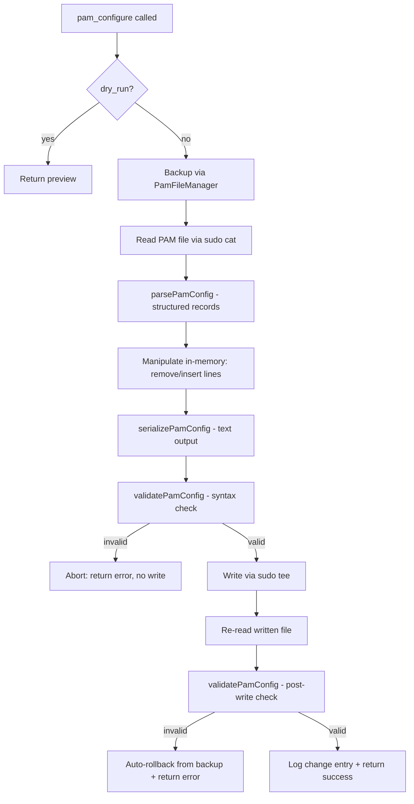
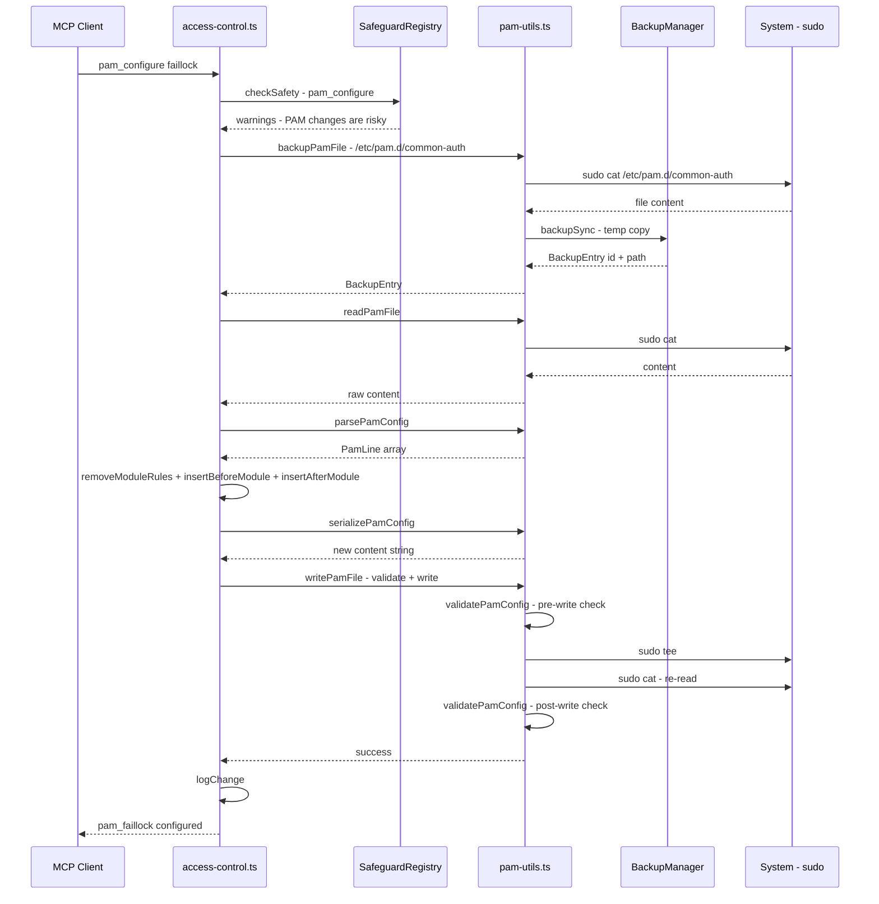
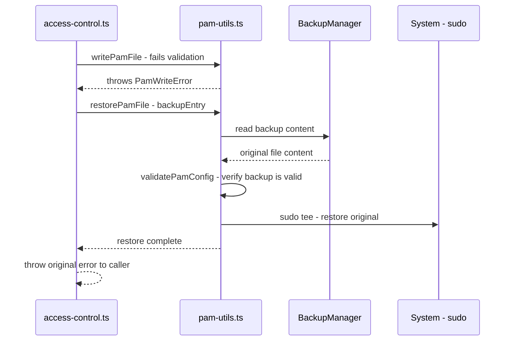

# PAM Hardening Fix — Architecture Plan

> **Status**: Draft  
> **Created**: 2026-03-14  
> **Scope**: Fix critical PAM config corruption bug in `access_control` tool  
> **Risk**: **Critical** — the current code can lock users out of their system

---

## 1. Problem Statement

The `access_control` tool with `action=pam_configure, module=faillock` uses sed commands to modify `/etc/pam.d/common-auth`. These sed commands **corrupt PAM config lines** by stripping whitespace separators, producing unparseable entries like `authrequiredpam_faillock.so` instead of `auth    required    pam_faillock.so`.

### Root Cause

In [`src/tools/access-control.ts`](../src/tools/access-control.ts:1232), three sequential sed commands manipulate the PAM file:

1. **Line deletion** (line 1222): `sed -i /pam_faillock\.so/d` — works correctly
2. **Insert before** (line 1233): `sed -i 0,/pam_unix\.so/s|.*pam_unix\.so.*|${preLine}\n&|` — the replacement string `${preLine}` contains multi-space separators and bracket syntax (`[default=die]`) that sed interprets as special characters, collapsing whitespace
3. **Insert after** (line 1245): `sed -i 0,/pam_unix\.so/{/pam_unix\.so/a\${authLine}}` — the `a\` append command followed by content containing brackets and multiple spaces causes further corruption

The corrupted output makes PAM unable to parse its config, which **blocks all authentication** including sudo and login.

### Additional Issues

- Backup uses ad-hoc `sudo cp` (line 1215) instead of the project's [`BackupManager`](../src/core/backup-manager.ts:95)
- No validation of the written file after modification
- No automatic rollback if the write produces invalid output
- The `pwquality` path (line 1116) has the same ad-hoc backup problem

---

## 2. Solution Overview

Replace all sed-based PAM manipulation with an **in-memory PAM config parser/generator** that:

1. Reads the file into structured records
2. Manipulates the data structure (insert, remove, reorder)
3. Serializes back with correct formatting
4. Validates the output before writing
5. Writes atomically with mandatory backup and auto-rollback



---

## 3. New File: `src/core/pam-utils.ts`

A reusable PAM config parser, generator, and validator.

### 3.1 Type Definitions

```typescript
// ── PAM Line Types ──────────────────────────────────────────────

/** Base type for any line in a PAM config file. */
interface PamLineBase {
  /** 1-based line number from the original file (0 if newly created). */
  lineNumber: number;
  /** The original raw text (preserved for round-trip fidelity). */
  raw: string;
}

/** A PAM rule line: type control module [args...] */
export interface PamRule extends PamLineBase {
  kind: "rule";
  /** PAM type: auth, account, password, session */
  pamType: string;
  /** Control flag: required, requisite, sufficient, optional, or [value=action ...] */
  control: string;
  /** Module path/name: pam_unix.so, pam_faillock.so, etc. */
  module: string;
  /** Module arguments: nullok, silent, deny=5, etc. */
  args: string[];
}

/** A comment line (starts with #). */
export interface PamComment extends PamLineBase {
  kind: "comment";
}

/** A blank/empty line. */
export interface PamBlank extends PamLineBase {
  kind: "blank";
}

/** An include directive (@include, -auth, etc.). */
export interface PamInclude extends PamLineBase {
  kind: "include";
  /** The directive keyword: @include, -auth, -account, etc. */
  directive: string;
  /** The included file/module name. */
  target: string;
}

/** Union of all PAM line types. */
export type PamLine = PamRule | PamComment | PamBlank | PamInclude;
```

### 3.2 Parser: [`parsePamConfig()`](../src/core/pam-utils.ts)

```typescript
/**
 * Parse PAM config file content into structured records.
 *
 * Handles:
 * - Standard rules: auth required pam_unix.so nullok
 * - Complex controls: auth [success=1 default=ignore] pam_unix.so
 * - Comments: # This is a comment
 * - Blank lines: (preserved for formatting fidelity)
 * - Include directives: @include common-auth
 * - Substack/optional includes: -auth [success=1] pam_unix.so
 *
 * @param content - Raw PAM config file text
 * @returns Array of PamLine records in file order
 */
export function parsePamConfig(content: string): PamLine[];
```

**Parsing rules:**

1. Split content on `\n`
2. For each line (1-indexed):
   - If empty or whitespace-only → `PamBlank`
   - If starts with `#` → `PamComment`
   - If starts with `@include` → `PamInclude` (split on whitespace, second token is target)
   - Otherwise → attempt to parse as `PamRule`:
     - Token 1: `pamType` (auth|account|password|session), possibly prefixed with `-`
     - Token 2: `control` — if starts with `[`, consume everything up to and including `]`
     - Token 3: `module` — the `.so` module name
     - Remaining tokens: `args`
   - If rule parsing fails (< 3 fields), store as `PamComment` with the raw text and log a warning — **never discard lines**

**Critical**: The parser must be **lossless**. Every line in the input must appear in the output array. Unknown/unparseable lines are preserved as-is (stored as comments with a warning flag) to prevent silent data loss.

### 3.3 Serializer: [`serializePamConfig()`](../src/core/pam-utils.ts)

```typescript
/**
 * Serialize structured PAM records back to file content.
 *
 * For PamRule records, generates lines with consistent formatting:
 *   - Fields separated by 4-space padding (tab-equivalent)
 *   - Module args separated by single spaces
 *
 * For PamComment, PamBlank, and PamInclude records, the original
 * raw text is emitted unchanged (round-trip preservation).
 *
 * @param lines - Array of PamLine records
 * @returns PAM config file content string (with trailing newline)
 */
export function serializePamConfig(lines: PamLine[]): string;
```

**Serialization rules for `PamRule`:**

```
{pamType}    {control}    {module} {args.join(" ")}
```

- Use 4 spaces between `pamType` and `control`
- Use 4 spaces between `control` and `module`
- Use single space between `module` and each arg
- This matches the canonical PAM formatting used by `pam-auth-update`

For all other line types, emit `line.raw` unchanged.

### 3.4 Manipulation Helpers

```typescript
/** Create a new PamRule record (lineNumber=0 since it's new). */
export function createPamRule(
  pamType: string,
  control: string,
  module: string,
  args: string[]
): PamRule;

/** Find all rules referencing a specific module (e.g., "pam_faillock.so"). */
export function findModuleRules(lines: PamLine[], module: string): PamRule[];

/** Remove all rules referencing a specific module. Returns new array. */
export function removeModuleRules(lines: PamLine[], module: string): PamLine[];

/**
 * Insert a new rule BEFORE the first rule matching targetModule.
 * If targetModule is not found, appends at the end.
 * Returns new array.
 */
export function insertBeforeModule(
  lines: PamLine[],
  targetModule: string,
  newRule: PamRule
): PamLine[];

/**
 * Insert a new rule AFTER the first rule matching targetModule.
 * If targetModule is not found, appends at the end.
 * Returns new array.
 */
export function insertAfterModule(
  lines: PamLine[],
  targetModule: string,
  newRule: PamRule
): PamLine[];
```

### 3.5 Validator: [`validatePamConfig()`](../src/core/pam-utils.ts)

```typescript
export interface PamValidationError {
  /** 1-based line number in the file. */
  line: number;
  /** The problematic line content. */
  content: string;
  /** Human-readable error description. */
  message: string;
}

export interface PamValidationResult {
  valid: boolean;
  errors: PamValidationError[];
  /** Count of parseable rule lines. */
  ruleCount: number;
}

/**
 * Validate PAM config content for syntactic correctness.
 *
 * Checks:
 * 1. Every non-comment, non-blank line has >= 3 whitespace-separated fields
 *    (or is a recognized include directive)
 * 2. The pamType field is one of: auth, account, password, session
 *    (optionally prefixed with -)
 * 3. The module field ends with .so
 * 4. At least one pam_unix.so rule exists (sanity check — PAM needs it)
 * 5. No line contains field concatenation (e.g., "authrequired" without space)
 *
 * Does NOT check:
 * - Whether .so files exist on disk (separate function)
 * - Semantic correctness of control flags
 *
 * @param content - Raw PAM config file text
 * @returns Validation result with error details
 */
export function validatePamConfig(content: string): PamValidationResult;

/**
 * Check whether a PAM module .so file exists on the local system.
 * Searches common library paths:
 *   - /lib/x86_64-linux-gnu/security/
 *   - /lib/security/
 *   - /lib64/security/
 *   - /usr/lib/x86_64-linux-gnu/security/
 *   - /usr/lib/security/
 *
 * @param moduleName - Module filename (e.g., "pam_faillock.so")
 * @returns true if the module exists on disk
 */
export function pamModuleExists(moduleName: string): boolean;
```

### 3.6 PAM File I/O Manager

Since PAM files are owned by root, we need sudo-aware read/write/backup/restore:

```typescript
/**
 * Read a PAM config file via sudo.
 * @param filePath - Absolute path (e.g., /etc/pam.d/common-auth)
 * @returns File content string
 * @throws If sudo cat fails
 */
export async function readPamFile(filePath: string): Promise<string>;

/**
 * Write a PAM config file via sudo tee, with mandatory pre-write validation.
 *
 * Steps:
 * 1. Validate the content with validatePamConfig()
 * 2. If invalid, throw PamValidationError (never write bad content)
 * 3. Write via sudo tee
 * 4. Re-read the written file
 * 5. Validate the re-read content
 * 6. If post-write validation fails, throw (caller handles rollback)
 *
 * @param filePath - Absolute path
 * @param content - Validated PAM config content
 * @throws PamWriteError if validation fails pre or post-write
 */
export async function writePamFile(filePath: string, content: string): Promise<void>;

/**
 * Backup a PAM file using the project BackupManager.
 *
 * Since PAM files are root-owned, this:
 * 1. Reads content via sudo cat
 * 2. Writes to a temp file in BackupManager's directory
 * 3. Registers it in the backup manifest
 *
 * @param filePath - PAM file to backup
 * @returns BackupEntry with id for later restore
 */
export async function backupPamFile(filePath: string): Promise<BackupEntry>;

/**
 * Restore a PAM file from backup.
 *
 * 1. Reads backup content from BackupManager's directory
 * 2. Validates the backup content (refuse to restore garbage)
 * 3. Writes back via sudo tee
 *
 * @param backupEntry - The BackupEntry from backupPamFile()
 */
export async function restorePamFile(backupEntry: BackupEntry): Promise<void>;
```

### 3.7 Error Types

```typescript
/** Thrown when PAM config validation fails. */
export class PamValidationError extends Error {
  constructor(
    public readonly errors: PamValidationError[],
    public readonly filePath: string
  ) {
    super(
      `PAM config validation failed for ${filePath}: ` +
      errors.map(e => `line ${e.line}: ${e.message}`).join("; ")
    );
    this.name = "PamValidationError";
  }
}

/** Thrown when PAM file write fails or post-write validation fails. */
export class PamWriteError extends Error {
  constructor(
    message: string,
    public readonly filePath: string,
    public readonly backupId?: string
  ) {
    super(message);
    this.name = "PamWriteError";
  }
}
```

---

## 4. Changes to `src/tools/access-control.ts`

### 4.1 Faillock Handler Rewrite (lines 1174–1279)

Replace the entire faillock section with the safe PAM manipulation flow.

**Before** (current buggy code):
```typescript
// Three sed commands that corrupt whitespace
await executeCommand({ command: "sudo", args: ["sed", "-i", ...] });
await executeCommand({ command: "sudo", args: ["sed", "-i", ...] });
await executeCommand({ command: "sudo", args: ["sed", "-i", ...] });
```

**After** (new safe code):

```typescript
import {
  parsePamConfig,
  serializePamConfig,
  validatePamConfig,
  createPamRule,
  removeModuleRules,
  insertBeforeModule,
  insertAfterModule,
  readPamFile,
  writePamFile,
  backupPamFile,
  restorePamFile,
} from "../core/pam-utils.js";

// ── module === "faillock" ─────────────────────────────────

// 1. Backup
const backupEntry = await backupPamFile(targetFile);

try {
  // 2. Read & parse
  const content = await readPamFile(targetFile);
  let lines = parsePamConfig(content);

  // 3. Remove existing faillock lines
  lines = removeModuleRules(lines, "pam_faillock.so");

  // 4. Create new rules
  const failArgs = [
    `deny=${merged.deny}`,
    `unlock_time=${merged.unlock_time}`,
    `fail_interval=${merged.fail_interval}`,
  ];

  const preRule = createPamRule("auth", "required", "pam_faillock.so", [
    "preauth", "silent", ...failArgs,
  ]);
  const authFailRule = createPamRule("auth", "[default=die]", "pam_faillock.so", [
    "authfail", ...failArgs,
  ]);

  // 5. Insert before/after pam_unix.so
  lines = insertBeforeModule(lines, "pam_unix.so", preRule);
  lines = insertAfterModule(lines, "pam_unix.so", authFailRule);

  // 6. Serialize & validate
  const newContent = serializePamConfig(lines);

  // 7. Write (validates pre and post-write internally)
  await writePamFile(targetFile, newContent);

} catch (err) {
  // 8. Auto-rollback on ANY failure
  try {
    await restorePamFile(backupEntry);
  } catch (restoreErr) {
    // Log restore failure but throw original error
    console.error(`[access_control] CRITICAL: PAM rollback failed: ${restoreErr}`);
  }
  throw err;
}
```

### 4.2 Pwquality Handler Backup Fix (lines 1116–1152)

The pwquality handler modifies `/etc/security/pwquality.conf` (a key=value file, not PAM syntax). The fix here is narrower:

1. Replace ad-hoc `sudo cp` backup with [`backupPamFile()`](../src/core/pam-utils.ts) (rename to `backupRootFile()` for generality, or keep `backupPamFile` since it works for any root-owned file)
2. Wrap the write in try/catch with rollback
3. The pwquality file doesn't need PAM syntax validation (it's key=value), but we should verify the write succeeded

### 4.3 Imports to Add

```typescript
import {
  parsePamConfig,
  serializePamConfig,
  validatePamConfig,
  createPamRule,
  removeModuleRules,
  insertBeforeModule,
  insertAfterModule,
  readPamFile,
  writePamFile,
  backupPamFile,
  restorePamFile,
  PamWriteError,
} from "../core/pam-utils.js";
```

### 4.4 Dry-Run Behavior

Dry-run mode (lines 1192–1211) is **unchanged** — it already produces a preview without writing. The new code only affects the non-dry-run path.

---

## 5. Changes to `src/core/safeguards.ts`

### 5.1 New PAM Operations Array

Add alongside the existing operation arrays (after line 74):

```typescript
const PAM_OPERATIONS = [
  "pam_configure", "pam", "faillock", "pwquality",
  "common-auth", "common-password", "system-auth",
];
```

### 5.2 PAM Safety Check in [`checkSafety()`](../src/core/safeguards.ts:333)

Add a new blocker section after the existing SSH lockout blocker (after line 484):

```typescript
// E. PAM lockout prevention — warn on PAM modifications, block if SSH session
if (matchesAny(operation, PAM_OPERATIONS)) {
  warnings.push(
    "PAM configuration changes affect system authentication. " +
    "A corrupted PAM config can lock you out of the system entirely."
  );

  if (isSSHSession()) {
    warnings.push(
      "WARNING: Modifying PAM configuration while connected via SSH. " +
      "If authentication breaks, you may lose access to this system. " +
      "Ensure you have physical/console access as a fallback."
    );
  }
}
```

> **Design decision**: This is a **warning, not a blocker**. PAM modification over SSH is risky but sometimes necessary. The real safety net is the validation + auto-rollback in the write path, not blocking the operation.

---

## 6. Integration Flow

### 6.1 Complete PAM Modification Sequence



### 6.2 Rollback Sequence (on failure)



---

## 7. Test Strategy

### 7.1 New Test File: `tests/core/pam-utils.test.ts`

#### Parser Tests

| Test | Input | Expected |
|------|-------|----------|
| Parses standard rule | `auth    required    pam_unix.so nullok` | `PamRule` with pamType=auth, control=required, module=pam_unix.so, args=[nullok] |
| Parses complex control | `auth    [success=1 default=ignore]    pam_unix.so` | `PamRule` with control=`[success=1 default=ignore]` |
| Preserves comments | `# PAM config` | `PamComment` with raw preserved |
| Preserves blank lines | `""` | `PamBlank` |
| Parses @include | `@include common-auth` | `PamInclude` with target=common-auth |
| Round-trip fidelity | Parse then serialize a real common-auth file | Output matches input exactly |
| Handles irregular spacing | `auth\trequired\t\tpam_unix.so` | Correctly parsed, serialized with normalized spacing |
| Never drops lines | File with 20 lines → parse → array length is 20 |

#### Serializer Tests

| Test | Input | Expected |
|------|-------|----------|
| Formats rule correctly | `createPamRule("auth", "required", "pam_faillock.so", ["preauth"])` | `auth    required    pam_faillock.so preauth` |
| Preserves comment raw text | `PamComment` with raw `# test` | `# test` |
| Adds trailing newline | Any input | Output ends with `\n` |

#### Manipulation Tests

| Test | Description |
|------|-------------|
| `removeModuleRules` removes only matching module | Remove pam_faillock.so, verify pam_unix.so remains |
| `insertBeforeModule` places line correctly | Insert before pam_unix.so, verify order |
| `insertAfterModule` places line correctly | Insert after pam_unix.so, verify order |
| Insert when target not found | Appends at end |
| Multiple operations compose | Remove → insert before → insert after produces correct result |

#### Validator Tests

| Test | Input | Expected |
|------|-------|----------|
| Valid config passes | Real Debian common-auth content | `valid: true, errors: []` |
| Missing whitespace fails | `authrequiredpam_unix.so` | `valid: false`, error on that line |
| Missing module field fails | `auth    required` | `valid: false` |
| Invalid pamType fails | `foo    required    pam_unix.so` | `valid: false` |
| Missing pam_unix.so warns | Config without any pam_unix.so rule | Error: no pam_unix.so |
| Comments and blanks are fine | `# comment\n\n# another` | `valid: true` |

#### Backup/Restore Tests (mocked sudo)

| Test | Description |
|------|-------------|
| `backupPamFile` reads via sudo and stores in BackupManager | Mock executeCommand, verify BackupManager.backupSync called |
| `restorePamFile` writes backup content via sudo tee | Mock executeCommand, verify tee called with correct content |
| `writePamFile` rejects invalid content pre-write | Pass concatenated-field content, verify it throws, verify tee NOT called |
| `writePamFile` rolls back on post-write validation failure | Mock re-read to return corrupted content, verify error thrown |

### 7.2 Updated Test File: `tests/tools/access-control.test.ts`

Add PAM-specific integration tests alongside existing SSH tests:

```typescript
describe("pam_configure - faillock", () => {
  it("should produce valid PAM output in dry-run mode", async () => {
    const result = await handler({
      action: "pam_configure",
      module: "faillock",
      dry_run: true,
    });
    expect(result.isError).toBeUndefined();
    expect(result.content[0].text).toContain("pam_faillock.so");
    expect(result.content[0].text).toContain("DRY-RUN");
  });

  it("should call backupPamFile before modification", async () => {
    // Mock executeCommand to return valid common-auth content
    // Verify backupPamFile is called before writePamFile
  });

  it("should auto-rollback if writePamFile throws", async () => {
    // Mock writePamFile to throw PamWriteError
    // Verify restorePamFile is called
    // Verify the handler returns isError: true
  });

  it("should not corrupt whitespace in PAM output", async () => {
    // THE critical regression test:
    // Mock readPamFile to return real common-auth content
    // Call the handler with non-dry-run
    // Capture the content passed to writePamFile
    // Verify every non-comment non-blank line has >= 3 space-separated fields
  });

  it("should insert faillock lines in correct position relative to pam_unix", async () => {
    // Mock readPamFile with known content
    // Verify preauth line appears BEFORE pam_unix
    // Verify authfail line appears AFTER pam_unix
  });
});

describe("pam_configure - pwquality", () => {
  it("should backup before writing pwquality.conf", async () => {
    // Verify backup is created before tee is called
  });
});
```

### 7.3 Test Data Fixtures

Create `tests/fixtures/pam/` with real-world PAM config samples:

| File | Content |
|------|---------|
| `common-auth-debian.txt` | Default Debian 12 `/etc/pam.d/common-auth` |
| `common-auth-ubuntu.txt` | Default Ubuntu 24.04 `/etc/pam.d/common-auth` |
| `system-auth-rhel.txt` | Default RHEL 9 `/etc/pam.d/system-auth` |
| `common-auth-with-faillock.txt` | A config that already has pam_faillock lines |
| `common-auth-corrupted.txt` | The corrupted output from the current bug |

---

## 8. File Inventory

| File | Action | Description |
|------|--------|-------------|
| `src/core/pam-utils.ts` | **NEW** | PAM parser, serializer, validator, file I/O manager |
| `src/tools/access-control.ts` | **MODIFY** | Replace sed commands with pam-utils calls (lines 1116-1279) |
| `src/core/safeguards.ts` | **MODIFY** | Add PAM_OPERATIONS array and warning in checkSafety |
| `tests/core/pam-utils.test.ts` | **NEW** | Unit tests for all pam-utils functions |
| `tests/tools/access-control.test.ts` | **MODIFY** | Add pam_configure integration tests |
| `tests/fixtures/pam/*.txt` | **NEW** | Real PAM config test fixtures |

---

## 9. Design Constraints & Decisions

### 9.1 Why Not a Blocker?

The SafeguardRegistry PAM check is a **warning, not a blocker**, because:
- PAM modification is a legitimate security hardening operation
- The real safety net is validation + auto-rollback, not preventing the operation
- Blocking would make the tool useless for its primary purpose
- The SSH blocker pattern (block SSH changes during SSH session) doesn't apply — PAM changes don't immediately affect the current session

### 9.2 Why In-Memory Parsing Instead of Fixing the Sed Commands?

Fixing the sed expressions (e.g., escaping brackets, quoting whitespace) would be a band-aid:
- Sed behavior varies across GNU/BSD implementations
- Shell escaping of complex PAM syntax (`[default=die]`) is fragile
- Future PAM changes would reintroduce similar bugs
- In-memory manipulation is testable; sed one-liners are not

### 9.3 Sudo Requirements

PAM files (`/etc/pam.d/*`) are owned by root. All reads use `sudo cat`, all writes use `sudo tee`. This matches the existing pattern in [`access-control.ts`](../src/tools/access-control.ts:1124) and works with the project's sudo session management in [`executor.ts`](../src/core/executor.ts:1).

### 9.4 BackupManager Integration

The existing [`BackupManager`](../src/core/backup-manager.ts:95) stores backups in `~/.kali-defense/backups/` (user-writable). Since PAM files are root-owned, `backupPamFile()` reads via `sudo cat` and writes the content into BackupManager's directory as a user-owned copy. Restore reverses this: reads from BackupManager's directory and writes back via `sudo tee`.

### 9.5 Atomic Write Consideration

[`secure-fs.ts`](../src/core/secure-fs.ts:144) provides `atomicWriteFileSync()` (write-to-temp, then rename). This **cannot be used** for PAM files because:
- PAM files are root-owned in `/etc/pam.d/`
- The temp file and rename must happen as root
- We use `sudo tee` instead, which is not atomic

The validation + rollback strategy compensates for this limitation.

### 9.6 Round-Trip Fidelity

The parser preserves original line text in `raw` fields. For **existing** lines (comments, includes, unmodified rules), the serializer emits `raw` as-is. For **new** rules created by `createPamRule()`, the serializer generates canonical formatting. This means modifications don't reformat the entire file — only touched lines change.

---

## 10. Implementation Order

1. **`src/core/pam-utils.ts`** — parser, serializer, validator, helpers (no external dependencies except executor)
2. **`tests/core/pam-utils.test.ts`** + **`tests/fixtures/pam/`** — test the parser/serializer/validator in isolation
3. **`src/tools/access-control.ts`** — rewrite faillock handler, fix pwquality backup
4. **`tests/tools/access-control.test.ts`** — integration tests for pam_configure
5. **`src/core/safeguards.ts`** — add PAM warning (smallest change, lowest risk)
