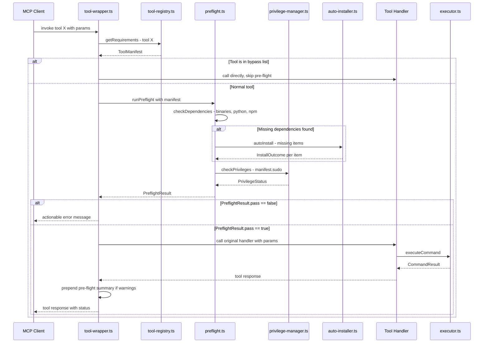
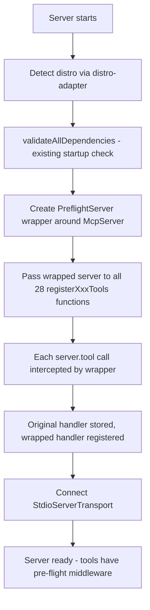
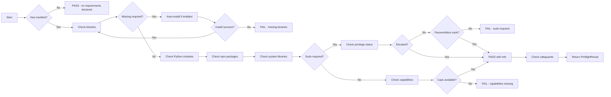
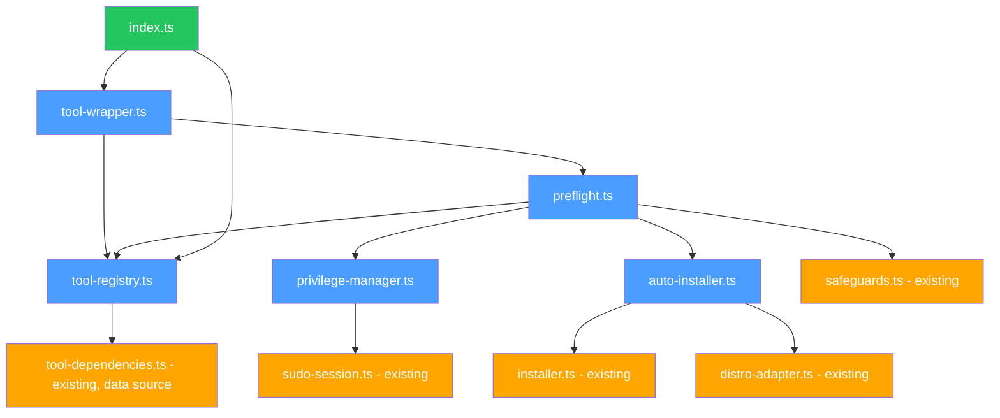

# Pre-flight Validation System — Architecture Document

> **Status**: Implemented (v0.3.0+, updated in v0.5.0)
> **Scope**: defense-mcp-server v0.5.0
> **Author**: Architecture session 2026-03-03

---

## 1. Problem Statement

The defense-mcp-server has 78 MCP tools across 21 tool modules. Rich infrastructure already exists for dependency checking (`dependency-validator.ts`), cross-distro installation (`installer.ts`), privilege management (`sudo-session.ts`), and application safety detection (`safeguards.ts`) — but originally **none of it was wired into tool invocations**. Tools would execute blindly and fail with raw shell errors when:

- A required binary is missing (e.g., `rkhunter`, `lynis`, `nmap`)
- Sudo credentials haven't been provided via `sudo_elevate`
- A Linux capability like `CAP_NET_RAW` is needed but unavailable
- A Python module or npm package is missing

The result: cryptic `spawn ENOENT` or `sudo: a password is required` errors returned to the MCP client, with no actionable guidance.

---

## 2. Design Goals

1. **Zero tool-file modifications** — The 29 existing tool files must not change
2. **Automatic pre-flight** — Every tool invocation validates dependencies and privileges before the handler runs
3. **Actionable errors** — When pre-flight fails, return structured messages explaining what's missing and how to fix it
4. **Auto-remediation** — Missing binaries are installed silently when `KALI_DEFENSE_AUTO_INSTALL=true`
5. **Least privilege** — Never elevate the whole server; only specific subprocesses run under sudo
6. **Bypass for sudo tools** — `sudo_elevate`, `sudo_status`, `sudo_drop`, `sudo_extend` skip pre-flight (they manage the session itself)
7. **Performance** — Cached lookups; no re-checking binaries that were validated seconds ago

---

## 3. Architecture Overview

### 3.1 New Files

| File | Purpose |
|------|---------|
| `src/core/tool-registry.ts` | Enhanced dependency registry — single source of truth for all tool requirements |
| `src/core/privilege-manager.ts` | Privilege detection: UID/EUID, Linux capabilities, sudo availability |
| `src/core/auto-installer.ts` | Enhanced installer with multi-backend support (apt, pip, npm, cargo, binary download) |
| `src/core/preflight.ts` | Pre-flight orchestration engine — runs checks, returns structured results |
| `src/core/tool-wrapper.ts` | Middleware that intercepts `server.tool()` and injects pre-flight |

### 3.2 Modified Files

| File | Change |
|------|--------|
| `src/index.ts` | Wrap `server` with `createPreflightServer()` before passing to register functions |

### 3.3 Files Made Obsolete (Gradually)

| File | Replaced By |
|------|-------------|
| `src/core/tool-dependencies.ts` | `src/core/tool-registry.ts` (superset; old file kept for backward compat) |
| `src/core/dependency-validator.ts` | `src/core/preflight.ts` + `src/core/auto-installer.ts` (startup validation stays; `ensureDependencies()` superseded by pre-flight) |

---

## 4. Data Flow

### 4.1 Tool Invocation Flow



### 4.2 Startup Flow (Enhanced)



### 4.3 Pre-flight Engine Pipeline



---

## 5. File-by-File Design

### 5.1 `src/core/tool-registry.ts` — Enhanced Dependency Registry

This file replaces and extends `tool-dependencies.ts`. It is the **single source of truth** for what every tool needs.

#### Core Types

```typescript
// ── Dependency Types ─────────────────────────────────────────────────────────

/** A system binary dependency */
interface BinaryDependency {
  /** Binary name (e.g., "iptables", "nmap") */
  name: string;
  /** Whether this binary is required (true) or optional (false) */
  required: boolean;
  /** Minimum version if applicable (semver string) */
  minVersion?: string;
  /** Human-readable purpose: why this binary is needed */
  purpose?: string;
}

/** A Python module dependency */
interface PythonDependency {
  /** Module name (e.g., "yara-python") */
  module: string;
  /** pip package name if different from module */
  pipPackage?: string;
  required: boolean;
}

/** An npm package dependency */
interface NpmDependency {
  /** Package name (e.g., "cdxgen") */
  package: string;
  /** Whether to install globally */
  global: boolean;
  required: boolean;
}

/** A system shared library dependency */
interface LibraryDependency {
  /** Library name (e.g., "libssl") */
  name: string;
  /** .so file to check (e.g., "libssl.so") */
  soName: string;
  required: boolean;
}

/** A file that must exist on disk */
interface FileDependency {
  /** Absolute path to the file */
  path: string;
  /** Human-readable description */
  description: string;
  required: boolean;
}

/** Linux capability requirements */
type LinuxCapability =
  | "CAP_NET_RAW"
  | "CAP_NET_ADMIN"
  | "CAP_SYS_ADMIN"
  | "CAP_DAC_READ_SEARCH"
  | "CAP_AUDIT_CONTROL"
  | "CAP_AUDIT_READ"
  | "CAP_SYS_PTRACE"
  | "CAP_SETUID"
  | "CAP_SETGID";

/** Sudo requirement specification */
interface SudoRequirement {
  /** Whether any operation in this tool needs sudo */
  needed: boolean;
  /** Human-readable reason why sudo is needed */
  reason: string;
  /**
   * Specific subcommands that require sudo.
   * If empty, the entire tool needs sudo.
   * If specified, only these subcommands are elevated.
   */
  subcommands?: string[];
  /**
   * Whether the tool can degrade gracefully without sudo.
   * If true, the tool runs with reduced functionality.
   * If false, the tool cannot run at all without sudo.
   */
  degradable?: boolean;
}

// ── Tool Manifest ────────────────────────────────────────────────────────────

/**
 * Complete requirements manifest for a single MCP tool.
 * This is the enhanced replacement for ToolDependency.
 */
interface ToolManifest {
  /** The MCP tool name (e.g., "firewall_iptables_list") */
  toolName: string;

  /** Tool module category for grouping */
  category: string;

  /** System binary dependencies */
  binaries: BinaryDependency[];

  /** Python module dependencies */
  python?: PythonDependency[];

  /** npm package dependencies */
  npm?: NpmDependency[];

  /** System library dependencies */
  libraries?: LibraryDependency[];

  /** Files that must exist */
  files?: FileDependency[];

  /** Sudo/privilege requirements */
  sudo: SudoRequirement;

  /** Required Linux capabilities (beyond basic user) */
  capabilities?: LinuxCapability[];

  /** Whether this is a critical tool (warns loudly if broken) */
  critical?: boolean;

  /**
   * Tools that must be skipped by the pre-flight wrapper.
   * Used for sudo_elevate, sudo_drop, etc.
   */
  bypassPreflight?: boolean;

  /**
   * Tags for cross-cutting concerns.
   * E.g., "reads-system-files", "modifies-firewall", "network-capture"
   */
  tags?: string[];
}
```

#### Registry API

```typescript
/** Map-based registry with O(1) lookup */
class ToolRegistry {
  private manifests: Map<string, ToolManifest>;

  /** Get manifest for a tool, or undefined if unregistered */
  get(toolName: string): ToolManifest | undefined;

  /** Register or update a tool manifest */
  set(toolName: string, manifest: ToolManifest): void;

  /** Check if a tool has a manifest */
  has(toolName: string): boolean;

  /** Get all manifests */
  getAll(): ToolManifest[];

  /** Get manifests by category */
  getByCategory(category: string): ToolManifest[];

  /** Get all tools requiring sudo */
  getSudoTools(): ToolManifest[];

  /** Get all critical tools */
  getCriticalTools(): ToolManifest[];

  /** Get all unique required binaries across all tools */
  getAllRequiredBinaries(): string[];
}

/** Singleton registry instance */
const REGISTRY: ToolRegistry;

/** Export helper: get requirements for a specific tool */
function getToolManifest(toolName: string): ToolManifest | undefined;
```

#### Migration Strategy from `tool-dependencies.ts`

The registry is **pre-populated** by converting the existing `TOOL_DEPENDENCIES` array at module load time. Each old `ToolDependency` entry maps to a `ToolManifest`:

```typescript
// Auto-migration from legacy format
for (const legacy of TOOL_DEPENDENCIES) {
  REGISTRY.set(legacy.toolName, {
    toolName: legacy.toolName,
    category: inferCategory(legacy.toolName),
    binaries: [
      ...legacy.requiredBinaries.map(b => ({
        name: b, required: true
      })),
      ...(legacy.optionalBinaries ?? []).map(b => ({
        name: b, required: false
      })),
    ],
    sudo: inferSudoRequirement(legacy.toolName),
    critical: legacy.critical,
  });
}
```

The `inferSudoRequirement()` function uses a static map of tool names to sudo needs, derived from analyzing which tools call `command: "sudo"` in their handlers. Example:

```typescript
const SUDO_MAP: Record<string, SudoRequirement> = {
  firewall_iptables_list:  { needed: true, reason: "iptables requires root to list rules", degradable: false },
  firewall_iptables_add:   { needed: true, reason: "iptables requires root to modify rules", degradable: false },
  harden_sysctl_get:       { needed: true, reason: "sysctl requires root to read kernel parameters", degradable: false },
  harden_sysctl_set:       { needed: true, reason: "sysctl requires root to modify kernel parameters", degradable: false },
  access_ssh_audit:        { needed: true, reason: "Reading sshd_config requires root", degradable: true },
  // ... 130+ more entries
  defense_check_tools:     { needed: false, reason: "", degradable: true },
  defense_suggest_workflow: { needed: false, reason: "", degradable: true },
};
```

---

### 5.2 `src/core/privilege-manager.ts` — Privilege Manager

Detects the current privilege level and determines what the server process can do.

#### Types

```typescript
interface PrivilegeStatus {
  /** Current effective user ID */
  euid: number;
  /** Current real user ID */
  uid: number;
  /** Whether running as root (euid === 0) */
  isRoot: boolean;
  /** Current username */
  username: string;
  /** Whether SudoSession has cached credentials */
  hasSudoSession: boolean;
  /** Whether passwordless sudo is available */
  hasPasswordlessSudo: boolean | null; // null = not yet checked
  /** Linux capabilities available to the process */
  capabilities: LinuxCapability[];
  /** Groups the current user belongs to */
  groups: string[];
}

interface PrivilegeCheckResult {
  /** Whether the required privilege level is satisfied */
  satisfied: boolean;
  /** What's missing */
  missing: string[];
  /** Human-readable explanation of what's needed and why */
  explanation: string;
  /** Suggested remediation steps */
  remediation: string[];
}
```

#### Module API

```typescript
class PrivilegeManager {
  private static instance: PrivilegeManager | null;
  private cachedStatus: PrivilegeStatus | null;
  private cacheExpiry: number;

  static getInstance(): PrivilegeManager;

  /**
   * Get current privilege status (cached for 30 seconds).
   * Sources:
   *   - process.getuid() / process.geteuid()
   *   - SudoSession.getInstance().isElevated()
   *   - `capsh --print` or /proc/self/status CapEff line
   *   - `sudo -n true` to test passwordless sudo
   *   - `id -Gn` for group membership
   */
  async getStatus(): Promise<PrivilegeStatus>;

  /**
   * Check if a specific tool's privilege requirements are met.
   * Cross-references ToolManifest.sudo and ToolManifest.capabilities
   * against the current PrivilegeStatus.
   */
  async checkForTool(manifest: ToolManifest): Promise<PrivilegeCheckResult>;

  /**
   * Parse Linux capabilities from /proc/self/status.
   * Reads CapEff line and decodes the hex bitmask.
   */
  private parseCapabilities(): Promise<LinuxCapability[]>;

  /**
   * Test if passwordless sudo is available.
   * Runs: sudo -n true (non-interactive, no password)
   */
  private testPasswordlessSudo(): Promise<boolean>;

  /** Invalidate the cached status */
  invalidate(): void;
}
```

#### Capability Detection Strategy

```typescript
// /proc/self/status contains CapEff as hex bitmask
// Parse it and check specific bits:
const CAP_BIT_MAP: Record<LinuxCapability, number> = {
  CAP_NET_RAW:          13,
  CAP_NET_ADMIN:        12,
  CAP_SYS_ADMIN:        21,
  CAP_DAC_READ_SEARCH:   2,
  CAP_AUDIT_CONTROL:    30,
  CAP_AUDIT_READ:       37,
  CAP_SYS_PTRACE:       19,
  CAP_SETUID:            7,
  CAP_SETGID:            6,
};
```

---

### 5.3 `src/core/auto-installer.ts` — Enhanced Auto-Installer

Extends the existing `installer.ts` with multi-backend support. The existing installer is retained and used as the primary backend; this module adds fallback strategies.

#### Types

```typescript
type InstallBackend =
  | "system-package"   // apt, dnf, pacman, etc.
  | "pip"              // pip install
  | "npm"              // npm install -g
  | "cargo"            // cargo install
  | "go"               // go install
  | "binary-download"  // wget/curl precompiled binary
  | "vendored";        // bundled in the repo

interface InstallAttempt {
  backend: InstallBackend;
  package: string;
  success: boolean;
  message: string;
  durationMs: number;
}

interface AutoInstallResult {
  /** Overall success - at least one method worked */
  success: boolean;
  /** Binary name that was being installed */
  binary: string;
  /** All attempts made, in order */
  attempts: InstallAttempt[];
  /** The backend that succeeded (if any) */
  successfulBackend?: InstallBackend;
}
```

#### Module API

```typescript
class AutoInstaller {
  private static instance: AutoInstaller | null;

  static getInstance(): AutoInstaller;

  /**
   * Install a missing binary, trying multiple backends in order:
   * 1. System package manager (via existing installer.ts)
   * 2. pip (for Python tools)
   * 3. npm -g (for Node tools like cdxgen)
   * 4. Binary download from known URLs
   * 5. Vendored copy
   *
   * Returns after the first successful backend.
   * Logs all attempts.
   */
  async installBinary(binary: string): Promise<AutoInstallResult>;

  /**
   * Install a Python module via pip.
   */
  async installPythonModule(module: PythonDependency): Promise<InstallAttempt>;

  /**
   * Install an npm package globally.
   */
  async installNpmPackage(pkg: NpmDependency): Promise<InstallAttempt>;

  /**
   * Detect available package managers on the system.
   * Returns ordered list: system pkg mgr first, then pip, npm, etc.
   */
  private async detectBackends(): Promise<InstallBackend[]>;

  /**
   * Known binary download URLs for tools not in system repos.
   * E.g., trivy, grype, cosign, slsa-verifier.
   */
  private readonly DOWNLOAD_URLS: Map<string, string>;
}
```

#### Trusted Download Sources

```typescript
// Pre-approved download URLs for security tools
const TRUSTED_DOWNLOADS: Record<string, {url: string; verify: string}> = {
  trivy: {
    url: "https://github.com/aquasecurity/trivy/releases/latest/download/trivy_Linux-64bit.tar.gz",
    verify: "sha256"
  },
  grype: {
    url: "https://raw.githubusercontent.com/anchore/grype/main/install.sh",
    verify: "sha256"
  },
  // Only well-known, checksummed sources
};
```

---

### 5.4 `src/core/preflight.ts` — Pre-flight Engine

The orchestrator that runs all checks in the correct order and produces a structured result.

#### Types

```typescript
/** Status of a single check item */
type CheckStatus = "pass" | "fail" | "warn" | "skipped" | "installed";

interface CheckItem {
  /** What was checked */
  name: string;
  /** Category: "binary", "python", "npm", "library", "file", "privilege", "capability", "safety" */
  category: string;
  /** Result of the check */
  status: CheckStatus;
  /** Human-readable detail */
  detail: string;
}

interface PreflightResult {
  /** Overall pass/fail */
  pass: boolean;

  /** The tool that was checked */
  toolName: string;

  /** All individual check items */
  checks: CheckItem[];

  /** Items that were auto-installed during this pre-flight */
  installed: CheckItem[];

  /** Privilege status summary */
  privilege: {
    sudoNeeded: boolean;
    sudoAvailable: boolean;
    explanation: string;
  };

  /** Safety warnings from SafeguardRegistry */
  safetyWarnings: string[];

  /** Total pre-flight duration in milliseconds */
  durationMs: number;

  /**
   * Formatted human-readable summary for prepending to tool output.
   * Only non-empty when there are warnings or installs to report.
   */
  summary: string;

  /**
   * Formatted error message when pass === false.
   * Includes what's missing, why, and how to fix it.
   */
  errorMessage: string;
}
```

#### Module API

```typescript
/**
 * Run the pre-flight check pipeline for a tool.
 *
 * Pipeline order:
 *   1. Dependency checks (binaries, python, npm, libraries, files)
 *   2. Auto-install for missing items (if enabled)
 *   3. Re-check after installation
 *   4. Privilege/capability checks
 *   5. Safety checks (via SafeguardRegistry)
 *   6. Compile result
 */
async function runPreflight(
  toolName: string,
  manifest: ToolManifest | undefined
): Promise<PreflightResult>;

/**
 * Format a failed PreflightResult into an MCP-compatible error response.
 */
function formatPreflightError(result: PreflightResult): {
  content: Array<{ type: "text"; text: string }>;
  isError: true;
};

/**
 * Format pre-flight warnings as a status banner to prepend to tool output.
 * Returns empty string if no warnings.
 */
function formatPreflightBanner(result: PreflightResult): string;
```

#### Caching Strategy

Pre-flight results are cached per tool name with a 60-second TTL. If the same tool is invoked again within 60 seconds, the cached `PreflightResult` is reused — unless it failed (failures are never cached, to allow immediate retry after fixing the issue).

```typescript
const preflightCache = new Map<string, {
  result: PreflightResult;
  timestamp: number;
}>();

const CACHE_TTL_MS = 60_000;

function getCachedResult(toolName: string): PreflightResult | null {
  const entry = preflightCache.get(toolName);
  if (!entry) return null;
  if (!entry.result.pass) return null; // Never cache failures
  if (Date.now() - entry.timestamp > CACHE_TTL_MS) {
    preflightCache.delete(toolName);
    return null;
  }
  return entry.result;
}
```

---

### 5.5 `src/core/tool-wrapper.ts` — Middleware Wrapper

The critical integration point. This module provides a function that wraps `McpServer` to intercept all `.tool()` registrations.

#### Strategy: Proxy the `.tool()` Method

The wrapper creates a `Proxy` around `McpServer` that intercepts the `tool` property. When a tool file calls `server.tool(name, desc, schema, handler)`, the proxy:

1. Stores the original handler
2. Creates a new handler that runs pre-flight first
3. Calls the real `server.tool()` with the wrapped handler

This is **transparent** to all 29 tool files — they receive what looks like a normal `McpServer`.

#### Types

```typescript
/** Tools that skip pre-flight entirely */
const BYPASS_TOOLS = new Set<string>([
  "sudo_elevate",
  "sudo_status",
  "sudo_drop",
  "sudo_extend",
]);

/** Options for the wrapper */
interface WrapperOptions {
  /** Additional tools to bypass */
  additionalBypass?: string[];
  /** Whether to enable pre-flight (can be disabled globally) */
  enabled?: boolean;
  /** Whether to prepend status banners to successful responses */
  prependBanners?: boolean;
}

/**
 * The MCP tool handler return type (derived from SDK).
 * This matches what server.tool() expects.
 */
type ToolResponse = {
  content: Array<{ type: "text"; text: string }>;
  isError?: boolean;
};
```

#### Module API

```typescript
/**
 * Creates a proxied McpServer that wraps every .tool() registration
 * with pre-flight validation.
 *
 * Usage in index.ts:
 *   const server = new McpServer({...});
 *   const wrapped = createPreflightServer(server);
 *   registerFirewallTools(wrapped);  // tools register on the proxy
 *   await server.connect(transport); // connect uses the real server
 */
function createPreflightServer(
  server: McpServer,
  options?: WrapperOptions
): McpServer;
```

#### Implementation Sketch

```typescript
function createPreflightServer(
  server: McpServer,
  options: WrapperOptions = {}
): McpServer {
  const { enabled = true, prependBanners = true } = options;
  const bypassSet = new Set([...BYPASS_TOOLS, ...(options.additionalBypass ?? [])]);

  // Save reference to the original .tool() method
  const originalTool = server.tool.bind(server);

  // Create a proxy that intercepts .tool() calls
  return new Proxy(server, {
    get(target, prop, receiver) {
      if (prop === "tool") {
        // Return a wrapped .tool() function
        return (
          name: string,
          description: string,
          schema: Record<string, unknown>,
          handler: Function
        ) => {
          if (!enabled || bypassSet.has(name)) {
            // Register without wrapping
            return originalTool(name, description, schema, handler);
          }

          // Create wrapped handler
          const wrappedHandler = async (params: unknown) => {
            const manifest = getToolManifest(name);
            const result = await runPreflight(name, manifest);

            if (!result.pass) {
              return formatPreflightError(result);
            }

            // Call the original handler
            const response = await handler(params);

            // Optionally prepend status banner
            if (prependBanners && result.summary) {
              // Prepend to first text content
              if (response.content?.[0]?.type === "text") {
                response.content[0].text =
                  result.summary + "\n\n" + response.content[0].text;
              }
            }

            return response;
          };

          // Register with the real server using wrapped handler
          return originalTool(name, description, schema, wrappedHandler);
        };
      }

      // Pass through all other property accesses
      return Reflect.get(target, prop, receiver);
    },
  });
}
```

#### Overload Handling

The MCP SDK `server.tool()` method supports multiple call signatures:

```typescript
// Signature 1: (name, handler)
// Signature 2: (name, description, handler)
// Signature 3: (name, schema, handler)
// Signature 4: (name, description, schema, handler)
```

The wrapper must detect which overload is being used by inspecting argument types:

```typescript
// Inside the proxy's .tool() replacement
return (...args: unknown[]) => {
  let name: string;
  let handler: Function;

  // Detect overload by argument count and types
  if (args.length === 2 && typeof args[1] === "function") {
    // (name, handler)
    name = args[0] as string;
    handler = args[1] as Function;
  } else if (args.length === 3 && typeof args[2] === "function") {
    // (name, description, handler) OR (name, schema, handler)
    name = args[0] as string;
    handler = args[2] as Function;
  } else if (args.length === 4 && typeof args[3] === "function") {
    // (name, description, schema, handler)
    name = args[0] as string;
    handler = args[3] as Function;
  }

  // ... wrap the handler, reconstruct args with wrapped handler
};
```

In this codebase, **all 137+ tools use the 4-argument signature**: `server.tool(name, description, schema, handler)`. But the wrapper should handle all overloads for robustness.

---

### 5.6 Integration in `src/index.ts`

The changes to `index.ts` are minimal — **3 lines added**:

```typescript
// ── Before (current) ────────────────────────────────
const server = new McpServer({
  name: "defense-mcp-server",
  version: "2.2.0",
});

// ... startup validation ...

registerSudoManagementTools(server);
registerFirewallTools(server);
// ... 26 more ...

// ── After (with pre-flight) ─────────────────────────
import { createPreflightServer } from "./core/tool-wrapper.js";

const server = new McpServer({
  name: "defense-mcp-server",
  version: "2.2.0",
});

// ... startup validation (unchanged) ...

// Wrap the server with pre-flight middleware
const wrappedServer = createPreflightServer(server);

// Pass wrapped server to all register functions
// Sudo management tools are registered FIRST and bypass pre-flight automatically
registerSudoManagementTools(wrappedServer);
registerFirewallTools(wrappedServer);
// ... 26 more, all receive wrappedServer ...

// Connect uses the REAL server (not the proxy)
const transport = new StdioServerTransport();
await server.connect(transport);
```

**Key detail**: `server.connect(transport)` uses the original `server`, not the proxy. The proxy is only used during tool registration to wrap handlers. Once registered, the handlers live on the real `McpServer`.

---

## 6. Error Message Templates

### 6.1 Missing Binary — Required

```
❌ Pre-flight Failed: firewall_iptables_list

Missing required tool: iptables
  Package: iptables (Debian/Ubuntu)
  Purpose: Required to list firewall rules

To fix:
  • Run: sudo apt install iptables
  • Or: Enable auto-install with KALI_DEFENSE_AUTO_INSTALL=true
  • Or: Use the defense_check_tools MCP tool to install all missing tools
```

### 6.2 Missing Binary — Auto-installed

When a binary is auto-installed during pre-flight, this banner is prepended to the tool's normal output:

```
⚙️ Pre-flight: auto-installed 'rkhunter' (package: rkhunter via apt)
```

### 6.3 Sudo Required but Not Elevated

```
❌ Pre-flight Failed: firewall_iptables_add

Elevated privileges required.
  Reason: iptables requires root to modify firewall rules
  Current user: robert (UID 1000)

To fix:
  • Call sudo_elevate first to provide your password
  • Password is cached securely for 15 minutes
  • All subsequent tools will use it automatically

Example: sudo_elevate with your password, then retry this tool.
```

### 6.4 Missing Capability

```
❌ Pre-flight Failed: netdef_tcpdump_capture

Missing Linux capability: CAP_NET_RAW
  Reason: tcpdump requires raw socket access to capture packets
  Current capabilities: [none detected]

To fix:
  • Elevate via sudo_elevate (recommended)
  • Or: setcap cap_net_raw+ep /usr/bin/tcpdump
```

### 6.5 Partial — Optional Dependencies Missing (Warning Banner)

```
⚠️ Pre-flight Warnings for ids_rootkit_summary:
  • Optional: rkhunter not found (install for rootkit scanning)
  • Optional: chkrootkit not found (install for alternative rootkit detection)
  Functionality will be reduced. Install missing tools for full coverage.

──────────────────────────────────────────
[normal tool output follows]
```

### 6.6 Multiple Issues

```
❌ Pre-flight Failed: compliance_lynis_audit

2 issues must be resolved:

1. Missing required tool: lynis
   Package: lynis (Debian/Ubuntu)
   Fix: sudo apt install lynis

2. Elevated privileges required
   Reason: Lynis audit requires root to access system configuration
   Fix: Call sudo_elevate first

Resolve these issues and retry.
```

---

## 7. Configuration

Pre-flight behavior is controlled via environment variables (consistent with the existing `config.ts` pattern):

| Variable | Default | Description |
|----------|---------|-------------|
| `KALI_DEFENSE_AUTO_INSTALL` | `false` | Auto-install missing binaries during pre-flight |
| `KALI_DEFENSE_PREFLIGHT` | `true` | Enable/disable pre-flight globally |
| `KALI_DEFENSE_PREFLIGHT_BANNERS` | `true` | Prepend status banners to tool output |
| `KALI_DEFENSE_PREFLIGHT_CACHE_TTL` | `60` | Cache TTL in seconds for passing pre-flight results |
| `KALI_DEFENSE_PREFLIGHT_SAFETY` | `true` | Run SafeguardRegistry safety checks |

These would be added to the `DefenseConfig` interface in `config.ts`:

```typescript
interface DefenseConfig {
  // ... existing fields ...

  /** Enable pre-flight validation on tool invocations */
  preflightEnabled: boolean;
  /** Prepend status banners to tool output */
  preflightBanners: boolean;
  /** Cache TTL for passing pre-flight results (seconds) */
  preflightCacheTtl: number;
  /** Run safety checks during pre-flight */
  preflightSafety: boolean;
}
```

---

## 8. Dependency Graph Between New Modules



**Legend**: Blue = new files, Orange = existing files (consumed), Green = modified file

---

## 9. Circular Dependency Prevention

A critical concern: the existing codebase has one known circular-dependency-avoidance pattern (`sudo-session.ts` uses raw `spawn` instead of `executor.ts`). The new modules must avoid creating cycles:

| Module | Can Import | Cannot Import |
|--------|-----------|---------------|
| `tool-registry.ts` | `tool-dependencies.ts` | anything else (pure data) |
| `privilege-manager.ts` | `sudo-session.ts`, `executor.ts` | `preflight.ts`, `tool-wrapper.ts` |
| `auto-installer.ts` | `installer.ts`, `distro-adapter.ts`, `executor.ts`, `config.ts` | `preflight.ts`, `tool-wrapper.ts` |
| `preflight.ts` | `tool-registry.ts`, `privilege-manager.ts`, `auto-installer.ts`, `safeguards.ts`, `config.ts` | `tool-wrapper.ts` |
| `tool-wrapper.ts` | `preflight.ts`, `tool-registry.ts` | nothing else directly |

---

## 10. Testing Strategy

### Unit Tests (per module)

| Module | Test Focus |
|--------|-----------|
| `tool-registry.ts` | Manifest lookup, migration from legacy format, category filtering |
| `privilege-manager.ts` | Mock `/proc/self/status` parsing, capability decoding, sudo session integration |
| `auto-installer.ts` | Mock `executeCommand`, verify fallback chain, verify no install when dry-run |
| `preflight.ts` | Mock registry + privilege manager + installer, verify pipeline order, verify caching |
| `tool-wrapper.ts` | Verify handler wrapping, verify bypass list, verify overload detection, verify error formatting |

### Integration Tests

1. **Happy path**: Register a tool with all dependencies satisfied → handler executes normally
2. **Missing binary, no auto-install**: Pre-flight blocks → structured error returned
3. **Missing binary, auto-install on**: Pre-flight installs → handler executes
4. **Sudo needed, not elevated**: Pre-flight blocks with sudo guidance
5. **Bypass tool**: `sudo_elevate` invoked → no pre-flight, handler runs directly
6. **Cached pre-flight**: Second invocation within TTL reuses result

---

## 11. Rollout Plan

### Phase 1: Foundation (no behavior change)
- Create `tool-registry.ts` with auto-migration from legacy data
- Create `privilege-manager.ts` as a standalone module
- Create `auto-installer.ts` wrapping existing `installer.ts`
- All new modules are importable but not wired in

### Phase 2: Pre-flight Engine
- Create `preflight.ts` orchestrating the new modules
- Create `tool-wrapper.ts` with the Proxy approach
- Unit test all modules

### Phase 3: Integration
- Modify `index.ts` (3 lines) to use `createPreflightServer()`
- Feature-flag with `KALI_DEFENSE_PREFLIGHT=true` (default: enabled)
- Test against all 137+ tools

### Phase 4: Enhancement
- Add Python/npm/library dependency types to select tools
- Add capability requirements to network tools
- Populate sudo requirement map for all 137+ tools
- Add safety check integration via `SafeguardRegistry`

---

## 12. Open Questions

1. **Should pre-flight run on `dry_run` tools?** Proposed: Yes, but with relaxed sudo checks (dry-run tools often don't actually need sudo).

2. **Should the pre-flight cache survive across tool invocations?** Proposed: Yes, 60s TTL for passing results. This prevents re-checking `iptables` availability if the user calls 5 firewall tools in sequence.

3. **Should auto-install require sudo?** Currently `installer.ts` calls `sudo apt install`. If the user hasn't called `sudo_elevate`, auto-install will fail. Proposed: Auto-install attempts use `SudoSession` if available, otherwise reports the install command for the user to run manually.

4. **How to handle tools with zero dependencies?** Tools like `defense_suggest_workflow` have `requiredBinaries: []`. Proposed: Pre-flight passes immediately (no-op) — no overhead.

---

## 13. Summary

The pre-flight system is a **non-invasive middleware layer** that:

- Intercepts tool registration via a `Proxy` on `McpServer`
- Looks up each tool's requirements in an enhanced registry
- Validates dependencies, privileges, and safety before the handler runs
- Returns actionable errors when validation fails
- Auto-installs missing tools when configured
- Caches results for performance
- Requires zero changes to existing tool handler code

The entire integration touches **1 existing file** (`index.ts`, 3 lines changed) and adds **5 new files** in `src/core/`.
