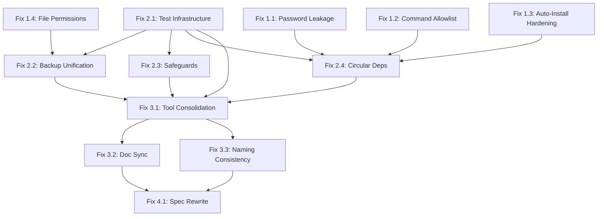

# Defense MCP Server — Security Remediation Plan

**Date:** 2026-03-04
**Version:** 1.0
**Scope:** All validated findings from security audit of defense-mcp-server v0.4.0-beta.2
**Status:** Approved for implementation

---

## Table of Contents

- [1. Executive Summary](#1-executive-summary)
- [2. Findings Overview](#2-findings-overview)
- [3. Remediation Phases](#3-remediation-phases)
  - [Phase 1: Critical Security Fixes](#phase-1-critical-security-fixes)
    - [Fix 1.1: Password String Leakage (Finding 3)](#fix-11-password-string-leakage-finding-3)
    - [Fix 1.2: Command Allowlist and Path Enforcement (Finding 4)](#fix-12-command-allowlist-and-path-enforcement-finding-4)
    - [Fix 1.3: Auto-Installation Supply Chain Hardening (Finding 8)](#fix-13-auto-installation-supply-chain-hardening-finding-8)
    - [Fix 1.4: State File Permission Hardening (Finding 10)](#fix-14-state-file-permission-hardening-finding-10)
  - [Phase 2: Structural Integrity](#phase-2-structural-integrity)
    - [Fix 2.1: Test Infrastructure (Finding 2)](#fix-21-test-infrastructure-finding-2)
    - [Fix 2.2: Backup/Rollback Unification (Finding 5)](#fix-22-backuprollback-unification-finding-5)
    - [Fix 2.3: Safeguards Integration (Finding 9)](#fix-23-safeguards-integration-finding-9)
    - [Fix 2.4: Circular Dependency Resolution (Finding A)](#fix-24-circular-dependency-resolution-finding-a)
  - [Phase 3: Consolidation & Quality](#phase-3-consolidation--quality)
    - [Fix 3.1: Tool Consolidation (Finding 6)](#fix-31-tool-consolidation-finding-6)
    - [Fix 3.2: Document Synchronization (Finding 7)](#fix-32-document-synchronization-finding-7)
    - [Fix 3.3: Tool Naming Consistency (Finding E)](#fix-33-tool-naming-consistency-finding-e)
  - [Phase 4: Specification & Documentation](#phase-4-specification--documentation)
    - [Fix 4.1: Specification Rewrite (Finding 1)](#fix-41-specification-rewrite-finding-1)
- [4. Validated — No Action Needed](#4-validated--no-action-needed)
- [5. Low-Priority / Future Considerations](#5-low-priority--future-considerations)
- [6. Tool Consolidation Plan](#6-tool-consolidation-plan)
- [7. Test Strategy](#7-test-strategy)
- [8. Migration & Breaking Changes](#8-migration--breaking-changes)
- [9. Implementation Order & Dependencies](#9-implementation-order--dependencies)
- [10. Success Metrics](#10-success-metrics)

---

## 1. Executive Summary

A comprehensive security audit of the **defense-mcp-server** project — a TypeScript/Node.js MCP server providing 157 defensive security tools — identified **10 primary findings** and **5 additional findings** across the codebase. The findings range from HIGH severity (password string leakage, missing command allowlists) to LOW severity (rate limiting, error isolation).

The most critical issues are:

1. **Password stored as Buffer but returned as string** — defeating the purpose of zeroable memory (HIGH)
2. **No command allowlist** — any binary can be executed through the executor with no validation (HIGH)
3. **Auto-installer runs `sudo apt-get install -y` with no version pinning or allowlist enforcement** — supply chain risk when enabled (HIGH)
4. **Zero test coverage** for a security tool that modifies production system configurations with root privileges (HIGH)

This plan organizes remediation into **4 phases** with explicit dependencies, acceptance criteria, and risk assessments for each fix. Phase 1 addresses direct security vulnerabilities. Phase 2 establishes structural integrity (testing, unification). Phase 3 consolidates the tool surface area. Phase 4 rewrites the specification to match the actual implementation.

All fixes maintain backward compatibility with the MCP protocol. Tool name changes in Phase 3 require explicit approval and a deprecation period.

---

## 2. Findings Overview

| # | Finding | Severity | Phase | Status |
|---|---------|----------|-------|--------|
| 1 | Spec describes a different project | HIGH | 4 | Confirmed |
| 2 | Zero test coverage | HIGH | 2 | Confirmed |
| 3 | Password string leakage | HIGH | 1 | Confirmed |
| 4 | No command allowlist | HIGH | 1 | Confirmed |
| 5 | Three competing backup/rollback systems | MEDIUM | 2 | Confirmed |
| 6 | 157 tools exceeds LLM limits | MEDIUM | 3 | Partially confirmed |
| 7 | Document inconsistencies | LOW-MEDIUM | 3 | Confirmed |
| 8 | Auto-installation supply chain risk | HIGH (when enabled) | 1 | Confirmed |
| 9 | Safeguards are advisory-only | MEDIUM | 2 | Confirmed |
| 10 | Unprotected changelog/rollback state | MEDIUM | 1 | Confirmed |
| A | Circular dependency workarounds | MEDIUM | 2 | Confirmed |
| B | Proxy pattern fragility | LOW | — | **Not confirmed** |
| C | Per-tool error isolation | LOW | 5 | Partially confirmed |
| D | Rate limiting absent | LOW | 5 | Confirmed |
| E | Tool naming conflicts | MEDIUM | 3 | Confirmed |

---

## 3. Remediation Phases

### Phase 1: Critical Security Fixes

These fixes address direct security vulnerabilities and must be implemented first. They have minimal structural dependencies and can be done incrementally.

---

#### Fix 1.1: Password String Leakage (Finding 3)

**Finding Reference:** Finding 3 — CONFIRMED, HIGH: Password String Leakage

**Current State:**

[`sudo-session.ts`](src/core/sudo-session.ts:206) stores the password in a `Buffer` (line 99, `passwordBuf: Buffer | null`), but `getPassword()` at line 206 calls `this.passwordBuf.toString("utf-8")`, returning a `string`. JavaScript strings are immutable and interned by V8 — they **cannot be zeroed** from memory.

In [`executor.ts`](src/core/executor.ts:121), `prepareSudoOptions()` at line 134–139 concatenates this string:
```typescript
const stdinPayload = options.stdin
  ? password + "\n" + options.stdin
  : password + "\n";
```

The same pattern appears in [`auto-installer.ts`](src/core/auto-installer.ts:118) at line 127:
```typescript
input: password ? password + "\n" : undefined,
```

The `drop()` method at line 255 correctly zeroes the Buffer (`this.passwordBuf.fill(0)`), but every call to `getPassword()` has already created unreachable string copies that remain in V8's heap until garbage collected — which could be **never** if V8 interns them.

**Target State:**

- `getPassword()` returns `Buffer | null` instead of `string | null`
- All consumers pipe the Buffer directly to stdin without intermediate string conversion
- No password strings exist outside the zeroable Buffer at any point
- The `storePassword()` method accepts `Buffer` directly (avoiding the `elevate()` string→Buffer→string round-trip)

**Implementation Approach:**

1. Change `SudoSession.getPassword()` signature:
   ```typescript
   getPassword(): Buffer | null {
     if (!this.passwordBuf || this.passwordBuf.length === 0) return null;
     if (this.isExpired()) { this.drop(); return null; }
     // Return a COPY — caller should not hold a reference
     return Buffer.from(this.passwordBuf);
   }
   ```

2. Change `SudoSession.elevate()` to convert the password string to Buffer immediately at the API boundary (line 151) and zero the original:
   ```typescript
   async elevate(password: string, timeoutMs?: number): Promise<...> {
     const passwordBuf = Buffer.from(password, "utf-8");
     try {
       // ... validation logic using passwordBuf ...
       this.storePasswordBuffer(passwordBuf, timeoutMs);
       return { success: true };
     } finally {
       // Zero the local buffer copy after storage
       passwordBuf.fill(0);
     }
   }
   ```

3. Update `prepareSudoOptions()` in [`executor.ts`](src/core/executor.ts:121) to work with Buffer:
   ```typescript
   function prepareSudoOptions(options: ExecuteOptions): ExecuteOptions {
     // ...
     const passwordBuf = session.getPassword(); // Buffer | null
     if (passwordBuf) {
       const newArgs = ["-S", "-p", "", ...options.args];
       // Build stdin as Buffer, not string
       const newlineBuf = Buffer.from("\n");
       const stdinBuf = options.stdin
         ? Buffer.concat([passwordBuf, newlineBuf, Buffer.from(options.stdin)])
         : Buffer.concat([passwordBuf, newlineBuf]);
       return { ...options, args: newArgs, stdinBuffer: stdinBuf };
     }
     // ...
   }
   ```

4. Add `stdinBuffer?: Buffer` to `ExecuteOptions` interface, and update `executeCommand()` to prefer it over `stdin: string` when present.

5. Update [`auto-installer.ts`](src/core/auto-installer.ts:105) `execWithSudo()` at line 118 to use `Buffer` for the `input` option (Node.js `execFileSync` natively accepts `Buffer` for `input`).

6. After each use of a returned `Buffer`, the caller should call `.fill(0)` on their copy.

**Files Affected:**
- [`src/core/sudo-session.ts`](src/core/sudo-session.ts) — `getPassword()`, `elevate()`, `storePassword()`
- [`src/core/executor.ts`](src/core/executor.ts) — `ExecuteOptions`, `prepareSudoOptions()`, `executeCommand()`
- [`src/core/auto-installer.ts`](src/core/auto-installer.ts) — `execWithSudo()`

**Risk Assessment:**
- **Medium risk.** All sudo-dependent tools flow through either `executor.ts` or `auto-installer.ts`. A type error in the Buffer/string boundary will break ALL privileged operations. Must be tested with an active sudo session before merging.
- The `elevate()` API still accepts `string` (MCP clients send JSON strings), but the string is converted to Buffer immediately and the function-local copy is zeroed. The incoming MCP JSON-RPC payload string cannot be zeroed (it's in the SDK's memory), but this is an acceptable limitation.

**Acceptance Criteria:**
- [ ] `getPassword()` return type is `Buffer | null`
- [ ] No `.toString()` calls on password buffers anywhere in the codebase (verify via `grep -rn "getPassword.*toString" src/`)
- [ ] `sudo_elevate` → `firewall_iptables_list` integration works end-to-end
- [ ] Unit test confirms `drop()` zeroes all allocated buffers
- [ ] `grep -rn "password.*\+.*\"\\\\n\"" src/` returns zero results

**Estimated Complexity:** Medium — touches 3 files, changes a core API signature, requires integration testing.

**Dependencies:** None — can be done first.

---

#### Fix 1.2: Command Allowlist and Path Enforcement (Finding 4)

**Finding Reference:** Finding 4 — CONFIRMED, MEDIUM-HIGH: No Command Allowlist

**Current State:**

[`executor.ts`](src/core/executor.ts:185) `executeCommand()` accepts any `command` string and passes it directly to `spawn()` at line 213:
```typescript
child = spawn(effectiveOptions.command, effectiveOptions.args, {
  shell: false,
  // ...
});
```

There is no `validateCommand()` function in [`sanitizer.ts`](src/core/sanitizer.ts). While `shell: false` prevents shell injection, there is no restriction on **which binaries** can be executed.

[`tool-dependencies.ts`](src/core/tool-dependencies.ts) maps tools to binaries (e.g., `firewall_iptables_list` → `["iptables"]`), but this mapping is used **only** for pre-flight existence checks — not for runtime enforcement.

Commands use bare names (e.g., `"iptables"` not `/usr/sbin/iptables`), which means a modified `PATH` could cause a different binary to be executed.

**Target State:**

- A `COMMAND_ALLOWLIST` maps each allowed binary name to its absolute path(s)
- `executeCommand()` validates the command against the allowlist before spawning
- Commands are resolved to absolute paths using `which` at startup (cached)
- Any command not in the allowlist is rejected with a clear error

**Implementation Approach:**

1. Create a new module [`src/core/command-allowlist.ts`](src/core/command-allowlist.ts):
   ```typescript
   /**
    * Runtime command allowlist — only binaries in this set may be
    * executed via executeCommand().
    */

   import { execFileSync } from "node:child_process";

   // All binaries referenced across tool-dependencies.ts + direct usage
   const ALLOWED_BINARIES: ReadonlySet<string> = new Set([
     "iptables", "ip6tables", "iptables-save", "ip6tables-save",
     "iptables-restore", "ip6tables-restore", "nft", "ufw",
     "sysctl", "systemctl", "systemd-analyze",
     "cat", "tee", "cp", "ls", "stat", "find", "grep", "mount",
     "chmod", "chown", "chgrp", "usermod", "id", "whoami",
     "ss", "nmap", "tcpdump", "ip", "ping",
     "auditctl", "ausearch", "aureport", "journalctl",
     "fail2ban-client", "logrotate",
     "clamscan", "freshclam", "yara", "rkhunter", "chkrootkit",
     "aide", "sha256sum", "debsums",
     "openssl", "gpg", "cryptsetup",
     "docker", "trivy", "grype", "cosign",
     "apparmor_status", "apparmor_parser", "aa-status",
     "getenforce", "setenforce", "sestatus",
     "lynis", "oscap",
     "curl", "wget",
     "lsmod", "modprobe", "lsns",
     "uname", "dpkg", "apt", "apt-get",
     "pgrep", "ps", "lsof", "crontab",
     "update-grub", "netfilter-persistent",
     "pip3", "pip", "npm", "python3", "python",
     "wg", "bpftool", "falco",
     "readelf", "checksec", "pkg-config", "ldconfig",
     "newuidmap", "newgidmap",
     "sudo", "which",
     // ... complete from TOOL_DEPENDENCIES + direct spawn calls
   ]);

   // Cache: binary name → absolute path
   const resolvedPaths = new Map<string, string>();

   export function resolveAllowedBinaries(): void {
     for (const bin of ALLOWED_BINARIES) {
       try {
         const absPath = execFileSync("which", [bin], {
           encoding: "utf-8", timeout: 5000, stdio: "pipe"
         }).trim();
         if (absPath) resolvedPaths.set(bin, absPath);
       } catch { /* binary not installed — OK */ }
     }
   }

   export function validateCommand(command: string): string {
     // If already absolute and in resolved set, allow
     for (const [bin, absPath] of resolvedPaths) {
       if (command === bin || command === absPath) return absPath;
     }
     // Bare name in allowlist but not resolved? Reject.
     if (ALLOWED_BINARIES.has(command)) {
       throw new Error(
         `Command '${command}' is in the allowlist but not found on this system`
       );
     }
     throw new Error(
       `Command '${command}' is not in the allowed binary list. ` +
       `Only pre-approved defensive security tools may be executed.`
     );
   }
   ```

2. Call `resolveAllowedBinaries()` during server startup in [`index.ts`](src/index.ts).

3. Add validation call in [`executor.ts`](src/core/executor.ts:185) `executeCommand()`:
   ```typescript
   export async function executeCommand(options: ExecuteOptions): Promise<CommandResult> {
     // Validate command against allowlist
     const resolvedCommand = validateCommand(options.command);
     const effectiveOptions = prepareSudoOptions({
       ...options,
       command: resolvedCommand
     });
     // ... rest unchanged
   }
   ```

4. Add `validateCommand()` to [`sanitizer.ts`](src/core/sanitizer.ts) as a re-export for discoverability:
   ```typescript
   export { validateCommand } from "./command-allowlist.js";
   ```

**Files Affected:**
- New: `src/core/command-allowlist.ts`
- [`src/core/executor.ts`](src/core/executor.ts) — add validation call
- [`src/core/sanitizer.ts`](src/core/sanitizer.ts) — re-export
- [`src/index.ts`](src/index.ts) — call `resolveAllowedBinaries()` at startup

**Risk Assessment:**
- **High risk.** An incomplete allowlist will break tools that call unlisted binaries. Must audit every tool handler to ensure all executed binaries are listed.
- Mitigation: Start with `warn-only` mode (log but don't reject) for one release cycle, then switch to `enforce` mode.
- PATH resolution at startup means newly installed binaries won't be found until restart. The auto-installer should call `resolveAllowedBinaries()` after successful installs.

**Acceptance Criteria:**
- [ ] `executeCommand({ command: "rm", args: ["-rf", "/"] })` returns an allowlist error
- [ ] All 157 tools still function correctly (run pre-flight batch check)
- [ ] Commands resolve to absolute paths (verify with `grep -rn "spawn(" src/core/executor.ts`)
- [ ] New binary names added to allowlist after auto-install

**Estimated Complexity:** High — requires auditing all tool handlers, risk of breaking tools.

**Dependencies:** Should be done after Fix 2.1 (test infrastructure) ideally, but the allowlist module itself can be written immediately.

---

#### Fix 1.3: Auto-Installation Supply Chain Hardening (Finding 8)

**Finding Reference:** Finding 8 — CONFIRMED, HIGH (when enabled): Auto-Installation Supply Chain Risk

**Current State:**

[`auto-installer.ts`](src/core/auto-installer.ts:387) `installBinary()` runs `sudo apt-get install -y <package>` via `execFileSync` at line 437 (through `execWithSudo()`).

Issues:
1. **No version pinning** — installs whatever version the repo provides
2. **No GPG verification** beyond default package manager behavior (which is already reasonable for apt)
3. **Fallback at line 414–415** uses the raw binary name as the package name when not in `DEFENSIVE_TOOLS`:
   ```typescript
   } else {
     packageName = binary;  // line 415: raw binary name used directly
   }
   ```
4. **Installations are NOT logged** to the changelog system
5. Package names from `DEFENSIVE_TOOLS` are trusted but the fallback path is not validated

**Target State:**

- Only binaries listed in `DEFENSIVE_TOOLS` can be auto-installed (strict allowlist)
- The fallback to raw binary name as package name is removed
- All installations are logged to the changelog
- Optional: version constraints in `DEFENSIVE_TOOLS` entries (e.g., `">= 1.0"`)

**Implementation Approach:**

1. Remove the fallback in [`auto-installer.ts`](src/core/auto-installer.ts:407) `installBinary()`:
   ```typescript
   if (toolReq) {
     packageName = (toolReq.packages as Record<string, string | undefined>)[distro.family]
       ?? toolReq.packages.fallback
       ?? binary;
   } else {
     // CHANGED: reject installation of unknown binaries
     console.error(
       `[auto-installer] ✗ Binary '${binary}' not in DEFENSIVE_TOOLS allowlist — skipping`
     );
     return {
       dependency: binary,
       type: "binary",
       method: "system-package",
       success: false,
       message: `Binary '${binary}' is not in the approved DEFENSIVE_TOOLS list and cannot be auto-installed`,
       duration: Date.now() - start,
     };
   }
   ```

2. Add changelog logging after successful installs in `installBinary()`, `installPythonModule()`, `installNpmPackage()`, and `installLibrary()`:
   ```typescript
   import { logChange, createChangeEntry } from "./changelog.js";

   // After successful install:
   logChange(createChangeEntry({
     tool: "auto-installer",
     action: `Installed ${type} '${dependency}' via ${method}`,
     target: packageName,
     dryRun: false,
     success: true,
   }));
   ```

3. Validate package names with `validatePackageName()` from [`sanitizer.ts`](src/core/sanitizer.ts:301) before passing to the package manager:
   ```typescript
   import { validatePackageName } from "./sanitizer.js";
   // In installBinary(), before building install command:
   const safePackageName = validatePackageName(packageName);
   ```

**Files Affected:**
- [`src/core/auto-installer.ts`](src/core/auto-installer.ts) — remove fallback, add logging, add validation
- [`src/core/installer.ts`](src/core/installer.ts) — (reference only, contains `DEFENSIVE_TOOLS`)

**Risk Assessment:**
- **Low risk.** Auto-install is off by default (`KALI_DEFENSE_AUTO_INSTALL=true` required). Removing the fallback only affects edge cases where a binary isn't in `DEFENSIVE_TOOLS`. These cases were already unreliable (binary name ≠ package name often).

**Acceptance Criteria:**
- [ ] Attempting to auto-install a binary not in `DEFENSIVE_TOOLS` returns a clear error without running `apt-get`
- [ ] All auto-install successes appear in `~/.kali-defense/changelog.json`
- [ ] Package names are validated against `validatePackageName()` regex before install
- [ ] `grep -rn "packageName = binary" src/core/auto-installer.ts` returns zero results

**Estimated Complexity:** Low — focused changes in one file.

**Dependencies:** None.

---

#### Fix 1.4: State File Permission Hardening (Finding 10)

**Finding Reference:** Finding 10 — CONFIRMED, MEDIUM: Unprotected Changelog/Rollback State

**Current State:**

Three modules write state files using `writeFileSync()` with **no `mode` option**:

| Module | File | Path |
|--------|------|------|
| [`changelog.ts`](src/core/changelog.ts:89) | `writeFileSync(changelogPath, ...)` | `~/.kali-defense/changelog.json` |
| [`rollback.ts`](src/core/rollback.ts:69) | `writeFileSync(this.storePath, ...)` | `~/.kali-defense/rollback-state.json` |
| [`backup-manager.ts`](src/core/backup-manager.ts:80) | `writeFileSync(this.manifestPath, ...)` | `~/.kali-mcp-backups/manifest.json` |

Without a `mode` option, `writeFileSync` inherits the process umask, which is typically `0o022`, resulting in `0o644` permissions — **world-readable**. These files may contain:
- File paths of backed-up security configurations
- Service names and states
- Sysctl values
- Firewall rule descriptions

Directories are created with `mkdirSync({ recursive: true })`, also without mode specification.

**Target State:**

- All state files written with `mode: 0o600` (owner read/write only)
- All state directories created with `mode: 0o700` (owner access only)
- A shared helper function enforces this consistently

**Implementation Approach:**

1. Create a helper in a new or existing utility module:
   ```typescript
   // In src/core/secure-fs.ts (new file)
   import { writeFileSync, mkdirSync, type WriteFileOptions } from "node:fs";

   const SECURE_FILE_MODE = 0o600;
   const SECURE_DIR_MODE = 0o700;

   export function secureWriteFileSync(
     path: string,
     data: string | Buffer,
     encoding: BufferEncoding = "utf-8"
   ): void {
     writeFileSync(path, data, { encoding, mode: SECURE_FILE_MODE });
   }

   export function secureEnsureDir(dirPath: string): void {
     mkdirSync(dirPath, { recursive: true, mode: SECURE_DIR_MODE });
   }
   ```

2. Replace all `writeFileSync` calls in state management modules:
   - [`changelog.ts`](src/core/changelog.ts:89) line 89: `writeFileSync(changelogPath, ...)` → `secureWriteFileSync(changelogPath, ...)`
   - [`rollback.ts`](src/core/rollback.ts:69) line 69: `writeFileSync(this.storePath, ...)` → `secureWriteFileSync(this.storePath, ...)`
   - [`backup-manager.ts`](src/core/backup-manager.ts:80) line 80: `writeFileSync(this.manifestPath, ...)` → `secureWriteFileSync(this.manifestPath, ...)`

3. Replace all `mkdirSync` calls for state directories:
   - [`changelog.ts`](src/core/changelog.ts:66) line 66
   - [`rollback.ts`](src/core/rollback.ts:66) line 66
   - [`backup-manager.ts`](src/core/backup-manager.ts:57) line 57

**Files Affected:**
- New: `src/core/secure-fs.ts`
- [`src/core/changelog.ts`](src/core/changelog.ts) — `logChange()`, `backupFile()`
- [`src/core/rollback.ts`](src/core/rollback.ts) — `save()`
- [`src/core/backup-manager.ts`](src/core/backup-manager.ts) — `writeManifest()`, `ensureDir()`

**Risk Assessment:**
- **Very low risk.** Tightening permissions cannot break functionality. The only concern is if a separate process (running as a different user) reads these files — but that would be an unexpected configuration.

**Acceptance Criteria:**
- [ ] `stat -c '%a' ~/.kali-defense/changelog.json` returns `600`
- [ ] `stat -c '%a' ~/.kali-defense/` returns `700`
- [ ] `stat -c '%a' ~/.kali-mcp-backups/manifest.json` returns `600`
- [ ] No `writeFileSync` calls in state modules without `mode: 0o600`
- [ ] Unit test verifies file permissions after write

**Estimated Complexity:** Low — mechanical replacement across 3 files.

**Dependencies:** None.

---

### Phase 2: Structural Integrity

These fixes address architectural issues that undermine the reliability and maintainability of the security tool. Test infrastructure (Fix 2.1) should be implemented first, as it validates subsequent changes.

---

#### Fix 2.1: Test Infrastructure (Finding 2)

**Finding Reference:** Finding 2 — CONFIRMED, HIGH: Zero Test Coverage

**Current State:**

There are **no test files** anywhere in the project. The [`package.json`](package.json) has no `test` script, no test framework in `dependencies` or `devDependencies`, and no `tests/` or `__tests__/` directory.

For a security tool that modifies production system configurations with root privileges, this is critical. Any refactoring (including the fixes in this plan) cannot be validated without tests.

**Target State:**

- Vitest installed and configured as the test framework
- Test directory structure mirroring `src/`
- Unit tests for all security-critical modules (executor, sanitizer, sudo-session, changelog, safeguards)
- Integration test harness for tool execution (mocked — not requiring root)
- Minimum coverage targets: 80% for `src/core/`, 60% overall
- CI-ready `npm test` script

**Implementation Approach:**

See [Section 7: Test Strategy](#7-test-strategy) for the complete testing plan.

1. Install vitest and configure:
   ```bash
   npm install -D vitest @vitest/coverage-v8
   ```

2. Add scripts to [`package.json`](package.json):
   ```json
   {
     "scripts": {
       "test": "vitest run",
       "test:watch": "vitest",
       "test:coverage": "vitest run --coverage"
     }
   }
   ```

3. Create `vitest.config.ts`:
   ```typescript
   import { defineConfig } from 'vitest/config';
   export default defineConfig({
     test: {
       globals: true,
       include: ['tests/**/*.test.ts'],
       coverage: {
         provider: 'v8',
         include: ['src/**/*.ts'],
         exclude: ['src/tools/**/*.ts'], // tool handlers tested via integration
         thresholds: {
           'src/core/': { statements: 80, branches: 70 }
         }
       }
     }
   });
   ```

4. Create initial test directory structure:
   ```
   tests/
   ├── core/
   │   ├── sanitizer.test.ts        # First priority
   │   ├── sudo-session.test.ts     # First priority
   │   ├── executor.test.ts         # Second priority
   │   ├── changelog.test.ts        # Second priority
   │   ├── safeguards.test.ts       # Second priority
   │   ├── config.test.ts
   │   ├── command-allowlist.test.ts # After Fix 1.2
   │   ├── backup-manager.test.ts
   │   ├── rollback.test.ts
   │   └── secure-fs.test.ts        # After Fix 1.4
   ├── integration/
   │   ├── preflight.test.ts
   │   └── tool-wrapper.test.ts
   └── helpers/
       ├── mock-executor.ts
       └── test-config.ts
   ```

5. Write initial tests for `sanitizer.ts` first (pure functions, easy to test, high value):
   ```typescript
   // tests/core/sanitizer.test.ts
   import { describe, it, expect } from 'vitest';
   import { validateTarget, validatePort, validateFilePath, sanitizeArgs } from '../../src/core/sanitizer.js';

   describe('validateTarget', () => {
     it('accepts valid IPv4', () => {
       expect(validateTarget('192.168.1.1')).toBe('192.168.1.1');
     });
     it('rejects shell metacharacters', () => {
       expect(() => validateTarget('192.168.1.1; rm -rf /')).toThrow('metacharacters');
     });
     // ... more cases
   });
   ```

**Files Affected:**
- [`package.json`](package.json) — add vitest dependency and test scripts
- New: `vitest.config.ts`
- New: `tests/` directory tree (all new files)

**Risk Assessment:**
- **No risk to existing functionality.** Adding tests is purely additive. The only concern is ensuring the test configuration doesn't interfere with the build output.

**Acceptance Criteria:**
- [ ] `npm test` runs and passes
- [ ] `npm run test:coverage` generates a coverage report
- [ ] `src/core/sanitizer.ts` has ≥90% line coverage
- [ ] `src/core/sudo-session.ts` has ≥80% line coverage
- [ ] `src/core/executor.ts` has ≥70% line coverage (spawn mocking required)

**Estimated Complexity:** Medium — significant volume of test code, but each test is straightforward.

**Dependencies:** None — should be done FIRST in Phase 2.

---

#### Fix 2.2: Backup/Rollback Unification (Finding 5)

**Finding Reference:** Finding 5 — CONFIRMED, MEDIUM: Three Competing Backup/Rollback Systems

**Current State:**

Three independent systems manage backups and rollback state with **no cross-references**:

| System | Module | State File | Backup Directory |
|--------|--------|-----------|-----------------|
| Changelog | [`changelog.ts`](src/core/changelog.ts) | `~/.kali-defense/changelog.json` | `~/.kali-defense/backups/` |
| Backup Manager | [`backup-manager.ts`](src/core/backup-manager.ts) | `~/.kali-mcp-backups/manifest.json` | `~/.kali-mcp-backups/` |
| Rollback | [`rollback.ts`](src/core/rollback.ts) | `~/.kali-defense/rollback-state.json` | (uses changelog's backup dir) |

Key issues:
- `changelog.ts` has its own `backupFile()` function (line 133) writing to `~/.kali-defense/backups/`
- `backup-manager.ts` has its own `backup()` method (line 87) writing to `~/.kali-mcp-backups/`
- `rollback.ts` references backup paths from changelog but doesn't know about backup-manager
- Two separate backup directories (`~/.kali-defense/backups/` vs `~/.kali-mcp-backups/`)

**Target State:**

- Single `BackupManager` class handles all file backup operations
- Single backup directory: `~/.kali-defense/backups/`
- Changelog records actions and references backup IDs from `BackupManager`
- `RollbackManager` uses `BackupManager` for restores instead of direct `copyFileSync`
- Manifest is unified: one source of truth for all backups

**Implementation Approach:**

1. **Migrate `BackupManager`** to use `~/.kali-defense/backups/` (from config's `backupDir`):
   ```typescript
   // backup-manager.ts constructor:
   constructor(backupDir?: string) {
     const config = getConfig();
     this.backupDir = backupDir ?? config.backupDir; // uses ~/.kali-defense/backups/
     this.manifestPath = join(this.backupDir, "manifest.json");
   }
   ```

2. **Remove `backupFile()` from changelog.ts** (line 133–150). Replace all call sites with `BackupManager.backup()`:
   ```typescript
   // Before (in tool handlers):
   import { backupFile } from "../core/changelog.js";
   const backupPath = backupFile(targetPath);

   // After:
   import { BackupManager } from "../core/backup-manager.js";
   const bm = new BackupManager();
   const backupId = await bm.backup(targetPath);
   ```

3. **Update `RollbackManager`** to use `BackupManager` for file restores:
   ```typescript
   // rollback.ts, rollbackRecord():
   case "file": {
     const bm = new BackupManager();
     await bm.restore(record.originalValue); // originalValue stores backup ID
     break;
   }
   ```

4. **Cross-reference changelog and backup**: When a backup is created, the changelog entry should include the backup ID:
   ```typescript
   logChange(createChangeEntry({
     tool: toolName,
     action: "Modified config",
     target: filePath,
     backupPath: backupId, // reference to BackupManager entry
     // ...
   }));
   ```

5. **Write a migration script** for existing users that moves files from `~/.kali-mcp-backups/` to `~/.kali-defense/backups/` and merges manifests.

**Files Affected:**
- [`src/core/backup-manager.ts`](src/core/backup-manager.ts) — change default directory
- [`src/core/changelog.ts`](src/core/changelog.ts) — remove `backupFile()`, `restoreFile()`
- [`src/core/rollback.ts`](src/core/rollback.ts) — use `BackupManager` for restores
- All tool files that call `backupFile()` from changelog — update imports
- New: `scripts/migrate-backups.ts` (one-time migration)

**Risk Assessment:**
- **Medium risk.** Changing backup paths could orphan existing backups. The migration script mitigates this. Must be tested with existing backup data.
- `backupFile()` removal from changelog.ts is a breaking API change for any external code importing it (unlikely but possible).

**Acceptance Criteria:**
- [ ] `ls ~/.kali-defense/backups/` contains all backup files (single directory)
- [ ] `~/.kali-mcp-backups/` is no longer created by new operations
- [ ] Rollback of a file change works end-to-end via `BackupManager`
- [ ] `grep -rn "backupFile" src/core/changelog.ts` returns zero results (function removed)
- [ ] Migration script handles edge cases (missing dirs, corrupt manifests)

**Estimated Complexity:** Medium — requires updating imports across many tool files.

**Dependencies:** Fix 1.4 (secure file permissions) should be done first so the unified system has correct permissions from the start.

---

#### Fix 2.3: Safeguards Integration (Finding 9)

**Finding Reference:** Finding 9 — CONFIRMED, MEDIUM: Safeguards Are Advisory-Only

**Current State:**

[`safeguards.ts`](src/core/safeguards.ts:283) `checkSafety()` at line 283 initializes `blockers: string[] = []` at line 298, but **no code path ever pushes to it**. The function always returns `safe: true` (line 372: `safe: blockers.length === 0`).

Furthermore, `checkSafety()` is **never called** from the preflight pipeline in [`preflight.ts`](src/core/preflight.ts) or [`tool-wrapper.ts`](src/core/tool-wrapper.ts). Safeguards are completely disconnected from tool execution.

**Target State:**

- `checkSafety()` has actual blocking conditions (e.g., "don't modify iptables while Docker is running AND `--force` is not set")
- `checkSafety()` is integrated into the preflight pipeline
- Warnings from `checkSafety()` are included in tool output
- Blockers prevent tool execution (with override mechanism)

**Implementation Approach:**

1. **Add real blockers** to [`safeguards.ts`](src/core/safeguards.ts:283) `checkSafety()`:
   ```typescript
   // Example blocking conditions:

   // Block setting default INPUT policy to DROP without an ACCEPT rule for SSH
   if (matchesAny(operation, ["firewall_set_policy"]) && docker.detected) {
     const policyParam = params.policy as string | undefined;
     const chainParam = params.chain as string | undefined;
     if (policyParam === "DROP" && chainParam === "INPUT") {
       blockers.push(
         "BLOCKED: Setting INPUT policy to DROP while Docker is active " +
         "would disrupt container networking. Stop Docker first or use " +
         "specific REJECT rules instead."
       );
       impactedApps.push("Docker");
     }
   }

   // Block stopping sshd if it's the current connection method
   if (matchesAny(operation, ["harden_service_manage"])) {
     const serviceParam = params.service as string | undefined;
     const actionParam = params.action as string | undefined;
     if (serviceParam?.includes("ssh") && (actionParam === "stop" || actionParam === "disable")) {
       if (process.env.SSH_CONNECTION) {
         blockers.push(
           "BLOCKED: Stopping/disabling SSH while connected via SSH " +
           "would lock you out of the system."
         );
       }
     }
   }
   ```

2. **Integrate into the preflight pipeline** in [`preflight.ts`](src/core/preflight.ts):
   ```typescript
   import { SafeguardRegistry } from "./safeguards.js";

   // In runPreflight(), after privilege checks (Step 5):
   // ── Step 5b: Safety checks ───────────────────────────
   const safeguardRegistry = SafeguardRegistry.getInstance();
   const safetyResult = await safeguardRegistry.checkSafety(
     toolName,
     {} // params not available at this level — see note below
   );

   if (!safetyResult.safe) {
     for (const blocker of safetyResult.blockers) {
       errors.push(`[SAFETY] ${blocker}`);
     }
   }
   for (const warning of safetyResult.warnings) {
     warnings.push(`[SAFETY] ${warning}`);
   }
   ```

   **Note:** The tool's `params` are not available in the preflight engine (they arrive in the tool handler). There are two approaches:
   - **Option A:** Move safety checks to the tool-wrapper layer where params ARE available
   - **Option B:** Pass params through the preflight pipeline

   **Recommended: Option A** — add safety checks in [`tool-wrapper.ts`](src/core/tool-wrapper.ts:235) `createWrappedHandler()` where `callbackArgs` contains the params.

3. **Add safety check in tool-wrapper.ts** after preflight passes but before handler execution:
   ```typescript
   // In createWrappedHandler(), after preflight passes:
   const safeguards = SafeguardRegistry.getInstance();
   const toolParams = extractParams(callbackArgs); // extract from MCP callback args
   const safety = await safeguards.checkSafety(toolName, toolParams);

   if (!safety.safe) {
     return {
       content: [{
         type: "text" as const,
         text: `⛔ Safety check BLOCKED execution of '${toolName}':\n` +
               safety.blockers.map(b => `  • ${b}`).join("\n") +
               (safety.warnings.length > 0
                 ? `\n\nWarnings:\n` + safety.warnings.map(w => `  ⚠ ${w}`).join("\n")
                 : ""),
       }],
       isError: true,
     };
   }
   ```

**Files Affected:**
- [`src/core/safeguards.ts`](src/core/safeguards.ts) — add real blockers in `checkSafety()`
- [`src/core/tool-wrapper.ts`](src/core/tool-wrapper.ts) — integrate safety checks
- [`src/core/preflight.ts`](src/core/preflight.ts) — add warning propagation (not blockers — those go in wrapper)

**Risk Assessment:**
- **Medium risk.** Overly aggressive blockers could prevent legitimate operations. Start with a small set of high-confidence blockers (SSH lockout, Docker/firewall conflicts) and expand over time.
- All blockers should have an override mechanism (e.g., `params.force = true` or `params.skip_safety = true`).

**Acceptance Criteria:**
- [ ] `checkSafety()` returns `safe: false` for at least 3 documented scenarios
- [ ] Safety warnings appear in tool output
- [ ] Safety blockers prevent tool execution with a clear error message
- [ ] A `force` parameter can override blockers
- [ ] Tests validate each blocking scenario

**Estimated Complexity:** Medium — requires careful design of blocking conditions.

**Dependencies:** Fix 2.1 (tests) — blocking conditions must be tested.

---

#### Fix 2.4: Circular Dependency Resolution (Finding A)

**Finding Reference:** Finding A — CONFIRMED, MEDIUM: Circular Dependency Workarounds

**Current State:**

Three modules bypass [`executor.ts`](src/core/executor.ts) by using raw `spawn`/`execFileSync` directly:

| Module | Method Used | Reason |
|--------|-------------|--------|
| [`sudo-session.ts`](src/core/sudo-session.ts:40) | `spawn` (line 50) via `runSimple()` | Executor imports SudoSession |
| [`auto-installer.ts`](src/core/auto-installer.ts:105) | `execFileSync` (line 123) via `execWithSudo()` | Executor imports SudoSession → circular |
| [`privilege-manager.ts`](src/core/privilege-manager.ts:166) | `execFileSync` (line 173) via `execSafe()` | Same circular chain |

This means any security controls added to `executeCommand()` (like the command allowlist in Fix 1.2) **will not protect these code paths**.

**Target State:**

- Extract a minimal, dependency-free command execution layer that both `SudoSession` and `executor.ts` can use
- The allowlist (Fix 1.2) is enforced in this shared layer
- No raw `spawn`/`execFileSync` calls outside the shared layer

**Implementation Approach:**

1. Create `src/core/spawn-safe.ts` — a minimal spawn wrapper with no imports from the core module graph:
   ```typescript
   /**
    * spawn-safe.ts — Low-level command execution with allowlist enforcement.
    * This module has ZERO imports from other core modules to break
    * circular dependencies. It is the only file that should call
    * child_process.spawn/execFileSync directly.
    */
   import { spawn, execFileSync } from "node:child_process";

   // Inline allowlist (or loaded from a JSON file to avoid circular imports)
   let allowedBinaries: Map<string, string> | null = null;

   export function setAllowedBinaries(map: Map<string, string>): void {
     allowedBinaries = map;
   }

   export function spawnSafe(
     command: string,
     args: string[],
     options: { /* subset of SpawnOptions */ }
   ): /* ChildProcess */ { ... }

   export function execFileSyncSafe(
     command: string,
     args: string[],
     options: { /* subset of ExecFileSyncOptions */ }
   ): string { ... }
   ```

2. Update `SudoSession.runSimple()`, `AutoInstaller.execWithSudo()`, and `PrivilegeManager.execSafe()` to use `spawnSafe`/`execFileSyncSafe`.

3. Update `executor.ts` to use `spawnSafe` internally.

4. Establish a lint rule or code review policy: "No direct `import { spawn } from 'node:child_process'` outside of `spawn-safe.ts`."

**Files Affected:**
- New: `src/core/spawn-safe.ts`
- [`src/core/sudo-session.ts`](src/core/sudo-session.ts) — replace `spawn` with `spawnSafe`
- [`src/core/auto-installer.ts`](src/core/auto-installer.ts) — replace `execFileSync` with `execFileSyncSafe`
- [`src/core/privilege-manager.ts`](src/core/privilege-manager.ts) — replace `execFileSync` with `execFileSyncSafe`
- [`src/core/executor.ts`](src/core/executor.ts) — replace `spawn` with `spawnSafe`

**Risk Assessment:**
- **Medium risk.** This is a significant refactor touching the most sensitive code paths. Must be done carefully with the test infrastructure in place.
- The allowlist initialization order matters: `spawn-safe.ts` must be initialized before any module that calls `spawnSafe()`. This requires careful startup sequencing in [`index.ts`](src/index.ts).

**Acceptance Criteria:**
- [ ] `grep -rn "from \"node:child_process\"" src/` returns only `src/core/spawn-safe.ts`
- [ ] All existing tools still work after the refactor
- [ ] The command allowlist is enforced for ALL command execution paths
- [ ] Circular dependency is broken (verified by import analysis tooling)

**Estimated Complexity:** High — fundamental architectural change.

**Dependencies:** Fix 1.2 (command allowlist), Fix 2.1 (tests).

---

### Phase 3: Consolidation & Quality

These fixes reduce the tool surface area, fix naming inconsistencies, and synchronize documentation. They may involve breaking changes to tool names, so they require a deprecation period.

---

#### Fix 3.1: Tool Consolidation (Finding 6)

**Finding Reference:** Finding 6 — PARTIALLY CONFIRMED, MEDIUM: 157 Tools Exceeds LLM Limits

**Current State:**

157 tool registrations across 28 files. LLM context windows struggle with this many tool definitions. Specific confirmed duplicate pairs:

| Tool A | File A | Tool B | File B | Overlap |
|--------|--------|--------|--------|---------|
| `secrets_scan` | [`secrets-management.ts`](src/tools/secrets-management.ts) | `scan_for_secrets` | [`secrets-scanner.ts`](src/tools/secrets-scanner.ts) | Same functionality |
| `secrets_env_audit` | [`secrets-management.ts`](src/tools/secrets-management.ts) | `audit_env_vars` | [`secrets-scanner.ts`](src/tools/secrets-scanner.ts) | Same functionality |
| `defense_security_posture` | [`meta.ts`](src/tools/meta.ts) | `calculate_security_score` | [`security-posture.ts`](src/tools/security-posture.ts) | Same functionality |
| `verify_package_integrity` | [`supply-chain-security.ts`](src/tools/supply-chain-security.ts) | `patch_integrity_check` | [`patch-management.ts`](src/tools/patch-management.ts) | Same functionality |

**Target State:**

- Reduce tool count to ~60–80 tools organized into logical tiers
- Eliminate duplicate tool pairs
- Consistent naming convention: `category_action_target`
- Tool tiers: Core (always loaded), Extended (loaded on demand), Advanced (opt-in)

**Implementation Approach:**

See [Section 6: Tool Consolidation Plan](#6-tool-consolidation-plan) for the complete mapping.

1. **Phase 3a — Remove duplicates** (no breaking changes to remaining tools):
   - Remove `scan_for_secrets`, keep `secrets_scan` (original)
   - Remove `audit_env_vars`, keep `secrets_env_audit` (original)
   - Remove `calculate_security_score`, keep `defense_security_posture` (more descriptive)
   - Remove `verify_package_integrity`, keep `patch_integrity_check` (category-consistent)

2. **Phase 3b — Merge related tools** into parameterized versions:
   - Merge `container_docker_audit` + `container_docker_bench` → single `container_docker_audit` with a `scope` parameter
   - Merge `container_apparmor_manage` + `container_apparmor_install` → single `container_apparmor_manage` with extended actions

3. **Phase 3c — Tier organization** (future, requires lazy loading):
   - **Core (~30 tools):** Firewall, hardening, access control, backup, sudo management, meta
   - **Extended (~25 tools):** Compliance, logging, IDS, malware, network defense
   - **Advanced (~20 tools):** Container security, zero-trust, eBPF, supply chain, drift detection

**Files Affected:**
- [`src/tools/secrets-scanner.ts`](src/tools/secrets-scanner.ts) — remove duplicate tools or entire file
- [`src/tools/security-posture.ts`](src/tools/security-posture.ts) — remove `calculate_security_score`
- [`src/tools/supply-chain-security.ts`](src/tools/supply-chain-security.ts) — remove `verify_package_integrity`
- [`src/index.ts`](src/index.ts) — update imports if files are removed
- [`src/core/tool-dependencies.ts`](src/core/tool-dependencies.ts) — remove entries for eliminated tools

**Risk Assessment:**
- **Medium risk.** Removing tools that users reference by name is a breaking change. Must document removed tool names and their replacements.
- Mitigation: In Phase 3a, register deprecated tool names as aliases that forward to the canonical tool with a deprecation warning.

**Acceptance Criteria:**
- [ ] Tool count is ≤ 80 after Phase 3a+3b
- [ ] No duplicate functionality remains
- [ ] Deprecated tool names still work (with warning) for one release cycle
- [ ] TOOLS-REFERENCE.md is updated to reflect new tool set

**Estimated Complexity:** Medium — spread across many files but each change is small.

**Dependencies:** Fix 2.1 (tests) — need tests to validate consolidated tools.

---

#### Fix 3.2: Document Synchronization (Finding 7)

**Finding Reference:** Finding 7 — CONFIRMED, LOW-MEDIUM: Document Inconsistencies

**Current State:**

| Inconsistency | Location A | Location B |
|--------------|------------|------------|
| Version mismatch | [`package.json`](package.json:2): `0.4.0-beta.2` | [`index.ts`](src/index.ts:54): `0.4.0-beta.1` |
| Tool count: 130 | [`TOOLS-REFERENCE.md`](TOOLS-REFERENCE.md) | — |
| Tool count: 137 | [`index.ts`](src/index.ts), [`PREFLIGHT-ARCHITECTURE.md`](PREFLIGHT-ARCHITECTURE.md) | — |
| Tool count: 155 | [`README.md`](README.md), [`ARCHITECTURE.md`](ARCHITECTURE.md), [`package.json`](package.json:4) | — |
| Tool count: 157 | Actual registration count | — |
| "Design phase" claim | [`PREFLIGHT-ARCHITECTURE.md`](PREFLIGHT-ARCHITECTURE.md) header | Preflight IS implemented |

**Target State:**

- Single source of truth for version (read from `package.json` at runtime)
- Actual tool count reflected in all documents (or replaced with "see TOOLS-REFERENCE.md")
- All "design phase" / "not yet implemented" markers removed from implemented features

**Implementation Approach:**

1. **Fix version in index.ts** — read from package.json:
   ```typescript
   import { readFileSync } from "node:fs";
   import { join, dirname } from "node:path";
   import { fileURLToPath } from "node:url";

   const __dirname = dirname(fileURLToPath(import.meta.url));
   const pkg = JSON.parse(
     readFileSync(join(__dirname, "..", "package.json"), "utf-8")
   );

   const server = new McpServer({
     name: "defense-mcp-server",
     version: pkg.version, // single source of truth
   });
   ```

2. **Update all tool count references** to use dynamic counting or reference TOOLS-REFERENCE.md:
   - In README.md, ARCHITECTURE.md, package.json description: use "150+" or link to TOOLS-REFERENCE
   - After Phase 3 consolidation, update to the final count

3. **Update PREFLIGHT-ARCHITECTURE.md** header: remove "Design phase — implementation not started"

4. **Create a doc-sync check** (optional): a script that extracts counts and versions from all docs and flags mismatches.

**Files Affected:**
- [`src/index.ts`](src/index.ts) — read version from package.json
- [`README.md`](README.md) — update tool count
- [`ARCHITECTURE.md`](ARCHITECTURE.md) — update tool count
- [`PREFLIGHT-ARCHITECTURE.md`](PREFLIGHT-ARCHITECTURE.md) — remove "design phase" header
- [`TOOLS-REFERENCE.md`](TOOLS-REFERENCE.md) — update tool count
- [`package.json`](package.json) — update description tool count

**Risk Assessment:**
- **Very low risk.** Documentation-only changes (except `index.ts` version read, which is trivial).

**Acceptance Criteria:**
- [ ] `node -e "const s = require('./build/index.js'); ..."` shows version matching package.json
- [ ] `grep -rn "0.4.0-beta.1" src/` returns zero results
- [ ] `grep -rn "137 tools\|130 tools\|155 tools" *.md` returns zero results
- [ ] PREFLIGHT-ARCHITECTURE.md has no "design phase" language

**Estimated Complexity:** Low — mostly search-and-replace.

**Dependencies:** Fix 3.1 (tool consolidation) should be done first so the final tool count is known.

---

#### Fix 3.3: Tool Naming Consistency (Finding E)

**Finding Reference:** Finding E — CONFIRMED, MEDIUM: Tool Naming Conflicts

**Current State:**

Tool names follow at least 3 different conventions:
- `category_action_target`: `firewall_iptables_list`, `harden_sysctl_get` — most common
- `action_target`: `generate_sbom`, `lookup_cve`, `setup_wireguard` — newer tools
- `category_action`: `secrets_scan`, `backup_list` — abbreviated

This inconsistency makes tools harder to discover and predict.

**Target State:**

All tools follow `category_action` or `category_action_target` convention:
- Category prefix matches the module (firewall, harden, access, etc.)
- Action is a verb (list, add, audit, scan, manage, configure)
- Target is optional and specifies the object

**Implementation Approach:**

1. Create a canonical naming map (see [Section 6](#6-tool-consolidation-plan))
2. Register aliases for old names during a deprecation period
3. Update TOOLS-REFERENCE.md with the canonical names

This is naturally combined with Fix 3.1 (tool consolidation).

**Files Affected:**
- All 28 tool files in `src/tools/`
- [`src/core/tool-dependencies.ts`](src/core/tool-dependencies.ts) — update tool names in dependency map
- [`TOOLS-REFERENCE.md`](TOOLS-REFERENCE.md) — update names

**Risk Assessment:**
- **High risk if done without aliases.** Users and MCP clients reference tools by name. Renaming without backward compatibility breaks all existing configurations.
- Mitigation: Maintain old names as aliases for at least 2 minor version releases.

**Acceptance Criteria:**
- [ ] All tool names follow `category_action` or `category_action_target` pattern
- [ ] Old names still work with deprecation warnings
- [ ] TOOLS-REFERENCE.md documents both old and new names during transition

**Estimated Complexity:** Medium — many files affected but each change is small.

**Dependencies:** Fix 3.1 (consolidation) — rename during consolidation, not separately.

---

### Phase 4: Specification & Documentation

---

#### Fix 4.1: Specification Rewrite (Finding 1)

**Finding Reference:** Finding 1 — CONFIRMED, HIGH: Spec Describes a Different Project

**Current State:**

[`kali-defense-mcp-server-spec.md`](kali-defense-mcp-server-spec.md) specifies:
- **Language:** Python 3.11+ (actual: TypeScript/Node.js)
- **Framework:** FastMCP, Pydantic, SQLite, asyncio (actual: `@modelcontextprotocol/sdk`, Zod)
- **Directory structure:** Python packages with `__init__.py` (actual: `src/core/`, `src/tools/`)
- **Models:** Pydantic BaseModel classes (actual: Zod schemas and TypeScript interfaces)

The spec bears no relation to the actual codebase and actively misleads anyone reading it.

**Target State:**

The specification accurately describes the current implementation:
- TypeScript/Node.js technology stack
- `@modelcontextprotocol/sdk` + Zod architecture
- Actual directory structure and module organization
- Real data models and interfaces
- Actual security architecture (preflight, sudo-session, executor, safeguards)

**Implementation Approach:**

1. **Archive the current spec** as `kali-defense-mcp-server-spec.ARCHIVED.md` with a header explaining it was for an earlier Python design that was never implemented.

2. **Write a new specification** that documents:
   - Technology stack and dependencies
   - Architecture diagram (matching ARCHITECTURE.md)
   - Module descriptions matching actual code
   - Data flow: MCP request → tool-wrapper → preflight → handler → executor → system
   - Security model: sanitizer, command allowlist, sudo-session, safeguards
   - Configuration via environment variables
   - Tool registration pattern (Zod schemas → McpServer.tool())

3. **Include a Mermaid architecture diagram:**
   ```mermaid
   graph TD
       A[MCP Client] -->|JSON-RPC| B[StdioTransport]
       B --> C[McpServer]
       C --> D[Proxy / tool-wrapper.ts]
       D --> E[PreflightEngine]
       E --> F[DependencyValidator]
       E --> G[PrivilegeManager]
       E --> H[AutoInstaller]
       D --> I[Tool Handler]
       I --> J[executor.ts]
       J --> K[SudoSession]
       J --> L[spawn-safe.ts]
       I --> M[SafeguardRegistry]
       I --> N[Changelog + BackupManager]
   ```

**Files Affected:**
- [`kali-defense-mcp-server-spec.md`](kali-defense-mcp-server-spec.md) — complete rewrite
- New: `kali-defense-mcp-server-spec.ARCHIVED.md`

**Risk Assessment:**
- **No risk.** Documentation-only change. The spec is not imported or referenced by code.

**Acceptance Criteria:**
- [ ] New spec references TypeScript, Node.js, `@modelcontextprotocol/sdk`, Zod
- [ ] Architecture diagram matches actual module structure
- [ ] Old spec archived with explanation header
- [ ] New spec cross-references ARCHITECTURE.md and STANDARDS.md

**Estimated Complexity:** Medium — requires significant writing effort but no code changes.

**Dependencies:** All other fixes should be complete so the spec reflects the final state.

---

## 4. Validated — No Action Needed

### Finding B: Proxy Pattern Fragility — NOT CONFIRMED

The Proxy in [`tool-wrapper.ts`](src/core/tool-wrapper.ts:138) is **well-implemented**:

- Uses `Reflect.get(target, prop, receiver)` for passthrough (line 143) — correct Proxy pattern
- Only intercepts the `tool` property — minimal surface area
- Error handling wraps the handler with try/catch (line 333) — pre-flight failures don't prevent execution
- The `bind(server)` call at line 186 preserves `this` context correctly

**Status: No fix required.**

---

## 5. Low-Priority / Future Considerations

### Finding C: Per-Tool Error Isolation (LOW)

**Improvement:** Wrap individual tool registration calls in [`index.ts`](src/index.ts) with try/catch to prevent one module's registration failure from crashing the entire server:

```typescript
const registrations = [
  ["Firewall", registerFirewallTools],
  ["Hardening", registerHardeningTools],
  // ...
];

for (const [name, registerFn] of registrations) {
  try {
    registerFn(server);
    console.error(`[startup] ✓ Registered ${name} tools`);
  } catch (err) {
    console.error(`[startup] ✗ Failed to register ${name} tools: ${err}`);
  }
}
```

### Finding D: Rate Limiting (LOW)

**Future consideration:** Add a `rateLimit` field to [`config.ts`](src/core/config.ts) and implement a token-bucket or sliding-window rate limiter in [`tool-wrapper.ts`](src/core/tool-wrapper.ts). This is low priority because:
- MCP servers are typically single-client
- The LLM client already has inherent rate limiting from token generation speed
- System commands have their own execution time as a natural throttle

If implemented, the recommended approach is:
```typescript
// In config.ts:
rateLimit: {
  maxCallsPerMinute: number;  // default: 60
  maxCallsPerTool: number;    // default: 10/min
}
```

---

## 6. Tool Consolidation Plan

### Confirmed Duplicate Removals

| Keep (Canonical) | Remove (Duplicate) | Rationale |
|------------------|--------------------|-----------|
| `secrets_scan` | `scan_for_secrets` | Original; consistent `category_action` naming |
| `secrets_env_audit` | `audit_env_vars` | Original; consistent `category_action` naming |
| `defense_security_posture` | `calculate_security_score` | More descriptive; `defense_` prefix matches meta module |
| `patch_integrity_check` | `verify_package_integrity` | Consistent with `patch_` category; `patch-management.ts` is the canonical module |

### Proposed Merges

| Surviving Tool | Merged Into It | New Parameters |
|----------------|----------------|----------------|
| `container_docker_audit` | `container_docker_bench` | `scope: "config" \| "bench" \| "all"` |
| `container_apparmor_manage` | `container_apparmor_install` | Extended `action` enum: add `"install_profiles"`, `"list_loaded"` |
| `container_image_scan` | `scan_image_trivy` | Unified; `scanner: "trivy" \| "grype" \| "auto"` |

### Proposed Tier Organization

#### Tier 1: Core (~30 tools) — Always loaded

| Category | Tools |
|----------|-------|
| **Sudo Management** (5) | `sudo_elevate`, `sudo_elevate_gui`, `sudo_status`, `sudo_drop`, `sudo_extend` |
| **Preflight** (1) | `preflight_batch_check` |
| **Firewall** (8) | `firewall_iptables_list`, `firewall_iptables_add`, `firewall_iptables_delete`, `firewall_ufw_status`, `firewall_ufw_rule`, `firewall_set_policy`, `firewall_save`, `firewall_policy_audit` |
| **Hardening** (6) | `harden_sysctl_get`, `harden_sysctl_set`, `harden_sysctl_audit`, `harden_service_manage`, `harden_service_audit`, `harden_file_permissions` |
| **Access Control** (5) | `access_ssh_audit`, `access_ssh_harden`, `access_sudo_audit`, `access_user_audit`, `access_password_policy` |
| **Backup** (3) | `backup_config_files`, `backup_restore`, `backup_list` |
| **Meta** (3) | `defense_check_tools`, `defense_security_posture`, `defense_change_history` |

#### Tier 2: Extended (~25 tools) — Loaded by default, can be disabled

| Category | Tools |
|----------|-------|
| **Compliance** (4) | `compliance_lynis_audit`, `compliance_cis_check`, `compliance_report`, `compliance_policy_evaluate` |
| **Logging** (6) | `log_auditd_rules`, `log_auditd_search`, `log_journalctl_query`, `log_fail2ban_status`, `log_fail2ban_manage`, `log_syslog_analyze` |
| **IDS** (4) | `ids_aide_manage`, `ids_rkhunter_scan`, `ids_file_integrity_check`, `ids_rootkit_summary` |
| **Malware** (4) | `malware_clamav_scan`, `malware_clamav_update`, `malware_yara_scan`, `malware_suspicious_files` |
| **Network** (4) | `netdef_connections`, `netdef_open_ports_audit`, `netdef_self_scan`, `netdef_tcpdump_capture` |
| **Secrets** (3) | `secrets_scan`, `secrets_env_audit`, `secrets_ssh_key_sprawl` |

#### Tier 3: Advanced (~20 tools) — Opt-in via environment variable

| Category | Tools |
|----------|-------|
| **Container Security** (5) | `container_docker_audit`, `container_apparmor_manage`, `container_selinux_manage`, `container_namespace_check`, `container_image_scan` |
| **Zero Trust** (4) | `setup_wireguard`, `manage_wg_peers`, `setup_mtls`, `configure_microsegmentation` |
| **Incident Response** (3) | `ir_volatile_collect`, `ir_ioc_scan`, `ir_timeline_generate` |
| **eBPF/Runtime** (3) | `list_ebpf_programs`, `check_falco`, `deploy_falco_rules` |
| **Supply Chain** (3) | `generate_sbom`, `patch_integrity_check`, `check_slsa_attestation` |
| **Drift Detection** (2) | `create_baseline`, `compare_to_baseline` |

**Total: ~75 tools** (down from 157)

### Tools Proposed for Removal (Beyond Duplicates)

| Tool | File | Reason |
|------|------|--------|
| `firewall_restore` | firewall.ts | Rarely used; `firewall_save` + manual restore sufficient |
| `firewall_nftables_list` | firewall.ts | Low adoption; nft users manage directly |
| `firewall_create_chain` | firewall.ts | Advanced; merge into `firewall_iptables_add` with `chain_action` param |
| `firewall_persistence` | firewall.ts | Merge into `firewall_save` with `persist: true` param |
| `harden_permissions_audit` | hardening.ts | Merge into `harden_file_permissions` with `action: "audit"` |
| `harden_systemd_audit` | hardening.ts | Merge into `harden_systemd_apply` with `action: "audit"` |
| `harden_kernel_security_audit` | hardening.ts | Merge into `harden_sysctl_audit` with `scope: "kernel"` |
| `harden_bootloader_audit` | hardening.ts | Niche; keep in Advanced tier |
| `harden_bootloader_configure` | hardening.ts | Niche; keep in Advanced tier |
| `harden_module_audit` | hardening.ts | Merge into `harden_sysctl_audit` |
| `harden_cron_audit` | hardening.ts | Merge into `compliance_cis_check` |
| `harden_umask_audit` + `harden_umask_set` | hardening.ts | Merge into single `harden_umask` |
| `harden_banner_audit` + `harden_banner_set` | hardening.ts | Merge into single `harden_banner` |
| `harden_coredump_disable` | hardening.ts | Merge into `harden_sysctl_set` with preset |
| `log_auditd_report` | logging.ts | Merge into `log_auditd_search` with `format: "report"` |
| `log_auditd_cis_rules` | logging.ts | Merge into `compliance_cis_check` |
| `log_rotation_audit` | logging.ts | Merge into `compliance_cis_check` |
| `log_fail2ban_audit` | logging.ts | Merge into `log_fail2ban_status` with `verbose: true` |
| `ids_chkrootkit_scan` | ids.ts | `ids_rootkit_summary` runs both; remove standalone |
| `malware_quarantine_manage` | malware.ts | Niche; merge into `malware_clamav_scan` post-action |
| `malware_webshell_detect` | malware.ts | Merge into `malware_suspicious_files` |
| `backup_system_state` | backup.ts | Merge into `backup_config_files` with `scope: "system"` |
| `backup_verify` | backup.ts | Merge into `backup_list` with `verify: true` |
| `access_pam_audit` + `access_pam_configure` | access-control.ts | Merge into single `access_pam_manage` |
| `access_ssh_cipher_audit` | access-control.ts | Merge into `access_ssh_audit` |
| `access_restrict_shell` | access-control.ts | Merge into `access_user_audit` with `action: "restrict"` |
| `crypto_tls_config_audit` | encryption.ts | Merge into `crypto_tls_audit` |
| `netdef_port_scan_detect` | network-defense.ts | Niche; keep in Advanced |
| `netdef_dns_monitor` + `netdef_arp_monitor` | network-defense.ts | Merge into `netdef_tcpdump_capture` with `filter` presets |
| `netdef_ipv6_audit` | network-defense.ts | Merge into `compliance_cis_check` |
| `defense_suggest_workflow` | meta.ts | Keep but move to documentation |
| `defense_run_workflow` | meta.ts | Merge into `defense_suggest_workflow` with `execute: true` |
| `get_posture_trend` + `generate_posture_dashboard` | security-posture.ts | Merge into `defense_security_posture` |
| `scan_git_history` | secrets-scanner.ts | Keep; unique functionality |
| `get_ebpf_events` | ebpf-security.ts | Merge into `check_falco` |
| `setup_scheduled_audit` + `list_scheduled_audits` + `remove_scheduled_audit` + `get_audit_history` | automation-workflows.ts | Merge into single `automation_scheduled_audit` |
| `app_harden_audit` + `app_harden_recommend` + `app_harden_firewall` + `app_harden_systemd` | app-hardening.ts | Merge into single `app_harden` with `action` param |
| `run_compliance_check` | compliance-extended.ts | Merge into `compliance_report` |
| `container_seccomp_audit` + `container_daemon_configure` | container-security.ts | Merge into `container_docker_audit` |
| `generate_seccomp_profile` + `apply_apparmor_container` + `setup_rootless_containers` | container-advanced.ts | Keep in Advanced tier |
| `setup_cosign_signing` | supply-chain-security.ts | Niche; keep in Advanced |
| `audit_memory_protections` + `enforce_aslr` + `report_exploit_mitigations` | memory-protection.ts | Merge into single `memory_protection_audit` |
| `list_drift_alerts` | drift-detection.ts | Merge into `compare_to_baseline` |
| `lookup_cve` + `scan_packages_cves` + `get_patch_urgency` | vulnerability-intel.ts | Merge into single `vuln_intel_scan` with `action` param |
| `patch_update_audit` + `patch_unattended_audit` + `patch_kernel_audit` | patch-management.ts | Merge into single `patch_audit` with `scope` param |
| `compliance_oscap_scan` + `compliance_cron_restrict` + `compliance_tmp_hardening` | compliance.ts | Keep `oscap_scan` in Advanced; merge others into `compliance_cis_check` |

---

## 7. Test Strategy

### Framework

**Vitest** — chosen for:
- Native TypeScript support (no separate compilation step)
- Fast execution (Vite-based)
- Jest-compatible API (familiar to most Node.js developers)
- Built-in coverage via V8

### Directory Structure

```
tests/
├── core/                          # Unit tests for core modules
│   ├── sanitizer.test.ts          # Pure functions — highest ROI
│   ├── sudo-session.test.ts       # Buffer management, expiry logic
│   ├── executor.test.ts           # Spawn mocking, timeout, sudo injection
│   ├── command-allowlist.test.ts   # Allowlist enforcement
│   ├── config.test.ts             # Env var parsing
│   ├── changelog.test.ts          # File I/O, rotation
│   ├── backup-manager.test.ts     # Backup/restore lifecycle
│   ├── rollback.test.ts           # Change tracking, rollback execution
│   ├── safeguards.test.ts         # Detection mocking, blocker logic
│   ├── secure-fs.test.ts          # Permission verification
│   ├── tool-registry.test.ts      # Manifest resolution
│   └── preflight.test.ts          # Pipeline orchestration
├── integration/                   # Integration tests (mocked system)
│   ├── tool-wrapper.test.ts       # Proxy + preflight + handler flow
│   ├── sudo-flow.test.ts          # Elevate → execute → drop lifecycle
│   └── backup-rollback.test.ts    # Backup → modify → rollback cycle
├── e2e/                           # End-to-end (requires root, CI only)
│   ├── firewall.e2e.test.ts       # Real iptables operations in container
│   └── sysctl.e2e.test.ts         # Real sysctl operations in container
└── helpers/
    ├── mock-executor.ts           # Stub for executeCommand()
    ├── mock-sudo-session.ts       # Stub for SudoSession
    ├── test-config.ts             # Override getConfig() for tests
    └── fixtures/                  # Sample config files, etc.
```

### Priority Order

1. **`sanitizer.test.ts`** — Pure functions, no mocking needed, validates input sanitization
2. **`sudo-session.test.ts`** — Critical security component, validate Buffer handling
3. **`command-allowlist.test.ts`** — New code from Fix 1.2, must be tested
4. **`executor.test.ts`** — Spawn mocking, validates sudo injection
5. **`config.test.ts`** — Env var parsing, edge cases
6. **`changelog.test.ts`** — File I/O, verify permissions (Fix 1.4)
7. **`safeguards.test.ts`** — Validate blocker conditions (Fix 2.3)
8. **`tool-wrapper.test.ts`** — Integration of proxy + preflight

### Coverage Targets

| Module | Target | Justification |
|--------|--------|---------------|
| `src/core/sanitizer.ts` | 95% | Pure validation — every path must be tested |
| `src/core/sudo-session.ts` | 85% | Security-critical — password handling |
| `src/core/executor.ts` | 80% | Core execution path |
| `src/core/command-allowlist.ts` | 90% | Security boundary |
| `src/core/safeguards.ts` | 80% | Safety blockers must be validated |
| `src/core/` (overall) | 80% | High bar for security infrastructure |
| `src/tools/` (overall) | 40% | Tool handlers are thin wrappers over executor |
| **Overall** | 60% | Reasonable starting target |

### Test Patterns

**Unit tests** use dependency injection and mocking:
```typescript
// Example: executor.test.ts
import { vi, describe, it, expect, beforeEach } from 'vitest';
import { executeCommand } from '../../src/core/executor.js';

// Mock child_process.spawn
vi.mock('node:child_process', () => ({
  spawn: vi.fn(() => ({
    stdout: { on: vi.fn() },
    stderr: { on: vi.fn() },
    stdin: { write: vi.fn(), end: vi.fn() },
    on: vi.fn((event, cb) => {
      if (event === 'close') setTimeout(() => cb(0), 10);
    }),
  })),
}));
```

**E2E tests** run in Docker containers with restricted permissions:
```dockerfile
FROM node:18
RUN apt-get update && apt-get install -y iptables sudo
COPY . /app
WORKDIR /app
RUN npm ci && npm run build
CMD ["npm", "run", "test:e2e"]
```

---

## 8. Migration & Breaking Changes

### Phase 1 — No Breaking Changes
All Phase 1 fixes are internal. The `getPassword()` return type change from `string | null` to `Buffer | null` is internal to `src/core/` and not part of the public API.

### Phase 2 — Minor Breaking Changes
- **`backupFile()` removed from `changelog.ts`**: Any external code importing this function will break. Unlikely to affect users since this is an internal API.
- **Rollback state format**: If `RollbackManager.trackChange()` changes the `originalValue` format (e.g., from backup file path to backup ID), existing rollback states will be incompatible. Include a migration path.

### Phase 3 — Tool Name Changes (Major)
- **Removed tools**: Any MCP client referencing removed tool names will get errors
- **Mitigation**: Register old names as aliases with deprecation warnings for 2 minor releases:
  ```typescript
  // Register alias that forwards to canonical name with warning
  server.tool("scan_for_secrets", scanForSecretsSchema, async (params) => {
    console.error("[DEPRECATED] 'scan_for_secrets' is deprecated. Use 'secrets_scan' instead.");
    return secretsScanHandler(params);
  });
  ```
- **Timeline**: Phase 3a (remove duplicates with aliases) in v0.5.0, remove aliases in v0.7.0

### Phase 4 — No Breaking Changes
Spec rewrite is documentation only.

---

## 9. Implementation Order & Dependencies



### Recommended Execution Sequence

| Order | Fix | Can Parallelize With |
|-------|-----|---------------------|
| 1 | Fix 1.4: File Permissions | Fix 1.1, Fix 1.3 |
| 2 | Fix 1.1: Password Leakage | Fix 1.3, Fix 1.4 |
| 3 | Fix 1.3: Auto-Install Hardening | Fix 1.1, Fix 1.4 |
| 4 | Fix 1.2: Command Allowlist | — |
| 5 | Fix 2.1: Test Infrastructure | — |
| 6 | Fix 2.2: Backup Unification | Fix 2.3 |
| 7 | Fix 2.3: Safeguards Integration | Fix 2.2 |
| 8 | Fix 2.4: Circular Deps | — |
| 9 | Fix 3.1: Tool Consolidation | Fix 3.3 |
| 10 | Fix 3.3: Naming Consistency | Fix 3.1 |
| 11 | Fix 3.2: Doc Sync | — |
| 12 | Fix 4.1: Spec Rewrite | — |

---

## 10. Success Metrics

### Quantitative

| Metric | Current | Target | Measurement |
|--------|---------|--------|-------------|
| Test coverage (core) | 0% | ≥80% | `vitest --coverage` |
| Test coverage (overall) | 0% | ≥60% | `vitest --coverage` |
| Tool count | 157 | ≤80 | `grep -c "server.tool(" src/tools/*.ts` |
| Password string copies | Multiple | 0 | `grep -c "getPassword.*toString" src/` |
| World-readable state files | 3+ | 0 | `find ~/.kali-defense -perm -004 -type f` |
| Unvalidated commands | All | 0 | Code review of `spawn`/`execFileSync` calls |
| Backup directories | 2 | 1 | `ls -d ~/.kali*` |
| Document version mismatches | 5+ | 0 | Automated check script |
| Duplicate tool pairs | 4+ | 0 | Manual audit |
| Blockers in `checkSafety()` | 0 | ≥3 | Unit test count |

### Qualitative

- **Security:** No password strings in V8 heap beyond the initial MCP JSON-RPC boundary
- **Reliability:** All changes validated by automated tests before merging
- **Maintainability:** Single backup system, consistent naming, accurate documentation
- **Usability:** LLM clients can load the tool list within context window limits
- **Compliance:** Spec matches implementation; ARCHITECTURE.md reflects actual design

### Verification Process

After all phases are complete:
1. Run full test suite: `npm run test:coverage`
2. Run pre-flight batch check against all remaining tools
3. Verify state file permissions: `stat -c '%a' ~/.kali-defense/*`
4. Verify no raw spawn calls: `grep -rn "from \"node:child_process\"" src/`
5. Verify tool count: `grep -c "server.tool(" src/tools/*.ts`
6. Run the security audit checklist against the updated codebase
7. Compare spec against actual architecture

---

## Phase 5: Hardening & Robustness (Completed)

Additional fixes addressing remaining audit findings and operational concerns.

### Fix 5.1: Startup Error Isolation
- **Status:** ✅ Complete
- **Files:** `src/index.ts`
- **Change:** `safeRegister()` wrapper with try/catch around each tool module registration
- **Impact:** Individual module failures no longer crash the entire server

### Fix 5.2: Graceful Shutdown
- **Status:** ✅ Complete
- **Files:** `src/index.ts`
- **Change:** SIGTERM/SIGINT/uncaughtException/unhandledRejection handlers
- **Impact:** Sudo password buffer zeroed on exit, shutdown logged to changelog

### Fix 5.3: Network Timeout Handling
- **Status:** ✅ Complete
- **Files:** `src/core/config.ts`, `src/core/executor.ts`, `src/core/spawn-safe.ts`, `src/tools/patch-management.ts`
- **Change:** Configurable timeouts with SIGTERM→SIGKILL escalation
- **Impact:** No more hung processes; user-friendly timeout error messages

### Fix 5.4: Binary Integrity Verification
- **Status:** ✅ Complete
- **Files:** `src/core/command-allowlist.ts`, `src/index.ts`
- **Change:** `verifyBinaryOwnership()` + `verifyAllBinaries()` with 14 critical binary→package mappings
- **Impact:** Trojanized binaries detected at startup via package ownership verification

### Fix 5.5: Expanded Test Coverage
- **Status:** ✅ Complete
- **Files:** 4 new test files in `tests/core/`
- **Change:** executor.test.ts (19), rollback.test.ts (22), spawn-safe.test.ts (18), backup-manager.test.ts (28)
- **Impact:** 323 total tests, up from 236 (37% increase)

### Fix 5.6: Changelog User Attribution
- **Status:** ✅ Complete
- **Files:** `src/core/changelog.ts`, `tests/core/changelog.test.ts`
- **Change:** `user` and `sessionId` fields on ChangeEntry, auto-populated from OS
- **Impact:** Multi-admin audit trails now show who made each change

---

## Phase 6: Security Audit Remediation (v0.5.0-beta.3)

### Status: ✅ COMPLETE

Addresses 34 findings (12 Critical + 22 High) from the comprehensive security audit of v0.5.0-beta.2.

### Fix 6.1 — Core Critical Security Fixes (CORE-001 through CORE-004)
- **CORE-001**: Shell interpreters in command allowlist — Already secured in prior work
- **CORE-002**: Policy engine arbitrary execution — Already secured with Zod schemas + allowlist validation
- **CORE-003**: Rollback command injection — Added `validateRollbackArg()`, `validateFirewallCommand()`, `SAFE_SERVICE_NAME_RE` in [`src/core/rollback.ts`](src/core/rollback.ts)
- **CORE-004**: `bypassAllowlist` option — Already removed in prior work

### Fix 6.2 — Tool Shell Injection Elimination (TOOL-001 through TOOL-005)
- **TOOL-001**: Replaced shell string parsing in [`src/tools/incident-response.ts`](src/tools/incident-response.ts) with parameterized `{ command, args }` structures
- **TOOL-002**: Replaced `bash -c` with temp script approach in [`src/tools/sudo-management.ts`](src/tools/sudo-management.ts)
- **TOOL-003**: Added input validation + structured commands in [`src/tools/zero-trust-network.ts`](src/tools/zero-trust-network.ts) and [`src/tools/firewall.ts`](src/tools/firewall.ts)
- **TOOL-004**: Added schedule format validation in [`src/tools/meta.ts`](src/tools/meta.ts)
- **TOOL-005**: Added per-step safeguard checks in [`src/tools/meta.ts`](src/tools/meta.ts) defense_workflow

### Fix 6.3 — CI/CD Critical Fixes (CICD-006, CICD-020, CICD-023)
- **CICD-006**: Added `audit:security` npm script in [`package.json`](package.json)
- **CICD-020**: Fixed printf format string injection in [`mcp-call.sh`](mcp-call.sh) — all echo+variable replaced with `printf '%s'`
- **CICD-023**: Regenerated [`package-lock.json`](package-lock.json) for version consistency

### Fix 6.4 — Core Module HIGH Fixes
- **CORE-005**: Password Buffer handling in [`src/core/sudo-session.ts`](src/core/sudo-session.ts) — immediate Buffer conversion, zero on all exit paths
- **CORE-006**: SUDO_ASKPASS integrity validation in [`src/core/sudo-guard.ts`](src/core/sudo-guard.ts) — symlink, ownership, permission checks
- **CORE-007**: TOCTOU mitigation in [`src/core/command-allowlist.ts`](src/core/command-allowlist.ts) — runtime inode verification
- **CORE-008**: Package allowlist in [`src/core/auto-installer.ts`](src/core/auto-installer.ts) — ALLOWED_PIP_PACKAGES, ALLOWED_NPM_PACKAGES
- **CORE-009**: ReDoS protection in [`src/core/policy-engine.ts`](src/core/policy-engine.ts) — reduced regex limit to 200 chars
- **CORE-010/CICD-026**: Replaced hardcoded path in [`src/core/safeguards.ts`](src/core/safeguards.ts) with `os.homedir()`
- **CICD-013**: Removed `/etc` from default `allowedDirs` in [`src/core/config.ts`](src/core/config.ts)

### Fix 6.5 — Tool & CI/CD HIGH Fixes
- **TOOL-006**: Path traversal validation in [`src/tools/malware.ts`](src/tools/malware.ts) quarantine file_id
- **TOOL-007**: Path traversal validation in [`src/tools/hardening.ts`](src/tools/hardening.ts) with allowed directory enforcement
- **TOOL-008**: nftables table name validation in [`src/tools/firewall.ts`](src/tools/firewall.ts)
- **TOOL-009**: Replaced writeFileSync with secure-fs in [`src/tools/container-security.ts`](src/tools/container-security.ts) AppArmor writes
- **TOOL-010**: Replaced writeFileSync with secure-fs in [`src/tools/ebpf-security.ts`](src/tools/ebpf-security.ts) Falco rule deployment
- **TOOL-011**: Seccomp profile path restriction in [`src/tools/container-security.ts`](src/tools/container-security.ts)
- **TOOL-012**: SSH config key/value validation in [`src/tools/access-control.ts`](src/tools/access-control.ts)
- **TOOL-013/014**: Changed dry_run defaults to true in [`src/tools/compliance.ts`](src/tools/compliance.ts)
- **CICD-001**: Disabled source maps in [`tsconfig.json`](tsconfig.json)
- **CICD-005**: Pinned GitHub Actions to SHA in [`.github/workflows/ci.yml`](.github/workflows/ci.yml)
- **CICD-007**: Created CodeQL SAST workflow [`.github/workflows/codeql.yml`](.github/workflows/codeql.yml)
- **CICD-008**: Added coverage enforcement in CI
- **CICD-021**: Added security warning to [`run-assessment.mjs`](run-assessment.mjs), created [`.npmignore`](.npmignore)

### Fix 6.6 — Test Coverage Expansion
- Added 8 new core module test files: tool-registry, preflight, auto-installer, sudo-guard, privilege-manager, distro, parsers, tool-wrapper
- Added 8 new tool module test files: firewall, malware, hardening, compliance, access-control, container-security, meta, incident-response
- Total: 663 tests across 28 test files (up from 421 across 12)
- All security remediation code paths covered by tests

---

*End of Remediation Plan*
