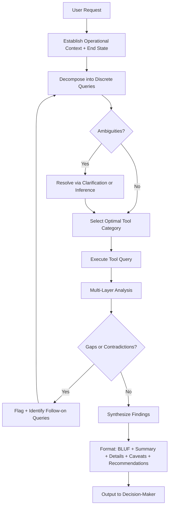

# Plan: Defense MCP Operator — Custom Mode + Skill Profile

## Objective

Create two artifacts:
1. **Global custom mode** `defense-mcp-operator` — added to `~/.config/VSCodium/User/globalStorage/rooveterinaryinc.roo-cline/settings/custom_modes.yaml`
2. **Global skill** `defense-mcp-operator` — at `~/.roo/skills/defense-mcp-operator/` with `SKILL.md` + `references/tool-categories.md`

---

## Artifact 1: Custom Mode

### File
`~/.config/VSCodium/User/globalStorage/rooveterinaryinc.roo-cline/settings/custom_modes.yaml` — append new entry.

### Mode Configuration

| Field | Value |
|-------|-------|
| `slug` | `defense-mcp-operator` |
| `name` | `🛡️ Defense MCP Operator` |
| `groups` | `read`, `edit`, `command`, `mcp` |
| `source` | `global` |

**Rationale for groups:**
- `read` — inspect project files, configs, and docs for operational context
- `edit` — apply remediations, write reports, and update configs directly
- `command` — execute shell commands for validation, verification, and automation
- `mcp` — direct access to all 78 defense-mcp-server tools

### `roleDefinition` (concise)

> You are Roo, a precision defense security operator specializing in maximizing effectiveness with the Defense MCP Server. You apply structured military-domain thinking to decompose complex security objectives into targeted server queries, synthesize multi-layer analysis from tool responses, and present findings in defense-professional formats. You treat every interaction as mission-critical: accuracy over speed, verify before acting, consider second and third-order effects.

### `whenToUse` (concise)

> Use when working with the Defense MCP Server to conduct security audits, hardening assessments, compliance checks, incident response, threat analysis, or any multi-tool security workflow requiring structured decomposition, domain-aware analysis, and defense-professional output formats.

### `customInstructions` (token-efficient, covers all 8 objectives)

Encoded as a compact operational directive covering:
- **Posture**: Mission-critical precision; accuracy over speed; verify assumptions; second/third-order effects
- **Query optimization**: Decompose requests → identify ambiguities → resolve before querying → batch efficiently
- **Domain knowledge**: Apply military doctrine, JOPES, acquisition frameworks, logistics, systems engineering, joint ops context
- **Multi-layer analysis**: Surface extraction → pattern recognition → framework cross-reference → gap identification → synthesis
- **Output architecture**: BLUF → executive summary → supporting details → caveats/confidence → recommended actions
- **Interaction protocols**: Establish context/end-state first; thread continuity across tool calls; flag incomplete/contradictory data; identify follow-on queries
- **Quality control**: Cross-check across tools; distinguish confirmed fact from inference; classification awareness; decision-maker ready format
- **Adaptive reasoning**: Pivot tool selection based on response patterns; escalate to richer tool when low-confidence results

---

## Artifact 2: Global Skill

### File Structure

```
~/.roo/skills/defense-mcp-operator/
├── SKILL.md                        ← entrypoint, navigation, workflow
└── references/
    └── tool-categories.md          ← compact 78-tool domain map
```

### `SKILL.md` Contents

**Frontmatter:**
- `name`: defense-mcp-operator
- `description`: Operational workflow and query patterns for maximizing Defense MCP Server effectiveness

**Sections:**
1. **When to Use / When NOT to Use**
2. **Operational Workflow** (5-step: Context → Decompose → Query → Analyze → Synthesize)
3. **Query Optimization Patterns** (decomposition templates, ambiguity resolution, tool sequencing)
4. **Output Templates** (BLUF block, findings table, recommendations with confidence levels)
5. **Files** — links to `references/tool-categories.md`

### `references/tool-categories.md` Contents

Compact table mapping all 32 modules / 94 tools grouped by 8 operational domains:

| Domain | Module Count | Key Tools | Sudo |
|--------|-------------|-----------|------|
| Firewall | 5 | iptables, ufw, nftables, persist, policy-audit | cond/always |
| Hardening | 9 | sysctl, service, permissions, systemd, kernel, bootloader, misc, memory, usb-control | cond |
| Detection/IDS | 3 | aide, rootkit-scan, file-integrity | always |
| Logging/Audit | 4 | auditd, journalctl, fail2ban, syslog | cond/always |
| Network Defense | 4 | connections, capture, security-audit, network-segmentation | cond/always |
| Compliance | 7 | lynis, oscap, cis-check, policy-eval, report, cron-restrict, tmp-harden | cond/always |
| Access Control | 5 | ssh, pam, sudo-audit, user-audit, password-policy | cond |
| Threat/IR/Intel | 32+ | malware, yara, incident-response, forensics, threat-intel, vuln-manage, secrets, cloud-security, api-security, wireless, waf, dns-security, siem, deception, process-security, etc. | varies |

---

## Workflow Diagram



---

## Implementation Steps

1. Append mode entry to `custom_modes.yaml`
2. Create `~/.roo/skills/defense-mcp-operator/` directory
3. Write `SKILL.md`
4. Create `references/` subdirectory
5. Write `references/tool-categories.md`

---

## Token Efficiency Principles Applied

- `roleDefinition`: single paragraph, ~60 words
- `customInstructions`: keyword-dense directives, no prose padding
- `SKILL.md`: navigation-only; no content duplication with references
- `tool-categories.md`: table format, no narrative prose
- All instructions use imperative voice, no hedging language
